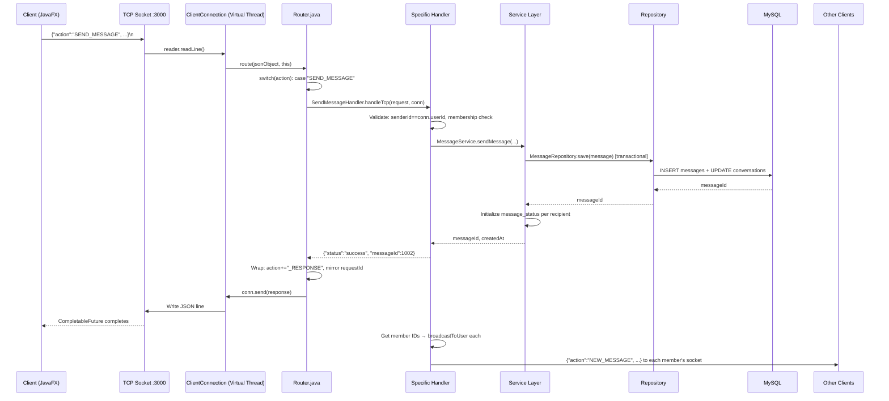

# 🏗️ System Architecture — Layered TCP Design

## Overview
SinChat uses a **Stateful TCP Socket** architecture where each client maintains one persistent connection to the server on port `3000`. The server runs on Java 25 **Virtual Threads** for massive concurrency. All communication uses JSON lines (`\n` delimited). LAN auto-discovery runs on port `9999`.

---

## Architecture

```
┌──────────────────────────────────────────────────────────────────┐
│                     Client (JavaFX Desktop)                       │
│                                                                   │
│  view/ (8)         controller/ (2)       service/ (2)            │
│  LoginView         AuthController         ChatService (Singleton) │
│  ChatView          ChatController         LanDiscoveryService     │
│  CreateGroupDialog                                              │
│  ManageGroupDialog  model/ (4)            util/ (3)              │
│  AvatarModalView    User, Message,        TimeUtils,             │
│  ChangePassword...  Conversation,         StyleConstants,        │
│  ChangeUsername...  ApiResponse           ImageUtils             │
│  FriendRequest...                                               │
│                     emoji/ (2)                                   │
│                     EmojiManager, EmojiDef                       │
└──────────────────────────────┬───────────────────────────────────┘
                               │ TCP Socket (JSON \n) :3000
                               │ LAN Discovery :9999
┌──────────────────────────────▼───────────────────────────────────┐
│                     TCP Server (Java 25)                          │
│                                                                   │
│  tcp/ (9 classes)                                                │
│  TcpServer          — Virtual Thread acceptor + lifecycle        │
│  ClientConnection   — readLine() loop → Router                   │
│  Router             — Static dispatch on 36 actions              │
│  TcpConnectionManager — userId→Set<ClientConnection> (multi-dev) │
│  PresenceService    — Online/offline/avatar/name broadcasts      │
│  LanDiscoveryBroadcaster — Port 9999 "SINCHAT_SERVER:<port>"     │
│  IdleConnectionSweeper   — 5s interval, 60s timeout              │
│  TcpServerSocketFactory  — Plain or TLS socket                   │
│  Connection         — Abstract base class                        │
│                                                                   │
│  handler/ (30 classes)             service/ (6 classes)          │
│  auth/       (4): Login, Register,  AuthService (Singleton)      │
│                    ForgotPwd, ChangePwd  MessageService           │
│  message/   (14): Send, Get, Edit,    ConversationService        │
│                    Delete, Search, Pin, FriendshipService         │
│                    Group, CreateGroup,  AvatarService             │
│                    Typing, Ping, Join    UserNameService          │
│  friendship/ (8): SendReq, Respond,                             │
│                    GetFriends, Block...   model/ (8 classes)     │
│  avatar/     (2): Avatar, GetAvatar      User, Message,          │
│  changeName/ (1): NameHandler            MessageStatus,          │
│                                          Friendship, Conversation│
│  repository/ (5 classes)                 Attachment, ChangeAvatar│
│  UserRepo, MessageRepo,                  MessageSearchResult     │
│  MessageStatusRepo,                                             │
│  FriendshipRepo, ConversationRepo        config/ (1)             │
│                                          Database (HikariCP)     │
└──────────────────────────────┬───────────────────────────────────┘
                               │ JDBC (HikariCP pool: max 5)
┌──────────────────────────────▼───────────────────────────────────┐
│                     MySQL Database                                │
│  users, conversations, conversation_members, messages,            │
│  message_status, attachments, friendships, user_avatars,          │
│  conversation_roles, calls, call_participants                     │
└──────────────────────────────────────────────────────────────────┘
```

---

## Source Files

| Layer | Key Files | Count |
|---|---|---|
| **Server Entry** | `Main.java`, `ProfileHandler.java` | 2 |
| **Config** | `Database.java` (HikariCP + auto-migrations) | 1 |
| **TCP Infra** | `TcpServer`, `ClientConnection`, `Router`, `TcpConnectionManager`, `PresenceService`, `LanDiscoveryBroadcaster`, `IdleConnectionSweeper`, `TcpServerSocketFactory`, `Connection` | 9 |
| **Handlers** | `auth/` (4), `message/` (14), `friendship/` (8), `avatar/` (2), `changeName/` (1), root (3: Typing, Ping, Join) | 30 |
| **Services** | `AuthService`, `MessageService`, `ConversationService`, `FriendshipService`, `AvatarService`, `UserNameService` | 6 |
| **Repositories** | `UserRepository`, `MessageRepository`, `MessageStatusRepository`, `FriendshipRepository`, `ConversationRepository` | 5 |
| **Models** | `User`, `Message`, `MessageStatus`, `MessageSearchResult`, `Friendship`, `Conversation`, `ChangeAvatar`, `Attachment` | 8 |
| **Client Entry** | `Main.java`, `Launcher.java` | 2 |
| **Client Views** | `LoginView`, `ChatView`, `CreateGroupDialog`, `ManageGroupDialog`, `AvatarModalView`, `ChangePasswordDialog`, `ChangeUsernameDialog`, `FriendRequestHistoryDialog` | 8 |
| **Client Controllers** | `AuthController`, `ChatController` | 2 |
| **Client Services** | `ChatService`, `LanDiscoveryService` | 2 |
| **Client Models** | `User`, `Message`, `Conversation`, `ApiResponse` | 4 |
| **Client Emoji** | `EmojiManager`, `EmojiDef` | 2 |
| **Client Utils** | `TimeUtils`, `StyleConstants`, `ImageUtils` | 3 |
| **Total** | | **103** |

---

## Request Routing Flow



---

## Key Design Principles

### Layered Separation
```
View → Controller → Service (TCP) ─── Network ─── Router → Handler → Service → Repository → DB
```
- **Client**: Views never call TCP directly; Controllers orchestrate; Services manage the socket
- **Server**: Handlers validate + parse; Services contain business logic; Repositories contain SQL
- **No cross-layer leakage**: Handlers don't write SQL; Views don't know about TCP frames

### Singleton Pattern
`AuthService`, `TcpConnectionManager`, `PresenceService`, `ChatService`, `EmojiManager` are Singletons — single source of truth for their domain.

### Virtual Threads (Java 25)
```java
Thread.ofVirtual().start(clientConnection);
```
No thread pool sizing needed. Thousands of concurrent connections with minimal overhead.

### Request-Response Correlation
```java
ConcurrentHashMap<String, CompletableFuture<ApiResponse>> pendingRequests;
```
Client generates UUID `requestId`, server mirrors it in response. Reader thread completes the future.

### Push Events
Server-pushed events (no `requestId`) dispatched via registered callbacks:
```java
switch(eventAction) {
    case "NEW_MESSAGE" → onNewMessage.accept(data);
    case "USER_STATUS_EVENT" → onUserStatusChange.accept(data);
    // ... 15+ event types
}
```

---

## Technology Stack

| Component | Technology | Version | Why |
|---|---|---|---|
| **Runtime** | Java JDK | 25 | Virtual Threads for massive concurrency |
| **Server Networking** | `ServerSocket` + Virtual Threads | JDK | Zero-dependency TCP |
| **Client GUI** | JavaFX | 25 | Rich desktop UI, programmatic layout |
| **Database** | MySQL | 8.x | Relational, widely supported |
| **Connection Pool** | HikariCP | 5.1.0 | Fastest JDBC pool |
| **JSON** | Gson | 2.10.1 | Lightweight, reflection-based |
| **Password Hash** | jBCrypt | 0.4 | Industry standard, built-in salt |
| **Config** | dotenv-java | 3.0.0 | 12-factor app `.env` support |
| **Logging** | SLF4J + slf4j-simple | 2.0.13 | Simple, sufficient for server |
| **Container** | Docker multi-stage | — | `eclipse-temurin:25-jdk` → `25-jre` |
| **Test** | JUnit 5 + Mockito | 5.10.2 / 5.17.0 | Standard Java test stack |

---

## Notable Design Decisions

| Decision | Rationale |
|---|---|
| Pure TCP (no HTTP/REST) | Single persistent connection; lower latency; stateful sessions |
| JSON lines (`\n` delimiter) | Simple framing; `readLine()` is built-in; human-debuggable |
| Virtual Threads over ThreadPool | No tuning needed; scales to 10K+ connections |
| `userId` stored on `ClientConnection` | Stateless auth after LOGIN; no token refresh needed |
| `user1_id < user2_id` for friendships | Single row per relationship; prevents duplicates |
| Copy-on-edit for messages | Preserves history; enables future "view edit history" |
| Soft delete (`is_deleted`) for messages | Recoverable; audit trail |
| BLOB storage for avatars | Self-contained; no external CDN dependency |
| Server-side avatar resize (512×512) | Consistent display; reduced client complexity |
| Auto-migrations on startup | Schema evolution without manual SQL scripts |
| LAN discovery (port 9999) | Zero-configuration local network deployment |
| TLS support via env var | Security without code changes |
| Multi-device (`Set<ClientConnection>`) | Phone + laptop share same session |
│  │  TcpConnectionManager — Thread-safe userId→Socket mapping    │ │
│  │  PresenceService  — Broadcasts online/offline/avatar events  │ │
│  │  LanDiscoveryBroadcaster — Listens on port 9999 for LAN     │ │
│  │  IdleConnectionSweeper — Closes idle connections (60s)       │ │
│  │  TcpServerSocketFactory — Plain or TLS socket factory        │ │
│  │  Connection       — Abstract base for ClientConnection       │ │
│  └─────────────────────────────────────────────────────────────┘ │
│  ┌─────────────────────────────────────────────────────────────┐ │
│  │ handler/ (30 handlers in sub-packages)                       │ │
│  │  auth/     — Login, Register, ForgotPassword, ChangePassword │ │
│  │  message/  — Send, Get, Edit, Delete, Search, Pin, Group...  │ │
│  │  friendship/ — 8 handlers for full friend management         │ │
│  │  changeavatar/, avatar/, changeName/                         │ │
│  │  TypingHandler, PingHandler, JoinHandler                     │ │
│  └─────────────────────────────────────────────────────────────┘ │
│  ┌─────────────────────────────────────────────────────────────┐ │
│  │ service/ (6 services)                                        │ │
│  │  AuthService, MessageService, ConversationService,           │ │
│  │  FriendshipService, AvatarService, UserNameService           │ │
│  └─────────────────────────────────────────────────────────────┘ │
│  ┌─────────────────────────────────────────────────────────────┐ │
│  │ repository/ (5 repositories) + model/ (8 model classes)      │ │
│  │  UserRepository, MessageRepository, MessageStatusRepository, │ │
│  │  FriendshipRepository, ConversationRepository                │ │
│  └─────────────────────────────────────────────────────────────┘ │
│  ┌─────────────────────────────────────────────────────────────┐ │
│  │ config/                                                      │ │
│  │  Database.java — HikariCP pool, auto-migrations              │ │
│  └─────────────────────────────────────────────────────────────┘ │
└──────────────────────────────────────┬───────────────────────────┘
                                       │ JDBC
┌──────────────────────────────────────▼───────────────────────────┐
│                      MySQL Database                               │
│  Tables: users, conversations, conversation_members, messages,    │
│          message_status, attachments, friendships, user_avatars,  │
│          conversation_roles                                       │
└──────────────────────────────────────────────────────────────────┘
```

---

## 3. Layered Responsibilities

### 3.1. TCP Network Layer (`com.server.tcp`)
*   **`TcpServer`**: Listens on configured port (`3000` by default). Uses Java 25 **Virtual Threads** (`Thread.ofVirtual()`) for high-concurrency connection handling. Starts `LanDiscoveryBroadcaster` (port `9999`) and `IdleConnectionSweeper` (5s interval, 60s timeout).
*   **`ClientConnection`**: Implements `Runnable`. Runs a continuous `reader.readLine()` loop. Each JSON message is a single line terminated by `\n`. Dispatches to `Router.route()`. On disconnect, triggers `PresenceService.onUserOffline()`.
*   **`Router`**: Static dispatch switch on the `action` field. Handles ~36 actions. Wraps responses with `_RESPONSE` suffix and mirrors `requestId`. Catches `Throwable` to prevent connection crashes.
*   **`TcpConnectionManager`** (Singleton): `ConcurrentHashMap<Long, Set<ClientConnection>>` maps userId → active connections (multi-device support). Provides `broadcastToUser(userId, json)` for real-time pushes.
*   **`PresenceService`** (Singleton): On user online/offline, updates `users.is_online` and `users.last_seen`, then broadcasts `USER_STATUS_EVENT` to all friends and conversation peers. Also handles `USER_AVATAR_CHANGED_EVENT` and `USER_NAME_CHANGED_EVENT` broadcasts.
*   **`LanDiscoveryBroadcaster`**: Listens on TCP port `9999`. Responds `SINCHAT_SERVER:<port>\n` to any connection, enabling LAN auto-discovery.
*   **`IdleConnectionSweeper`**: Every 5 seconds, closes connections idle longer than 60 seconds.
*   **`TcpServerSocketFactory`**: Factory for plain `ServerSocket` or `SSLServerSocket` based on `TLS_ENABLED` env var.

### 3.2. Handler Layer (`com.server.handler.*`)
30 handlers organized in sub-packages:
*   **`auth/`**: `LoginHandler` (with rate limiting: 5 failed attempts → 60s lockout), `RegisterHandler` (username/password/email validation), `ForgotPasswordHandler` (6-digit code, 5-min TTL, 5 attempts), `ChangePasswordHandler`
*   **`message/`**: 14 handlers — `SendMessageHandler`, `GetMessagesHandler`, `GetConversationsHandler`, `ConversationHandler`, `CreateGroupHandler`, `GroupManagementHandler`, `LeaveGroupHandler`, `EditMessageHandler`, `DeleteMessageHandler`, `SearchMessagesHandler`, `SearchUserHandler`, `PinMessageHandler`, `UnpinMessageHandler`, `SetPinPolicyHandler`
*   **`friendship/`**: 8 handlers — `SendFriendRequestHandler`, `RespondFriendRequestHandler`, `GetFriendsHandler`, `GetFriendRequestsHandler`, `GetFriendshipStatusHandler`, `UnfriendHandler`, `BlockUserHandler`, `UnblockUserHandler`
*   **`changeavatar/`**: `AvatarHandler`
*   **`avatar/`**: `GetAvatarHandler`
*   **`changeName/`**: `NameHandler`
*   **Root handlers**: `TypingHandler`, `PingHandler`, `JoinHandler`, `ProfileHandler` (directly in `com.server`)

### 3.3. Service Layer (`com.server.service`)
6 services implementing core business logic:
*   `AuthService` (Singleton): BCrypt hashing, login, register, password reset (6-digit SecureRandom code), change password
*   `MessageService`: Send (with reply/forward support), get, edit (creates new message, links old→new), delete (soft), search (LIKE-based)
*   `ConversationService`: Private conversation find-or-create, group CRUD, member management, role management
*   `FriendshipService`: Friend requests, accept/reject, block/unblock, unfriend
*   `AvatarService`: Base64 decode, resize to 512×512 PNG, save as BLOB to `user_avatars`
*   `UserNameService`: Update display name with uniqueness check

### 3.4. Repository & Model Layer
*   **5 repositories**: `UserRepository`, `MessageRepository`, `MessageStatusRepository`, `FriendshipRepository` (uses `user1_id < user2_id` convention), `ConversationRepository`
*   **8 model classes**: `User`, `Message` (enum: `TEXT/IMAGE/VIDEO/VOICE/FILE/SYSTEM`, reply/forward support, seen users, pin), `MessageStatus` (enum: `SENT/DELIVERED/SEEN`), `MessageSearchResult`, `Friendship` (enum: `PENDING/ACCEPTED/BLOCKED`), `Conversation` (enum: `PRIVATE/GROUP`), `ChangeAvatar`, `Attachment`
*   **`Database.java`**: HikariCP pool (max 5, min 1 idle, 30s connection timeout, 10min idle timeout, 30min max lifetime, 1min keepalive). Auto-migrations for schema evolution.

### 3.5. Client Architecture (`com.client`)
*   **Entry points**: `Main.java` (JavaFX `Application`) and `Launcher.java` (fat JAR bootstrap)
*   **`service/`**: `ChatService` (Singleton TCP client with ~40 API methods, 15+ event callbacks, heartbeat scheduler every 15s), `LanDiscoveryService` (probes subnet on port 9999)
*   **`controller/`**: `AuthController` (async login/register/reset), `ChatController` (async wrappers for ALL chat operations with JavaFX thread dispatch)
*   **`view/`**: 8 views — `LoginView`, `ChatView` (~2000+ lines, 3-panel), `CreateGroupDialog`, `ManageGroupDialog`, `AvatarModalView`, `ChangePasswordDialog`, `ChangeUsernameDialog`, `FriendRequestHistoryDialog`
*   **`model/`**: 4 models — `User`, `Message`, `Conversation`, `ApiResponse` (record)
*   **`emoji/`**: `EmojiManager` (WeChat-style rendering), `EmojiDef`
*   **`util/`**: `TimeUtils` (Vietnamese relative time), `StyleConstants` (centralized theme), `ImageUtils` (base64 encode/decode)

---

## 4. TCP Protocol Overview

All communication uses JSON lines over TCP (`\n` delimited):

**Request** (Client → Server):
```json
{"action": "LOGIN", "requestId": "uuid", "username": "...", "password": "..."}
```

**Response** (Server → Client):
```json
{"action": "LOGIN_RESPONSE", "requestId": "uuid", "status": "success", "userId": 12}
```

**Server Push** (Server → Client, no requestId):
```json
{"action": "NEW_MESSAGE", "conversationId": 45, "messageId": 1002, "content": "Hello"}
```

The server supports **36+ actions** covering: authentication (4), profile (4), messaging (6 CRUD + 3 pin), conversations (5), groups (2 + management), friendship (8), real-time (3: JOIN, PING, TYPING), plus avatars and search.

---

## 5. Data Flow Example: Sending a Message

1. **Client** (`ChatView`): User types message and presses Enter.
2. **`ChatController.sendMessage()`**: Runs async on background thread, calls `ChatService.sendMessage()`.
3. **`ChatService`**: Creates JSON `{"action":"SEND_MESSAGE", ...}`, writes to socket via `sendRequestSync()`, uses `CompletableFuture` + `ConcurrentHashMap` for request/response correlation.
4. **Server** (`ClientConnection.run()`): Reads JSON line, calls `Router.route()`.
5. **`Router`**: Dispatches to `SendMessageHandler.handleTcp()`.
6. **`SendMessageHandler`**: Validates sender/membership, calls `MessageService.sendMessage()`.
7. **`MessageService`**: Inserts message via `MessageRepository.save()` (transactional — also updates `last_message_at`). Initializes `message_status` for each recipient.
8. **Response to sender**: `SEND_MESSAGE_RESPONSE` with `messageId`.
9. **Broadcast**: `TcpConnectionManager.broadcastToUser()` sends `NEW_MESSAGE` to all online conversation members.
10. **Client** (`ChatService` reader thread): Receives `NEW_MESSAGE`, triggers `onNewMessage` callback → `Platform.runLater()` → UI updates.
