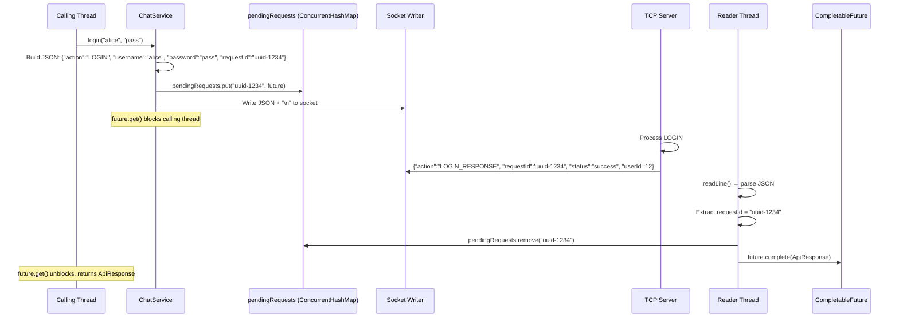
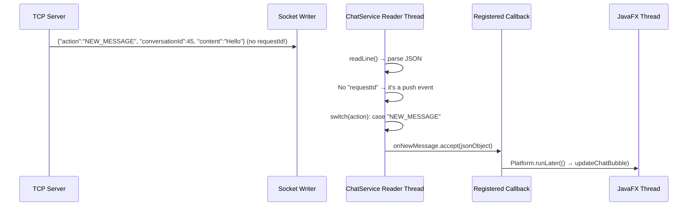

# 🔌 TCP Communication Protocol

## Overview
SinChat uses a custom **JSON line protocol** over raw TCP sockets. Every message is a single UTF-8 JSON object terminated by `\n`. The client correlates requests with responses using `requestId` + `CompletableFuture`. Server-pushed events are dispatched via registered callbacks. The protocol supports **36 actions** organized into 8 categories.

---

## Source Files

| Layer | File | Package |
|---|---|---|
| **Server Router** | `Router.java` (dispatch switch) | `com.server.tcp` |
| **Server Connection** | `ClientConnection.java` (readLine/send) | `com.server.tcp` |
| **Client Service** | `ChatService.java` (sendRequestSync, reader thread) | `com.client.service` |
| **Client Model** | `ApiResponse.java` (record) | `com.client.model` |

---

## Flow: Request-Response Cycle



## Flow: Server Push Event



---

## Frame Format

### Request (Client → Server)
```json
{
  "action": "ACTION_NAME",
  "requestId": "uuid-v4",
  "...": "action-specific fields"
}
```
- `action`: Case-sensitive action name (e.g., `LOGIN`, `SEND_MESSAGE`)
- `requestId`: UUID for response correlation
- All other fields depend on the action

### Response (Server → Client)
```json
{
  "action": "ACTION_NAME_RESPONSE",
  "requestId": "same-as-request",
  "status": "success | error",
  "message": "Human-readable description",
  "...": "action-specific fields"
}
```
- `action`: Original action + `_RESPONSE` suffix
- `status`: `"success"` or `"error"`
- Server ALWAYS mirrors `requestId`

### Push Event (Server → Client)
```json
{
  "action": "EVENT_NAME",
  "...": "event-specific fields"
}
```
- NO `requestId` field
- NO `status` field
- Identified by `action` not ending in `_RESPONSE`

---

## Complete Action Map

### Authentication (4 actions)
| Action | Handler | Request Fields | Response Fields |
|---|---|---|---|
| `LOGIN` | `LoginHandler` | `username`, `password` | `userId`, `username` |
| `REGISTER` | `RegisterHandler` | `username`, `password`, `email` | `message` |
| `FORGOT_PASSWORD` | `ForgotPasswordHandler` | Step1: `username` / Step2: `code`, `password` | Step1: `code` / Step2: `message` |
| `CHANGE_PASSWORD` | `ChangePasswordHandler` | `userId`, `oldPassword`, `newPassword` | `message` |

### Profile (5 actions)
| Action | Handler | Request Fields | Response Fields |
|---|---|---|---|
| `PROFILE` (GET_PROFILE) | `ProfileHandler` | `subAction`, `userId` | `username`, `email`, `avatar_url` |
| `PROFILE` (UPDATE_PROFILE) | `ProfileHandler` | `subAction`, `userId`, `email` | `message` |
| `CHANGE_AVATAR` | `AvatarHandler` | `userId`, `avatarUrl` (base64 data URI) | `avatarUrl` |
| `GET_AVATAR` | `GetAvatarHandler` | `userId` | `avatarUrl` (base64 from BLOB) |
| `CHANGE_NAME` | `NameHandler` | `userId`, `newUsername` | `message` |

### Conversation (5 actions)
| Action | Handler | Request Fields | Response Fields |
|---|---|---|---|
| `GET_OR_CREATE_CONVERSATION` | `ConversationHandler` | `user1Id`, `user2Id` | `conversationId` |
| `GET_USER_CONVERSATIONS` | `GetConversationsHandler` | `userId` | `conversations[]` |
| `CREATE_GROUP` | `CreateGroupHandler` | `name`, `creatorId`, `memberIds[]` | `conversationId`, `name`, `type` |
| `LEAVE_GROUP` | `LeaveGroupHandler` | `conversationId`, `userId` | `message` |
| `MANAGE_GROUP` | `GroupManagementHandler` | `subAction`, `conversationId` + subAction fields | varies by subAction |

### Message (6 actions)
| Action | Handler | Request Fields | Response Fields |
|---|---|---|---|
| `SEND_MESSAGE` | `SendMessageHandler` | `conversationId`, `senderId`, `content`, `type`, `replyToId?`, `forwardFromId?` | `messageId`, `createdAt` |
| `GET_MESSAGES` | `GetMessagesHandler` | `conversationId`, `limit`, `offset` | `messages[]`, `hasMore` |
| `EDIT_MESSAGE` | `EditMessageHandler` | `messageId`, `conversationId`, `content` | `messageId`, `content` |
| `DELETE_MESSAGE` | `DeleteMessageHandler` | `messageId`, `conversationId` | `messageId` |
| `SEARCH_MESSAGES` | `SearchMessagesHandler` | `conversationId`, `keyword`, `limit`, `offset` | `messages[]`, `count` |
| `UPDATE_MESSAGE_STATUS` | `UpdateMessageStatusHandler` | Single: `messageId`, `userId`, `status` / Bulk: `conversationId`, `userId`, `status` | — |

### Pin (3 actions)
| Action | Handler | Request Fields | Response Fields |
|---|---|---|---|
| `PIN_MESSAGE` | `PinMessageHandler` | `messageId`, `conversationId`, `userId` | `pinnedCount` |
| `UNPIN_MESSAGE` | `UnpinMessageHandler` | `messageId`, `conversationId`, `userId` | `message` |
| `SET_PIN_POLICY` | `SetPinPolicyHandler` | `conversationId`, `userId`, `adminOnly` | `message` |

### Friendship (8 actions)
| Action | Handler | Request Fields | Response Fields |
|---|---|---|---|
| `SEND_FRIEND_REQUEST` | `SendFriendRequestHandler` | `senderId`, `receiverId` | `result` |
| `RESPOND_FRIEND_REQUEST` | `RespondFriendRequestHandler` | `userId`, `requesterId`, `decision` | `message` |
| `GET_FRIENDS` | `GetFriendsHandler` | `userId` | `friends[]` |
| `GET_FRIEND_REQUESTS` | `GetFriendRequestsHandler` | `userId` | `pending[]`, `sent[]` |
| `GET_FRIENDSHIP_STATUS` | `GetFriendshipStatusHandler` | `viewerId`, `otherId` | `friendshipStatus` |
| `UNFRIEND` | `UnfriendHandler` | `userId`, `friendId` | `message` |
| `BLOCK_USER` | `BlockUserHandler` | `userId`, `targetId` | `message` |
| `UNBLOCK_USER` | `UnblockUserHandler` | `userId`, `targetId` | `message` |

### Search (2 actions)
| Action | Handler | Request Fields | Response Fields |
|---|---|---|---|
| `SEARCH_USERS` | `SearchUserHandler` | `userId`, `keyword` | `users[]` (with `friendshipStatus`) |
| `SEARCH_MESSAGES` | `SearchMessagesHandler` | `conversationId`, `keyword`, `limit`, `offset` | `messages[]` |

### Real-Time (3 actions — no response expected)
| Action | Handler | Request Fields | Push Event |
|---|---|---|---|
| `JOIN` | `JoinHandler` | `userId` | (registers in TcpConnectionManager) |
| `PING` | `PingHandler` | — | `PING_RESPONSE` |
| `TYPING` | `TypingHandler` | `conversationId`, `userId` | `TYPING_EVENT` to members |

---

## Push Events Reference

| Event | Trigger | Fields |
|---|---|---|
| `NEW_MESSAGE` | Message sent | `conversationId`, `senderId`, `senderUsername`, `content`, `messageId`, `type`, `createdAt`, reply/forward metadata |
| `EDIT_MESSAGE_EVENT` | Message edited | `messageId`, `conversationId`, `content` |
| `DELETE_MESSAGE_EVENT` | Message deleted | `messageId`, `conversationId` |
| `MESSAGE_PINNED_EVENT` | Message pinned | `messageId`, `conversationId`, message data |
| `MESSAGE_UNPINNED_EVENT` | Message unpinned | `messageId`, `conversationId` |
| `MESSAGE_STATUS_EVENT` | Status changed | `messageId`, `userId`, `status` |
| `TYPING_EVENT` | User typing | `conversationId`, `userId` |
| `USER_STATUS_EVENT` | Online/offline | `userId`, `status`, `lastSeen` |
| `USER_AVATAR_CHANGED_EVENT` | Avatar changed | `userId`, `avatarUrl` |
| `USER_NAME_CHANGED_EVENT` | Name changed | `userId`, `newUsername` |
| `FRIEND_REQUEST_EVENT` | Request received | `senderId`, `senderUsername` |
| `FRIEND_ACCEPTED_EVENT` | Request accepted | `userId`, `username` |
| `LEFT_GROUP` | Member left | `conversationId`, `userId` |

---

## Connection Lifecycle Protocol

```
1. TCP CONNECT     → Client opens socket to server:3000
2. LOGIN           → {"action":"LOGIN", ...} → {"status":"success", "userId":12}
3. JOIN            → {"action":"JOIN", "userId":12} → (silent, registers in TcpConnectionManager)
4. [BUSINESS]      → Any action: SEND_MESSAGE, GET_FRIENDS, etc.
5. PING (every 15s)→ {"action":"PING"} → {"action":"PING_RESPONSE"}
6. DISCONNECT      → Socket close → PresenceService.onUserOffline()
```

---

## Error Handling

### Client-Side
```java
// Hang protection on disconnect
public void disconnect() {
    for (CompletableFuture<ApiResponse> future : pendingRequests.values()) {
        future.complete(new ApiResponse(500, "error", "Connection lost", ...));
    }
    pendingRequests.clear();
}
```

### Server-Side
```java
// Router.java — catch-all prevents connection crashes
try {
    // dispatch to handler
} catch (Throwable t) {
    response.addProperty("status", "error");
    response.addProperty("message", "Internal Server Error");
}
conn.send(response);
```

---

## Notable Design Decisions

| Decision | Rationale |
|---|---|
| JSON lines (`\n` delimiter) | `BufferedReader.readLine()` is built-in; no custom framing needed |
| `requestId` UUID for correlation | Globally unique; no collision across concurrent requests |
| Server mirrors `requestId` | Client doesn't need to track action type for response matching |
| Push events have NO `requestId` | Clear distinction: events are fire-and-forget, responses are paired |
| `action + "_RESPONSE"` suffix | Client can distinguish response from push by action name |
| Single TCP connection (no multiplexing) | Simpler; virtual threads handle concurrency server-side |
| `CompletableFuture` for sync-over-async | Clean API: callers use blocking `get()`, network is async |
| Hang protection on disconnect | No frozen UIs; all pending calls complete with error |

### 2.1. Authentication

#### LOGIN
Login with rate limiting: 5 failed attempts → 60-second lockout per username.
- **Request**: `action`, `username`, `password`, `requestId`
- **Success**: `status:"success"`, `userId`, `username`
- **Error**: `status:"error"`, `message`
- **Handler**: `LoginHandler.java`

#### REGISTER
Username: 3–50 chars `[a-zA-Z0-9_]`. Password: 6–100 chars. Valid email required.
- **Request**: `action`, `username`, `password`, `email`, `requestId`
- **Success**: `status:"success"`, `message`
- **Error**: `status:"error"`, `message` (includes duplicate detection)
- **Handler**: `RegisterHandler.java`

#### FORGOT_PASSWORD
Two-step flow: (1) send username → get code, (2) send code + new password.
- **Step 1 Request**: `action`, `username`, `requestId`
- **Step 1 Response**: `status:"success"`, `message`, `code` (6-digit)
- **Step 2 Request**: `action`, `code`, `password`, `requestId`
- **Step 2 Response**: `status:"success"`, `message`
- **Security**: 5-min TTL, max 5 attempts. Timing-attack mitigated (always runs BCrypt).
- **Handler**: `ForgotPasswordHandler.java`

#### CHANGE_PASSWORD
Requires authenticated connection. User must provide old password.
- **Request**: `action`, `userId`, `oldPassword`, `newPassword`, `requestId`
- **Success**: `status:"success"`, `message`
- **Error**: `status:"error"`, `message`
- **Handler**: `ChangePasswordHandler.java`

---

### 2.2. Profile

#### PROFILE (GET_PROFILE)
- **Request**: `action:"PROFILE"`, `subAction:"GET_PROFILE"`, `userId`, `requestId`
- **Success**: `status:"success"`, `username`, `email`, `avatar_url`
- **Handler**: `ProfileHandler.java`

#### PROFILE (UPDATE_PROFILE)
- **Request**: `action:"PROFILE"`, `subAction:"UPDATE_PROFILE"`, `userId`, `email`, `requestId`
- **Success**: `status:"success"`, `message`
- **Handler**: `ProfileHandler.java`

#### CHANGE_AVATAR
Sends base64 data URI. Server decodes, resizes to 512×512 PNG, stores as BLOB in `user_avatars`.
- **Request**: `action`, `userId`, `avatarUrl` (base64 data URI), `requestId`
- **Success**: `status:"success"`, `message`, `avatarUrl`
- **Server push**: `USER_AVATAR_CHANGED_EVENT` broadcast to peers
- **Handler**: `AvatarHandler.java`

#### GET_AVATAR
- **Request**: `action`, `userId`, `requestId`
- **Success**: `status:"success"`, `avatarUrl` (base64 data URI from BLOB)
- **Handler**: `GetAvatarHandler.java`

#### CHANGE_NAME
- **Request**: `action`, `userId`, `newUsername`, `requestId`
- **Success**: `status:"success"`, `message`
- **Server push**: `USER_NAME_CHANGED_EVENT` broadcast to peers (async via virtual thread)
- **Handler**: `NameHandler.java`

---

### 2.3. Conversations

#### GET_OR_CREATE_CONVERSATION
Creates or retrieves a PRIVATE conversation between two users. Uses `SELECT ... FOR UPDATE` for atomic find-or-create.
- **Request**: `action`, `user1Id`, `user2Id`, `requestId`
- **Success**: `status:"success"`, `conversationId`
- **Handler**: `ConversationHandler.java`

#### GET_USER_CONVERSATIONS
Returns all conversations for a user with last message, peer info, online status.
- **Request**: `action`, `userId`, `requestId`
- **Success**: `status:"success"`, `conversations` (array with `conversationId`, `type`, `name`, `avatar`, `lastMessage`, `lastMessageAt`, `isOnline`, etc.)
- **Handler**: `GetConversationsHandler.java`

#### CREATE_GROUP
Creates a GROUP conversation. Group name max 100 chars.
- **Request**: `action`, `name`, `creatorId`, `memberIds` (array), `requestId`
- **Success**: `status:"success"`, `conversationId`, `name`, `type:"GROUP"`
- **Handler**: `CreateGroupHandler.java`

#### LEAVE_GROUP
Removes user from group. Broadcasts `LEFT_GROUP` event to remaining members.
- **Request**: `action`, `conversationId`, `userId`, `requestId`
- **Success**: `status:"success"`, `message`
- **Handler**: `LeaveGroupHandler.java`

#### MANAGE_GROUP
Multi-purpose group management via `subAction`:
- **`GET_MEMBERS`**: Returns members with roles (`creator`, `admin`, `member`)
- **`RENAME`**: Creator or admin renames group (requires `newName`)
- **`ADD_MEMBER`**: Creator or admin adds member (requires `memberId`)
- **`KICK_MEMBER`**: Creator or admin removes member (requires `memberId`)
- **`TRANSFER_ADMIN`**: Creator transfers admin to another member (requires `newAdminId`)
- **`DISBAND`**: Creator disbands group (deletes conversation + members)
- **Request**: `action`, `subAction`, `conversationId`, `userId`, `requestId`, plus subAction-specific fields
- **Handler**: `GroupManagementHandler.java`

---

### 2.4. Messages

#### SEND_MESSAGE
Supports message types: TEXT (default), IMAGE, VIDEO, VOICE, FILE. Content limits: 10K chars text, 7M image data.
- **Request**: `action`, `conversationId`, `senderId`, `content`, `requestId`
- **Optional**: `type` (default `TEXT`), `replyToId`, `forwardFromId`
- **Response to sender**: `status:"success"`, `messageId`, `conversationId`, `senderId`, `content`, `createdAt`
- **Server push** (`NEW_MESSAGE`): sent to all online conversation members. Includes reply/forward metadata when applicable.
- **Message status**: Initializes `message_status` for each recipient (DELIVERED if online, else SENT)
- **Handler**: `SendMessageHandler.java`

#### GET_MESSAGES
Paginated message retrieval. Excludes deleted messages and edited-to children.
- **Request**: `action`, `conversationId`, `limit`, `offset`, `requestId`
- **Success**: `status:"success"`, `conversationId`, `count`, `hasMore`, `messages` (array with full message objects including reply/forward/pin/seen info)
- **Handler**: `GetMessagesHandler.java`

#### EDIT_MESSAGE
Creates a NEW message copy with updated content, links old→new via `edited_to_id`. Broadcasts `EDIT_MESSAGE_EVENT`.
- **Request**: `action`, `messageId`, `senderId`, `conversationId`, `newContent`, `requestId`
- **Success**: `status:"success"`, new message object
- **Handler**: `EditMessageHandler.java`

#### DELETE_MESSAGE
Soft-delete (sets `is_deleted = TRUE`). Sender only. Broadcasts `DELETE_MESSAGE_EVENT`.
- **Request**: `action`, `messageId`, `senderId`, `conversationId`, `requestId`
- **Success**: `status:"success"`, `message`
- **Handler**: `DeleteMessageHandler.java`

#### SEARCH_MESSAGES
LIKE-based search in a specific conversation. Max 50 results.
- **Request**: `action`, `conversationId`, `keyword`, `limit`, `offset`, `requestId`
- **Success**: `status:"success"`, `conversationId`, `keyword`, `count`, `messages`
- **Handler**: `SearchMessagesHandler.java`

#### UPDATE_MESSAGE_STATUS
Single message status update or bulk mark-all-as-seen. Broadcasts `MESSAGE_STATUS_EVENT`.
- **Single**: `action`, `messageId`, `userId`, `status` (`SENT`/`DELIVERED`/`SEEN`), `requestId`
- **Bulk**: `action`, `conversationId`, `userId`, `status:"SEEN"`, `requestId`
- **Handler**: `UpdateMessageStatusHandler.java`

---

### 2.5. Pin Messages

#### PIN_MESSAGE
Pin limit (default 5). Admin-only pinning option for groups.
- **Request**: `action`, `messageId`, `conversationId`, `userId`, `requestId`
- **Success**: `status:"success"`, `message`, `pinnedCount`
- **Server push**: `MESSAGE_PINNED_EVENT`
- **Handler**: `PinMessageHandler.java`

#### UNPIN_MESSAGE
- **Request**: `action`, `messageId`, `conversationId`, `userId`, `requestId`
- **Success**: `status:"success"`, `message`
- **Server push**: `MESSAGE_UNPINNED_EVENT`
- **Handler**: `UnpinMessageHandler.java`

#### SET_PIN_POLICY
Toggle admin-only pinning. Admin/owner only.
- **Request**: `action`, `conversationId`, `userId`, `adminOnly` (boolean), `requestId`
- **Success**: `status:"success"`, `message`
- **Handler**: `SetPinPolicyHandler.java`

---

### 2.6. Friendship

All friendship actions use `user1_id < user2_id` convention in the database.

#### SEND_FRIEND_REQUEST
- **Request**: `action`, `senderId`, `receiverId`, `requestId`
- **Response**: `status`, `result` (`"sent"`, `"already_friends"`, `"pending_sent"`, `"pending_received"`, `"blocked"`, `"error"`)
- **Server push**: `FRIEND_REQUEST_EVENT` to receiver
- **Handler**: `SendFriendRequestHandler.java`

#### RESPOND_FRIEND_REQUEST
- **Request**: `action`, `userId`, `requesterId`, `decision` (`"ACCEPTED"`/`"REJECTED"`), `requestId`
- **Response**: `status:"success"`, `message`
- **Server push**: `FRIEND_ACCEPTED_EVENT` to requester on accept
- **Handler**: `RespondFriendRequestHandler.java`

#### GET_FRIENDS
- **Request**: `action`, `userId`, `requestId`
- **Success**: `status:"success"`, `friends` (array with `userId`, `username`, `avatarUrl`, `isOnline`, `lastSeen`)
- **Handler**: `GetFriendsHandler.java`

#### GET_FRIEND_REQUESTS
- **Request**: `action`, `userId`, `requestId`
- **Success**: `status:"success"`, `pending` (received requests), `sent` (sent requests)
- **Handler**: `GetFriendRequestsHandler.java`

#### GET_FRIENDSHIP_STATUS
- **Request**: `action`, `viewerId`, `otherId`, `requestId`
- **Success**: `status:"success"`, `friendshipStatus` (`"friends"`, `"pending_sent"`, `"pending_received"`, `"blocked"`, `"none"`)
- **Handler**: `GetFriendshipStatusHandler.java`

#### UNFRIEND
Also handles `CANCEL_REQUEST` (same action, determines operation based on current status).
- **Request**: `action`, `userId`, `friendId`, `requestId`
- **Success**: `status:"success"`, `message`
- **Handler**: `UnfriendHandler.java`

#### BLOCK_USER
- **Request**: `action`, `userId`, `targetId`, `requestId`
- **Success**: `status:"success"`, `message`
- **Handler**: `BlockUserHandler.java`

#### UNBLOCK_USER
- **Request**: `action`, `userId`, `targetId`, `requestId`
- **Success**: `status:"success"`, `message`
- **Handler**: `UnblockUserHandler.java`

---

### 2.7. Search

#### SEARCH_USERS
Searches users by username (LIKE). Attaches `friendshipStatus` to each result. Limit 15.
- **Request**: `action`, `userId`, `keyword`, `requestId`
- **Success**: `status:"success"`, `users` (array with `userId`, `username`, `avatarUrl`, `friendshipStatus`)
- **Handler**: `SearchUserHandler.java`

---

### 2.8. Real-Time Actions

#### JOIN
Maps the socket connection to a userId after login. Triggers `PresenceService.onUserOnline()`.
- **Request**: `action`, `userId`
- **Response**: None (silent). Server registers in `TcpConnectionManager`.
- **Handler**: `JoinHandler.java`

#### PING
Heartbeat keep-alive. Client sends every 15 seconds. `IdleConnectionSweeper` closes connections idle >60s.
- **Request**: `action:"PING"`, `requestId`
- **Response**: `action:"PING_RESPONSE"`, `status:"success"`, `requestId`
- **Handler**: `PingHandler.java`

#### TYPING
Broadcasts typing indicator to conversation members.
- **Request**: `action`, `conversationId`, `userId` (and optionally `memberId` for private typing)
- **Server push**: `TYPING_EVENT` to other members
- **Handler**: `TypingHandler.java`

---

## 3. Server Push Events (asynchronous, no requestId)

| Event | Trigger | Fields |
|---|---|---|
| `NEW_MESSAGE` | Message sent by another user | `conversationId`, `senderId`, `senderUsername`, `content`, `messageId`, `type`, `createdAt`, `replyToId`*, `replyToUsername`*, `replyToContent`*, `forwardFromId`*, `forwardFromUsername`*, `forwardFromContent`* |
| `EDIT_MESSAGE_EVENT` | Message edited by sender | `conversationId`, `senderId`, `messageId`, old message id, new message object |
| `DELETE_MESSAGE_EVENT` | Message deleted by sender | `conversationId`, `messageId` |
| `MESSAGE_PINNED_EVENT` | Message pinned | `conversationId`, `messageId`, message data |
| `MESSAGE_UNPINNED_EVENT` | Message unpinned | `conversationId`, `messageId` |
| `MESSAGE_STATUS_EVENT` | Status updated (SENT→DELIVERED→SEEN) | `messageId`, `userId`, `status` |
| `TYPING_EVENT` | User typing in conversation | `conversationId`, `userId` |
| `USER_STATUS_EVENT` | User online/offline | `userId`, `status` (`"online"`/`"offline"`), `lastSeen` |
| `USER_AVATAR_CHANGED_EVENT` | Avatar changed by user | `userId`, `avatarUrl` |
| `USER_NAME_CHANGED_EVENT` | Display name changed | `userId`, `newUsername` |
| `FRIEND_REQUEST_EVENT` | Friend request received | `senderId`, `senderUsername` |
| `FRIEND_ACCEPTED_EVENT` | Friend request accepted | `userId`, `username` |
| `LEFT_GROUP` | Member left group | `conversationId`, `userId` |

---

## 4. Message Types

| Type | Description |
|---|---|
| `TEXT` | Plain text message (default) |
| `IMAGE` | Base64-encoded image content |
| `VIDEO` | Video message (metadata only) |
| `VOICE` | Voice message (metadata only) |
| `FILE` | File attachment message |
| `SYSTEM` | System-generated message (e.g., group events) |

---

## 5. Message Status Flow

```
SENT → DELIVERED → SEEN
```

- **SENT**: Stored in DB, recipient not yet online
- **DELIVERED**: Recipient is online (set on message creation for online users)
- **SEEN**: Recipient has viewed the message (client calls `UPDATE_MESSAGE_STATUS`)

The `MessageStatusRepository.getCollectiveStatus()` returns the lowest status across all recipients.

---

## 6. LAN Discovery Protocol

The server runs `LanDiscoveryBroadcaster` on TCP port **9999**.

- Client probes `localhost` then subnet addresses on port 9999
- Server responds: `SINCHAT_SERVER:<port>\n` (e.g., `SINCHAT_SERVER:3000\n`)
- Client uses discovered host/port for its TCP connection

---

## 7. Connection Lifecycle

1. Client opens TCP socket to `host:port`
2. Client sends `LOGIN` → server returns `userId`
3. Client sends `JOIN` with `userId` → server registers connection in `TcpConnectionManager`, triggers `PresenceService.onUserOnline()`
4. Client sends `PING` every 15 seconds
5. `IdleConnectionSweeper` closes connections idle >60 seconds
6. On disconnect: `ClientConnection.close()` → `TcpConnectionManager.removeConnection()` → `PresenceService.onUserOffline()` → broadcast `USER_STATUS_EVENT(offline)`

---

## 8. Security Features

| Feature | Implementation |
|---|---|
| **Password Hashing** | BCrypt via `jbcrypt` 0.4 |
| **SQL Injection Prevention** | `PreparedStatement` in all repositories |
| **Rate Limiting** | Login: 5 failed attempts → 60s lockout per username |
| **OTP Security** | 6-digit `SecureRandom` code, 5-min TTL, 5-attempt limit, timing-attack mitigation |
| **Brute Force Protection** | OTP attempt counting with expiry |
| **Connection Validation** | `userId` on connection must match request `userId` for authenticated actions |
| **Membership Verification** | All message/conversation actions validate user membership |
| **TLS Support** | `TcpServerSocketFactory` supports SSL via `TLS_ENABLED`, `TLS_KEYSTORE_PATH`, `TLS_KEYSTORE_PASSWORD` env vars |
