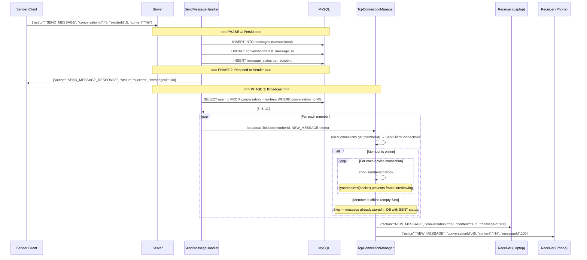

# � Real-Time Broadcast Engine

## Overview
SinChat's real-time broadcast engine delivers messages to all online conversation members within milliseconds of being sent. The engine uses `TcpConnectionManager` — a `ConcurrentHashMap<Long, Set<ClientConnection>>` — to map userIds to active TCP sockets, enabling targeted multi-device push without polling.

---

## Source Files

| Layer | File | Package | Role |
|---|---|---|---|
| **Server** | `TcpConnectionManager.java` | `com.server.tcp` | Singleton. userId→Set<ClientConnection> mapping. `broadcastToUser()` |
| **Server** | `ClientConnection.java` | `com.server.tcp` | Per-client socket. `send(JsonObject)` writes JSON line |
| **Server** | `SendMessageHandler.java` | `com.server.handler.message` | After DB save → broadcast loop |
| **Server** | `PresenceService.java` | `com.server.tcp` | Online/offline status broadcast |
| **Client** | `ChatService.java` | `com.client.service` | Reader thread + 15 event callbacks |
| **Client** | `ChatView.java` | `com.client.view` | `Platform.runLater()` → UI update |

---

## Core Data Structure

```java
// TcpConnectionManager (Singleton)
ConcurrentHashMap<Long, Set<ClientConnection>> userConnections;
// userId → all active sockets for that user (multi-device!)

Set<ClientConnection> activeConnections;  // snapshot for sweeping
```

**Multi-device example:**
```
userId=5 → {Socket_Laptop, Socket_Phone}     // 2 connections
userId=8 → {Socket_PC}                       // 1 connection
userId=11 → {}                                // offline, empty set removed
```

---

## Flow: Full Broadcast Pipeline



---

## Key Features

### 1. Multi-Device Delivery
`TcpConnectionManager` stores a `Set<ClientConnection>` per userId — not a single socket. When broadcasting:
```java
Set<ClientConnection> connections = userConnections.get(userId);
if (connections != null) {
    for (ClientConnection conn : connections) {
        conn.send(message);  // delivers to ALL devices
    }
}
```
A user logged in on both laptop and phone receives the message on BOTH devices simultaneously.

### 2. Thread-Safe Socket Writing
```java
// ClientConnection.send()
public synchronized void send(JsonObject message) {
    writer.println(gson.toJson(message));
    writer.flush();
}
```
`synchronized` prevents two virtual threads from interleaving JSON frames on the same socket.

### 3. Sender Included in Broadcast
The sender ALSO receives `NEW_MESSAGE` — this enables multi-device sync. If the sender sent from their phone, their laptop receives the broadcast too.

### 4. Offline Handling
If `userConnections.get(userId)` returns null or empty set, the broadcast is simply skipped. The message is already persisted in the database with `SENT` status. When the user comes online and fetches messages, they'll receive it.

### 5. Connection Cleanup
```java
// ClientConnection.close() → finally block
TcpConnectionManager.getInstance().removeConnection(this);
Set<ClientConnection> remaining = userConnections.get(userId);
if (remaining == null || remaining.isEmpty()) {
    PresenceService.getInstance().onUserOffline(userId);
}
```
Only when the LAST connection for a user is removed does `PresenceService` mark them offline.

---

## Event Dispatch (Client Side)

```java
// ChatService.java — background reader thread
while ((line = reader.readLine()) != null) {
    JsonObject json = gson.fromJson(line, JsonObject.class);
    String action = json.get("action").getAsString();
    
    if (json.has("requestId")) {
        // Synchronous response — complete the waiting future
        String requestId = json.get("requestId").getAsString();
        CompletableFuture<ApiResponse> future = pendingRequests.remove(requestId);
        if (future != null) future.complete(new ApiResponse(json));
    } else {
        // Asynchronous push event — dispatch to callback
        switch (action) {
            case "NEW_MESSAGE"       → onNewMessage.accept(json);
            case "TYPING_EVENT"      → onUserTyping.accept(json);
            case "USER_STATUS_EVENT" → onUserStatusChange.accept(json);
            case "EDIT_MESSAGE_EVENT" → onMessageEdited.accept(json);
            case "DELETE_MESSAGE_EVENT" → onMessageDeleted.accept(json);
            // ... 10+ more event types
        }
    }
}
```

---

## Broadcast Target Calculation

### For Messages
```java
List<Long> memberIds = conversationRepository.getMemberIds(conversationId);
for (Long memberId : memberIds) {
    TcpConnectionManager.getInstance().broadcastToUser(memberId, event);
}
```

### For Presence (Online/Offline)
```java
Set<Long> targets = new HashSet<>();
targets.addAll(userRepository.findAcceptedFriendIds(userId));    // friends
targets.addAll(conversationRepository.findConversationPeers(userId)); // conversation peers
for (Long targetId : targets) {
    TcpConnectionManager.getInstance().broadcastToUser(targetId, event);
}
```

---

## Push Event Types

| Event | Triggered By | Delivered To |
|---|---|---|
| `NEW_MESSAGE` | `SendMessageHandler` | All conversation members (incl. sender) |
| `EDIT_MESSAGE_EVENT` | `EditMessageHandler` | All conversation members |
| `DELETE_MESSAGE_EVENT` | `DeleteMessageHandler` | All conversation members |
| `MESSAGE_PINNED_EVENT` | `PinMessageHandler` | All conversation members |
| `MESSAGE_UNPINNED_EVENT` | `UnpinMessageHandler` | All conversation members |
| `MESSAGE_STATUS_EVENT` | `UpdateMessageStatusHandler` | All conversation members |
| `TYPING_EVENT` | `TypingHandler` | Other conversation members |
| `USER_STATUS_EVENT` | `PresenceService` | Friends + conversation peers |
| `USER_AVATAR_CHANGED_EVENT` | `PresenceService` | Friends + conversation peers |
| `USER_NAME_CHANGED_EVENT` | `PresenceService` | Friends + conversation peers |
| `FRIEND_REQUEST_EVENT` | `SendFriendRequestHandler` | Request receiver |
| `FRIEND_ACCEPTED_EVENT` | `RespondFriendRequestHandler` | Request sender |
| `LEFT_GROUP` | `LeaveGroupHandler` | Remaining group members |

---

## Notable Design Decisions

| Decision | Rationale |
|---|---|
| `Set<ClientConnection>` not single socket | Multi-device: phone + laptop receive simultaneously |
| Broadcast includes sender | Multi-device sync: sender's other devices also update |
| `synchronized` on socket write | Prevents JSON frame interleaving from concurrent virtual threads |
| Skip broadcast for offline users | Message already in DB; will be fetched on next `GET_MESSAGES` |
| `ConcurrentHashMap` for connection map | Thread-safe for concurrent add/remove/broadcast operations |
| Separate reader thread per client | Non-blocking; one thread handles all incoming data for a connection |
| 15 event callback consumers | Extensible; add new event types without changing dispatch logic |
| `Platform.runLater()` for UI updates | All UI changes happen on JavaFX Application Thread |

