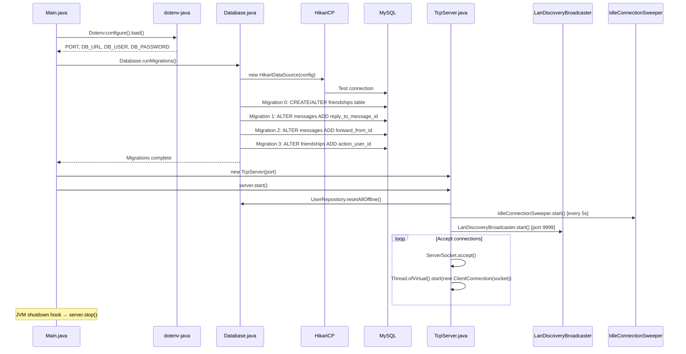
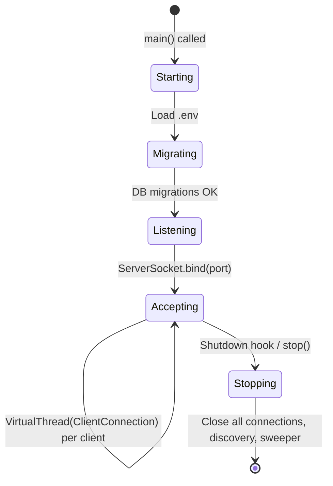

# 🖥️ Server Setup & Operation Guide

## Overview
The SinChat Server is a Java 25 TCP socket server using Virtual Threads for high concurrency. It listens on port `3000` for client connections, port `9999` for LAN discovery, and connects to MySQL via HikariCP. Configuration is loaded from `.env`, and schema migrations run automatically on startup.

---

## Source Files

| File | Package | Role |
|---|---|---|
| `Main.java` | `com.server` | Entry point: loads `.env`, runs migrations, starts `TcpServer` |
| `Database.java` | `com.server.config` | HikariCP pool setup + auto-migrations |
| `TcpServer.java` | `com.server.tcp` | ServerSocket lifecycle, Virtual Thread acceptor |
| `Dockerfile` | `Code/Server/` | Multi-stage Docker build (JDK 25 → JRE 25) |
| `pom.xml` | `Code/Server/` | Maven config: dependencies, plugins, main class |
| `.env` | `Code/Server/` | Environment variables |

---

## Startup Flow



---

## Key Configuration

### `.env` File
```env
PORT=3000
DB_URL=jdbc:mysql://host:port/database
DB_USER=username
DB_PASSWORD=password

# Optional TLS
TLS_ENABLED=true
TLS_KEYSTORE_PATH=/path/to/keystore.jks
TLS_KEYSTORE_PASSWORD=changeit
```

### HikariCP Pool Settings (`Database.java`)
| Setting | Value | Purpose |
|---|---|---|
| `maximumPoolSize` | 5 | Optimized for cloud free tier (Render) |
| `minimumIdle` | 1 | Keep one warm connection |
| `connectionTimeout` | 30,000 ms | Fail fast if DB unreachable |
| `idleTimeout` | 600,000 ms (10 min) | Recycle idle connections |
| `maxLifetime` | 1,800,000 ms (30 min) | Hard limit on connection age |
| `keepaliveTime` | 60,000 ms (1 min) | `SELECT 1` ping prevents cloud disconnect |

### Auto-Migrations
Run on every startup, idempotent (`IF NOT EXISTS`):
```sql
-- Migration 0
CREATE TABLE IF NOT EXISTS friendships (...);
ALTER TABLE friendships ADD COLUMN IF NOT EXISTS action_user_id ...;
ALTER TABLE friendships ADD COLUMN IF NOT EXISTS created_at ...;

-- Migration 1
ALTER TABLE messages ADD COLUMN IF NOT EXISTS reply_to_message_id ...;

-- Migration 2
ALTER TABLE messages ADD COLUMN IF NOT EXISTS forward_from_id ...;

-- Migration 3
ALTER TABLE friendships ADD COLUMN IF NOT EXISTS action_user_id ...;
```

---

## Running the Server

### Prerequisites
- **Java JDK 25**+
- **Maven 3.x** on PATH
- **MySQL** database accessible

### Quick Start
```bash
cd Code/Server
mvn compile
mvn exec:java -Dexec.mainClass="com.server.Main"
```
Or double-click `run_server.cmd` in the project root.

### Docker
```bash
cd Code/Server
docker build -t sinchat-server .
docker run -p 3000:3000 -p 9999:9999 --env-file .env sinchat-server
```

Multi-stage Dockerfile:
```dockerfile
FROM eclipse-temurin:25-jdk-jammy AS build   # Maven build
FROM eclipse-temurin:25-jre-jammy             # Runtime (smaller)
EXPOSE 3000 9999
ENTRYPOINT ["java", "-jar", "app.jar"]
```

### Expected Log Output
```
INFO com.server.Main - Starting SinChat Server on port 3000
INFO com.server.config.Database - Running database migrations...
INFO com.server.tcp.TcpServer - TCP Server started on port 3000
INFO com.server.tcp.TcpServer - LAN discovery started on port 9999
```

---

## Server Lifecycle



### Shutdown Hook
```java
Runtime.getRuntime().addShutdownHook(new Thread(() -> {
    server.stop();  // close discovery, sweeper, all ClientConnections, thread pool
}));
```

---

## Testing

### Run All Tests
```bash
cd Code/Server
mvn test
```

### Test Structure (16 test files)
| Package | Tests |
|---|---|
| `handler/` | `ForgotPasswordHandlerTest`, `RegisterHandlerTest` |
| `service/` | `AuthServiceTest`, `MessageServiceTest`, `ConversationServiceTest` |
| `model/` | `UserTest`, `MessageTest`, `ConversationTest`, `AttachmentTest`, `MessageStatusTest`, `FriendshipTest`, `ChangeAvatarTest` |
| `integration/` | `AuthEndpointIntegrationTest`, `EndpointIntegrationTest`, `MessageEndpointIntegrationTest`, `AdditionalEndpointsIntegrationTest` |

---

## Notable Design Decisions

| Decision | Rationale |
|---|---|
| Virtual Threads (not ThreadPool) | No pool sizing; scales to thousands of connections |
| Auto-migrations on startup | No manual SQL scripts; schema always matches code |
| HikariCP max 5 connections | Cloud free tier has connection limits; 5 is sufficient for chat workloads |
| `resetAllOffline()` on startup | Clean state after server restart; no stale online users |
| 30s connection timeout (not 10s) | Cloud DB latency can be higher than local |
| 30min max lifetime | Below MySQL's default 8-hour `wait_timeout` |
| JVM shutdown hook | Graceful cleanup on Ctrl+C or kill signal |
| Multi-stage Docker | Build JDK includes Maven; runtime JRE is smaller |
| `.env` fallback paths | Checks `./Code/Server/.env` then `./.env` for flexibility |

---

## 2. Technology Stack

| Component | Library / Framework | Version | Purpose |
|---|---|---|---|
| **Core Runtime** | Java Development Kit (JDK) | 25 | Virtual Threads, core runtime |
| **Networking** | `java.net.ServerSocket` / `Socket` | JDK built-in | Raw TCP Socket |
| **Concurrency** | Virtual Threads (`Thread.ofVirtual()`) | JDK 25 | High-concurrency connection handling |
| **Database Pool** | HikariCP | 5.1.0 | Connection pooling |
| **Database** | MySQL | 8.x | Persistent storage |
| **Security** | jBCrypt | 0.4 | Password hashing |
| **JSON** | Gson | 2.10.1 | Serialization/deserialization |
| **Configuration** | dotenv-java | 3.0.0 | `.env` file loading |
| **Logging** | SLF4J + slf4j-simple | 2.0.13 | Structured logging |
| **Build** | Apache Maven | 3.x | Build & dependency management |
| **Container** | Docker (multi-stage) | — | Deployment |
| **Testing** | JUnit Jupiter + Mockito | 5.10.2 / 5.17.0 | Unit & integration tests |

---

## 3. Directory Structure

```
Code/Server/
├── pom.xml
├── Dockerfile
├── .env
├── src/
│   ├── main/java/com/server/
│   │   ├── Main.java                          # Entry point
│   │   ├── ProfileHandler.java                # Profile get/update
│   │   ├── config/
│   │   │   └── Database.java                  # HikariCP pool + auto-migrations
│   │   ├── handler/
│   │   │   ├── TypingHandler.java             # TYPING action
│   │   │   ├── PingHandler.java               # PING heartbeat
│   │   │   ├── JoinHandler.java               # JOIN (register connection)
│   │   │   ├── auth/
│   │   │   │   ├── LoginHandler.java          # LOGIN with rate limiting
│   │   │   │   ├── RegisterHandler.java       # REGISTER with validation
│   │   │   │   ├── ForgotPasswordHandler.java # FORGOT_PASSWORD (2-step)
│   │   │   │   └── ChangePasswordHandler.java # CHANGE_PASSWORD
│   │   │   ├── message/                       # 14 message handlers
│   │   │   │   ├── SendMessageHandler.java    # SEND_MESSAGE + broadcast
│   │   │   │   ├── GetMessagesHandler.java    # GET_MESSAGES (paginated)
│   │   │   │   ├── GetConversationsHandler.java # GET_USER_CONVERSATIONS
│   │   │   │   ├── ConversationHandler.java   # GET_OR_CREATE_CONVERSATION
│   │   │   │   ├── CreateGroupHandler.java    # CREATE_GROUP
│   │   │   │   ├── GroupManagementHandler.java # MANAGE_GROUP (6 sub-actions)
│   │   │   │   ├── LeaveGroupHandler.java     # LEAVE_GROUP
│   │   │   │   ├── EditMessageHandler.java    # EDIT_MESSAGE
│   │   │   │   ├── DeleteMessageHandler.java  # DELETE_MESSAGE
│   │   │   │   ├── SearchMessagesHandler.java # SEARCH_MESSAGES
│   │   │   │   ├── SearchUserHandler.java     # SEARCH_USERS
│   │   │   │   ├── PinMessageHandler.java     # PIN_MESSAGE
│   │   │   │   ├── UnpinMessageHandler.java   # UNPIN_MESSAGE
│   │   │   │   ├── SetPinPolicyHandler.java   # SET_PIN_POLICY
│   │   │   │   └── UpdateMessageStatusHandler.java # UPDATE_MESSAGE_STATUS
│   │   │   ├── friendship/                    # 8 friendship handlers
│   │   │   │   ├── SendFriendRequestHandler.java
│   │   │   │   ├── RespondFriendRequestHandler.java
│   │   │   │   ├── GetFriendsHandler.java
│   │   │   │   ├── GetFriendRequestsHandler.java
│   │   │   │   ├── GetFriendshipStatusHandler.java
│   │   │   │   ├── UnfriendHandler.java
│   │   │   │   ├── BlockUserHandler.java
│   │   │   │   └── UnblockUserHandler.java
│   │   │   ├── changeavatar/
│   │   │   │   └── AvatarHandler.java        # CHANGE_AVATAR
│   │   │   ├── avatar/
│   │   │   │   └── GetAvatarHandler.java      # GET_AVATAR
│   │   │   └── changeName/
│   │   │       └── NameHandler.java           # CHANGE_NAME
│   │   ├── model/                             # 8 model classes
│   │   │   ├── User.java, Message.java, MessageStatus.java
│   │   │   ├── MessageSearchResult.java, Friendship.java
│   │   │   ├── Conversation.java, ChangeAvatar.java, Attachment.java
│   │   ├── repository/                        # 5 repositories
│   │   │   ├── UserRepository.java, MessageRepository.java
│   │   │   ├── MessageStatusRepository.java
│   │   │   ├── FriendshipRepository.java, ConversationRepository.java
│   │   ├── service/                           # 6 services
│   │   │   ├── AuthService.java, MessageService.java
│   │   │   ├── ConversationService.java, FriendshipService.java
│   │   │   ├── AvatarService.java, UserNameService.java
│   │   └── tcp/                               # 9 TCP infrastructure classes
│   │       ├── TcpServer.java, ClientConnection.java, Router.java
│   │       ├── TcpConnectionManager.java, PresenceService.java
│   │       ├── LanDiscoveryBroadcaster.java, IdleConnectionSweeper.java
│   │       ├── TcpServerSocketFactory.java, Connection.java
│   └── test/java/com/server/
│       ├── handler/     # Handler unit tests
│       ├── service/     # Service unit tests
│       ├── model/       # Model validation tests
│       └── integration/ # End-to-end TCP integration tests
```

---

## 4. Session & Connection Management

### TcpConnectionManager (Singleton)
Thread-safe management of online user sockets:
- `ConcurrentHashMap<Long, Set<ClientConnection>>`: userId → active connections (multi-device)
- `Set<ClientConnection>`: all active connections snapshot
- `addConnection(userId, connection)`: Registers connection (triggered by `JOIN`)
- `removeConnection(connection)`: Unregisters on disconnect
- `broadcastToUser(userId, message)`: Sends JSON to all connections of a user
- `hasOnlineConnection(userId)`: Checks if user has any active connection

### PresenceService (Singleton)
Handles online/offline state and broadcasts:
- `onUserOnline(userId)`: Sets `is_online=true`, broadcasts `USER_STATUS_EVENT` to friends + conversation peers
- `onUserOffline(userId)`: Sets `is_online=false`, `last_seen=NOW()`, broadcasts `USER_STATUS_EVENT`
- `broadcastAvatarChangeToPeers(userId, avatarUrl)`: Sends `USER_AVATAR_CHANGED_EVENT`
- `broadcastNameChangeToPeers(userId, newUsername)`: Sends `USER_NAME_CHANGED_EVENT`

### IdleConnectionSweeper
- Runs every 5 seconds
- Closes `ClientConnection` instances idle longer than `idleTimeoutMillis` (default 60 seconds)
- Prevents stale connections from consuming resources

### LanDiscoveryBroadcaster
- Listens on TCP port `9999`
- Responds `SINCHAT_SERVER:<port>\n` to any connection
- Enables client auto-discovery on LAN

---

## 5. Configuration Guide

### `.env` File (placed in `Code/Server/` or project root)
```env
PORT=3000
DB_URL=jdbc:mysql://host:port/database
DB_USER=username
DB_PASSWORD=password
```

### Optional TLS Configuration
```env
TLS_ENABLED=true
TLS_KEYSTORE_PATH=/path/to/keystore.jks
TLS_KEYSTORE_PASSWORD=changeit
```

### HikariCP Pool Tuning (`Database.java`)
| Setting | Value | Purpose |
|---|---|---|
| `maximumPoolSize` | 5 | Optimized for cloud free tier |
| `minimumIdle` | 1 | Keep one connection warm |
| `connectionTimeout` | 30,000 ms | Fail fast if DB unreachable |
| `idleTimeout` | 600,000 ms (10 min) | Recycle idle connections |
| `maxLifetime` | 1,800,000 ms (30 min) | Hard limit on connection age |
| `keepaliveTime` | 60,000 ms (1 min) | `SELECT 1` ping to prevent cloud disconnect |

### Auto-Migrations (`Database.runMigrations()`)
The server automatically applies schema migrations on startup:
- Creates `user_avatars` table for BLOB avatar storage
- Adds `reply_to_message_id` and `forward_from_id` to `messages`
- Adds `action_user_id` to `friendships`
- Ensures `friendships` table and missing columns exist

---

## 6. Running the Server

### Prerequisites
- **Java JDK 25** or later
- **Maven** on system PATH
- **MySQL** database accessible

### Quick Start
Double-click **`run_server.cmd`** in the repository root, or run manually:
```bash
cd Code/Server
mvn compile
mvn exec:java -Dexec.mainClass="com.server.Main"
```

### Docker Deployment
```bash
cd Code/Server
docker build -t sinchat-server .
docker run -p 3000:3000 --env-file .env sinchat-server
```

The Dockerfile uses multi-stage build: `eclipse-temurin:25-jdk-jammy` for build, `eclipse-temurin:25-jre-jammy` for runtime.

### Expected Log Output
```
[com.server.Main.main()] INFO com.server.Main - Starting SinChat Server on port 3000
[com.server.Main.main()] INFO com.server.config.Database - Running database migrations...
[com.server.Main.main()] INFO com.server.tcp.TcpServer - TCP Server started on port 3000
[com.server.Main.main()] INFO com.server.tcp.TcpServer - LAN discovery started on port 9999
```

---

## 7. Testing

### Running Tests
```bash
cd Code/Server
mvn test
```

### Test Structure
| Package | Contents |
|---|---|
| `handler/` | `ForgotPasswordHandlerTest`, `RegisterHandlerTest` |
| `service/` | `AuthServiceTest`, `MessageServiceTest`, `ConversationServiceTest` |
| `model/` | `UserTest`, `MessageTest`, `ConversationTest`, `AttachmentTest`, `MessageStatusTest`, `FriendshipTest`, `ChangeAvatarTest` |
| `integration/` | `AuthEndpointIntegrationTest`, `EndpointIntegrationTest`, `MessageEndpointIntegrationTest`, `AdditionalEndpointsIntegrationTest` |

---

## 8. Security Features

| Feature | Implementation |
|---|---|
| Password Hashing | BCrypt (jbcrypt 0.4) |
| SQL Injection | PreparedStatement in all repositories |
| Login Rate Limiting | 5 failed attempts → 60s lockout per username (ConcurrentHashMap) |
| OTP Security | 6-digit SecureRandom, 5-min TTL, 5 attempts max, timing-attack mitigation |
| Connection Auth | userId on connection must match request userId |
| Membership Checks | All conversation actions verify user membership |
| TLS Support | Optional SSL via TcpServerSocketFactory |
