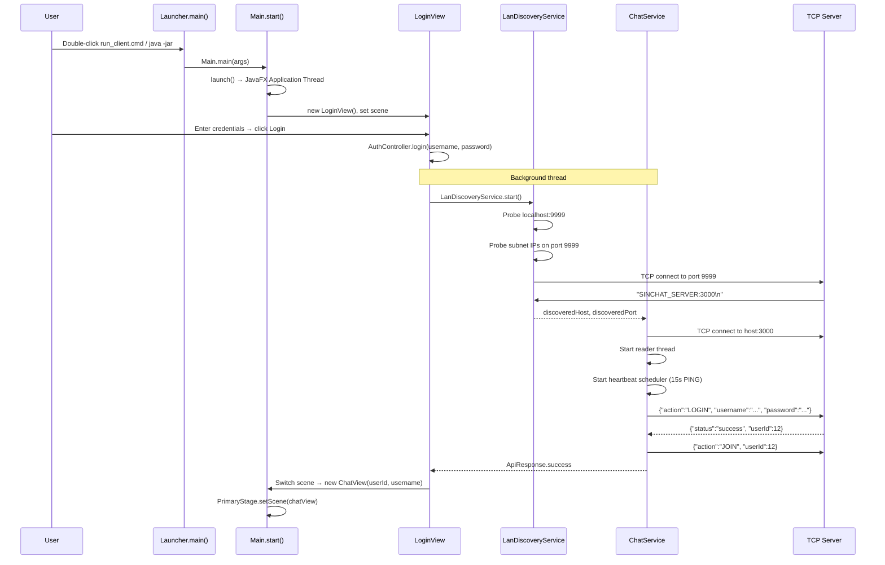

# 📱 Client Setup & Operation Guide

## Overview
The SinChat Client is a JavaFX 25 desktop application that maintains a single persistent TCP connection to the server. It auto-discovers servers on LAN via port `9999`, supports TLS, and renders a rich 3-panel chat UI with emoji, image paste, message reply/forward, and real-time event handling.

---

## Source Files

| File | Package | Role |
|---|---|---|
| `Main.java` | `com.client` | JavaFX Application entry; creates `LoginView`; `stop()` shuts down `ChatService` |
| `Launcher.java` | `com.client` | Fat JAR bootstrap (`maven-shade-plugin` main class) |
| `ChatService.java` | `com.client.service` | Singleton TCP client: ~40 API methods, 15 event callbacks, heartbeat, LAN discovery |
| `LanDiscoveryService.java` | `com.client.service` | Probes subnet on port 9999 for `SINCHAT_SERVER:<port>` |
| `ChatView.java` | `com.client.view` | Main 3-panel UI (~2000+ lines) |
| `LoginView.java` | `com.client.view` | 3-screen auth: Login, Register, Forgot Password |
| `pom.xml` | `Code/Client/` | JavaFX 25, Gson, maven-shade-plugin, javafx-maven-plugin |

---

## Startup Flow



---

## Connection Modes

### LAN Mode (`run_client_lan.cmd`)
```bash
# Uses LanDiscoveryService to find server automatically
java -Djavafx.version=25 -jar target/sinchat-client.jar
```
- Probes `localhost:9999` first
- Extracts local subnet (e.g., `192.168.1.x`)
- Scans subnet for `SINCHAT_SERVER:<port>` response
- Connects to discovered host:port

### Direct Mode (`run_client.cmd`)
```bash
# Explicit host/port via system properties
java -Dtcp.host=192.168.1.10 -Dtcp.port=3000 -jar target/sinchat-client.jar
```

### Railway Mode (`run_client_railway.cmd`)
```bash
# Connects to remote Railway deployment
java -Dtcp.host=sinchat.railway.app -Dtcp.port=3000 -jar target/sinchat-client.jar
```

### TLS Mode
```bash
java -Dtls.enabled=true -Dtcp.host=... -jar target/sinchat-client.jar
```

---

## Key Features

### ChatService: Singleton TCP Client
```java
ChatService service = ChatService.getInstance();

// Connection
service.connectAsync();          // Background thread
service.shutdown();              // Clean disconnect

// ~40 synchronous API methods (blocking)
service.login("alice", "pass");  // → ApiResponse
service.sendMessage(45, 12, "Hi!", "TEXT", null, null);
service.getConversations(12);
service.searchUsers(12, "bob");

// 15 event callbacks
service.onNewMessage = (json) -> { /* render bubble */ };
service.onUserStatusChange = (json) -> { /* update green dot */ };
service.onUserTyping = (json) -> { /* show typing indicator */ };
// ... 12 more
```

### Request-Response Engine
```java
ConcurrentHashMap<String, CompletableFuture<ApiResponse>> pendingRequests;

public ApiResponse sendRequestSync(JsonObject request) {
    String requestId = UUID.randomUUID().toString();
    request.addProperty("requestId", requestId);
    CompletableFuture<ApiResponse> future = new CompletableFuture<>();
    pendingRequests.put(requestId, future);
    writer.println(gson.toJson(request));  // Write to socket
    return future.get();                    // Block until response
}
```

### Heartbeat
```java
ScheduledExecutorService heartbeat = Executors.newSingleThreadScheduledExecutor();
heartbeat.scheduleAtFixedRate(() -> {
    if (isConnected()) sendPing();
}, 15, 15, TimeUnit.SECONDS);
```

### Hang Protection
```java
public void disconnect() {
    for (CompletableFuture<ApiResponse> f : pendingRequests.values()) {
        f.complete(new ApiResponse(500, "error", "Connection lost", null, null, null));
    }
    pendingRequests.clear();
}
```

---

## UI Layout (ChatView)

```
┌──────────┬────────────────────────────────┬──────────┐
│ LEFT     │         CENTER                  │  RIGHT   │
│ 250px    │         flex                    │  220px   │
│          │                                │          │
│ Search   │ Header: contact name, status   │ Avatar   │
│ bar      │                                │          │
│          │ Pinned messages bar (collapsible)│ Name    │
│ Contacts │                                │ Email    │
│ list     │ Message search panel (toggle)   │ Status   │
│          │                                │          │
│ Avatars  │ ┌──────────────────────────┐   │ Friend   │
│ Names    │ │ Message bubbles          │   │ buttons  │
│ Preview  │ │ • Sent: right, purple    │   │          │
│ Time     │ │ • Received: left, dark   │   │ Change   │
│ Status   │ │ • Reply preview bar      │   │ password │
│ dots     │ │ • Forward indicator      │   │          │
│          │ │ • Edited indicator       │   │ Group    │
│ Friend   │ │ • Seen-by avatars        │   │ manage   │
│ badge    │ │ • Status checkmarks      │   │          │
│          │ └──────────────────────────┘   │          │
│ New chat │                                │          │
│ button   │ Typing indicator (3s auto-hide)│          │
│          │                                │          │
│          │ [😊] [________________] [➤]    │          │
│          │ emoji  input field     send     │          │
└──────────┴────────────────────────────────┴──────────┘
```

---

## Building & Running

### Prerequisites
- **Java JDK 25**+
- **Maven 3.x** on PATH

### Compile & Run
```bash
cd Code/Client
mvn compile
mvn javafx:run
```

### Build Fat JAR
```bash
mvn package
java -jar target/sinchat-client-1.0-SNAPSHOT.jar
```
Uses `Launcher.java` as main class (required for JavaFX fat JAR classpath resolution).

### Dependencies
| Dependency | Version | Purpose |
|---|---|---|
| javafx-controls | 25 | UI controls (Button, Label, TextField, etc.) |
| javafx-swing | 25 | SwingFXUtils for image conversion |
| gson | 2.10.1 | JSON serialization |

---

## Notable Design Decisions

| Decision | Rationale |
|---|---|
| `Launcher.java` separate from `Main.java` | JavaFX fat JARs need a non-Application main class |
| `ChatService` as Singleton | Single TCP connection per client instance |
| Blocking API (`future.get()`) | Simpler than callback-based API; background threads handle blocking |
| `Platform.runLater()` for UI | All UI updates on JavaFX Application Thread |
| Programmatic UI (no FXML) | Full control over styling; no XML context switching |
| Emoji codes in message text | Standard format; no binary encoding in protocol |
| LAN discovery before every connect | Server may have changed IP; always fresh discovery |
| `stop()` shuts down ChatService | Clean disconnect on window close |
| Single `.cmd` launcher per mode | User doesn't need to remember JVM flags |
| **GUI Modules** | javafx-controls, javafx-swing | 25 |
| **JSON** | Gson | 2.10.1 |
| **Build** | Apache Maven + javafx-maven-plugin | 3.x |
| **Packaging** | maven-shade-plugin (fat JAR) | 3.6.0 |

---

## 3. Directory Structure

```
Code/Client/
├── pom.xml
├── dependency-reduced-pom.xml
└── src/main/
    ├── java/com/client/
    │   ├── Main.java                          # JavaFX Application entry
    │   ├── Launcher.java                      # Fat JAR bootstrap
    │   ├── controller/
    │   │   ├── AuthController.java            # Login/register/reset async
    │   │   └── ChatController.java            # Chat operations async
    │   ├── service/
    │   │   ├── ChatService.java               # TCP socket client (Singleton)
    │   │   └── LanDiscoveryService.java       # LAN auto-discovery
    │   ├── view/
    │   │   ├── LoginView.java                 # Auth UI (3 screens)
    │   │   ├── ChatView.java                  # Main chat UI (~2000+ lines)
    │   │   ├── CreateGroupDialog.java         # Group creation modal
    │   │   ├── ManageGroupDialog.java         # Group management modal
    │   │   ├── AvatarModalView.java           # Avatar picker/cropper
    │   │   ├── ChangePasswordDialog.java      # Change password modal
    │   │   ├── ChangeUsernameDialog.java      # Change name modal
    │   │   └── FriendRequestHistoryDialog.java # Friend request history
    │   ├── model/
    │   │   ├── User.java                      # userId, username, email, avatar, online
    │   │   ├── Message.java                   # id, conversationId, senderId, content, etc.
    │   │   ├── Conversation.java              # conversationId, displayName, lastMessage, etc.
    │   │   └── ApiResponse.java               # record(statusCode, status, message, rawBody)
    │   ├── emoji/
    │   │   ├── EmojiManager.java              # WeChat-style emoji rendering
    │   │   └── EmojiDef.java                  # Emoji definition (code, label, fileName)
    │   └── util/
    │       ├── TimeUtils.java                 # Vietnamese relative time
    │       ├── StyleConstants.java            # Centralized theme colors
    │       └── ImageUtils.java                # Image encode/decode/avatar
    └── resources/
        └── emojis/
            ├── emoji_list.json                # Emoji definitions
            ├── animated/                      # Animated GIFs
            └── static/                        # Static PNGs
```

---

## 4. TCP Network Layer (`ChatService.java`)

`ChatService` (Singleton) is the client's network controller. It replaces the old `ChatTcpClient`.

### Design Features

1. **LAN Auto-Discovery**: `LanDiscoveryService` probes `localhost:9999` then subnet addresses. Server responds `SINCHAT_SERVER:<port>\n`. If no explicit host configured, uses discovered host/port.

2. **Asynchronous Connection** (`connectAsync()`): Opens TCP socket on background thread, starts reader thread, starts heartbeat scheduler. Fires `onConnected` / `onDisconnected` callbacks.

3. **Request-Response Correlation**:
   - `sendRequestSync(JsonObject)`: Creates `CompletableFuture<ApiResponse>`, puts in `ConcurrentHashMap<String, CompletableFuture<ApiResponse>> pendingRequests` with unique `requestId`, writes JSON to socket.
   - Reader thread matches incoming `requestId` → completes future.
   - On disconnect: resolves all pending futures with error status.

4. **Heartbeat**: `ScheduledExecutorService` sends `PING` every 15 seconds.

5. **Push Event Dispatch**: Reader thread switches on `action` field:
   - `NEW_MESSAGE` → `onNewMessage` callback
   - `EDIT_MESSAGE_EVENT` → `onMessageEdited`
   - `DELETE_MESSAGE_EVENT` → `onMessageDeleted`
   - `MESSAGE_PINNED_EVENT` / `MESSAGE_UNPINNED_EVENT` → `onMessagePinned`
   - `TYPING_EVENT` → `onUserTyping`
   - `USER_STATUS_EVENT` → `onUserStatusChange`
   - `USER_AVATAR_CHANGED_EVENT` → `onUserAvatarChanged`
   - `MESSAGE_STATUS_EVENT` → `onMessageStatusChanged`
   - `LEFT_GROUP` → `onLeftGroup`
   - `FRIEND_REQUEST_EVENT` → `onFriendRequestReceived`
   - `FRIEND_ACCEPTED_EVENT` → `onFriendAccepted`

6. **~40 TCP API Methods** (all synchronous/blocking):
   - Auth: `login()`, `register()`, `requestPasswordResetCode()`, `resetPassword()`, `changePassword()`
   - Profile: `getUserProfile()`, `updateUserProfile()`, `changeAvatar()`, `getAvatar()`, `changeUsername()`
   - Conversations: `getConversations()`, `getOrCreateConversation()`, `createGroup()`, `leaveGroup()`, `manageGroup()`
   - Messages: `sendMessage()`, `getMessages()`, `searchMessages()`, `editMessage()`, `deleteMessage()`, `updateMessageStatus()`
   - Pin: `pinMessage()`, `unpinMessage()`, `setPinPolicy()`
   - Friendship: `getFriends()`, `getFriendRequests()`, `sendFriendRequest()`, `respondFriendRequest()`, `getFriendshipStatus()`, `unfriend()`, `cancelFriendRequest()`, `blockUser()`, `unblockUser()`
   - Search: `searchUsers()`
   - Real-time: `join()`, `sendPing()`, `sendTyping()`

---

## 5. Controller Layer

### `AuthController.java`
Asynchronous wrappers for auth actions:
- `runTcpCall(onStart, onLoading, tcpCall, onComplete)` — Generic async pattern: runs TCP call on background thread, callback on JavaFX thread
- `login(username, password, onSuccess, onError)`, `register(...)`, `requestPasswordResetCode(...)`, `resetPassword(...)`

### `ChatController.java`
Async wrappers for ALL chat operations. Every method follows the pattern:
```java
public void someOperation(params, Consumer<Result> onSuccess, Consumer<String> onError) {
    new Thread(() -> {
        ApiResponse response = chatService.someOperation(params);
        Platform.runLater(() -> {
            if (response.isSuccess()) onSuccess.accept(parse(response));
            else onError.accept(response.message());
        });
    }).start();
}
```
Methods include: `loadConversations`, `searchUsers`, `getOrCreateConversation`, `createGroup`, `leaveGroup`, `loadMessages`, `sendMessage` (with reply/forward overloads), `forwardMessage`, `sendTyping`, `markMessageSeen`, `markAllMessagesSeen`, `searchMessages`, `editMessage`, `deleteMessage`, `pinMessage`, `unpinMessage`, `setPinPolicy`, `manageGroup`, `changeAvatar`, `getAvatar`, `getUserProfile`, `updateUserProfile`, `changeUsername`, `changePassword`, `getFriends`, `getFriendRequests`, `sendFriendRequest`, `respondFriendRequest`, `getFriendshipStatus`, `unfriend`, `cancelFriendRequest`, `blockUser`, `unblockUser`, `join`, `subscribeToEvents`.

---

## 6. UI Views

All UI is built programmatically in Java (no FXML).

### 6.1. `LoginView.java`
`BorderPane` with dark theme. Switches between 3 form screens:
- **Login**: Username + password + eye toggle + Enter key support
- **Register**: Username + email + password + confirm password
- **Forgot Password**: Step 1 (username → code) + Step 2 (code + new password)
- Async TCP calls with loading indicators and error display

### 6.2. `ChatView.java` (~2000+ lines)
Three-panel `BorderPane` layout:

**Left Panel (250px)**:
- User search bar with contact filtering
- Scrollable conversation list: color-coded circle avatars with initials, display name, last message preview, time, online status dot (green/gray)
- Friend request badge (unread count)
- "+ New conversation" button (enter user ID or search)

**Center Panel (flexible)**:
- Header with contact name and online status
- Pinned messages bar (collapsible, max 5)
- Message search panel (toggle with button)
- Scrollable message area with infinite scroll pagination:
  - Sent bubbles: right-aligned, `#7c5cfc` background, white text
  - Received bubbles: left-aligned, `#1a1a2e` background, white text
  - Reply preview bar (shows quoted message)
  - Forward indicator
  - Edited indicator
  - Message status: single check (SENT), double check (DELIVERED), blue double check (SEEN)
  - Seen-by avatars
- Context menu on messages: Reply, Forward, Edit (own only), Delete (own only), Pin
- Typing indicator: "User is typing..." with 3-second auto-hide
- Emoji picker button → emoji grid popup
- Image paste support (Ctrl+V)
- Input field + send button (➤) + Enter key support

**Right Panel (220px)**:
- Profile photo (clickable → `AvatarModalView`)
- Display name + edit button → `ChangeUsernameDialog`
- Email display
- Online/offline status with last seen
- Friend management buttons (Add Friend, Accept/Reject, Unfriend, Block/Unblock)
- Change password button → `ChangePasswordDialog`
- Group management button (if group chat) → `ManageGroupDialog`

### 6.3. Dialogs and Modals

| Dialog | Purpose |
|---|---|
| `CreateGroupDialog` | Group name input (max 100 chars), member search, selected member chips |
| `ManageGroupDialog` | Member list with roles, rename, add/kick member, transfer admin, disband |
| `AvatarModalView` | 500×500 circular preview, zoom slider (1×–3×), drag, previously used gallery, file upload |
| `ChangePasswordDialog` | Old password + new password + confirm, client-side validation |
| `ChangeUsernameDialog` | Text input, async update, refreshes parent label |
| `FriendRequestHistoryDialog` | Two tabs: Sent / Received, avatar initials, status indicators |

---

## 7. Emoji System (`EmojiManager.java`)

WeChat-style rendering rules:
- **1 emoji alone** → large animated GIF (120×120)
- **2+ emojis only** → small static PNG inline (28×28)
- **Text + emoji(s)** → small static PNG inline (28×28)
- **Text only** → plain `Label`

Emoji definitions loaded from `emojis/emoji_list.json` in resources.

---

## 8. Utility Classes

| Class | Purpose |
|---|---|
| `TimeUtils` | Vietnamese relative time: "Vừa mới hoạt động", "X phút trước", "X giờ trước", "Offline" |
| `StyleConstants` | Centralized colors: `BG_BLACK (#000000)`, `PANEL_DARK (#111111)`, `ACCENT (#7c5cfc)`, `PIN_COLOR (#ffdd00)`, etc. Pre-built styles for inputs, buttons, links, contacts |
| `ImageUtils` | `imageToBase64Png(Image)`, `imageToPngBytes(Image)`, `createDefaultAvatarImage()`, `decodeAvatarDataUrl(String)` |

---

## 9. Running the Client

### Prerequisites
- **Java JDK 25** or later
- **Maven** on system PATH

### Quick Start
Double-click **`run_client.cmd`** in the repository root, or:
```bash
cd Code/Client
mvn compile
mvn javafx:run
```

### LAN Mode
Double-click **`run_client_lan.cmd`** — auto-discovers server on LAN via port 9999.

### Railway Mode
Double-click **`run_client_railway.cmd`** — connects to remote Railway deployment.

### Fat JAR
```bash
mvn package
java -jar target/sinchat-client-1.0-SNAPSHOT.jar
```
Uses `Launcher.java` as main class (required for JavaFX fat JAR classpath).

---

## 10. Connection Lifecycle

1. `ChatService.connectAsync()` — Opens TCP socket (uses LAN discovery if no host configured)
2. Sends `PING` every 15 seconds via `ScheduledExecutorService`
3. `IdleConnectionSweeper` on server closes connections idle >60s
4. On disconnect: resolves all pending futures with error, fires `onDisconnected` callback
5. `Main.stop()` → `ChatService.getInstanceOrNull()?.shutdown()` — clean shutdown on app exit
