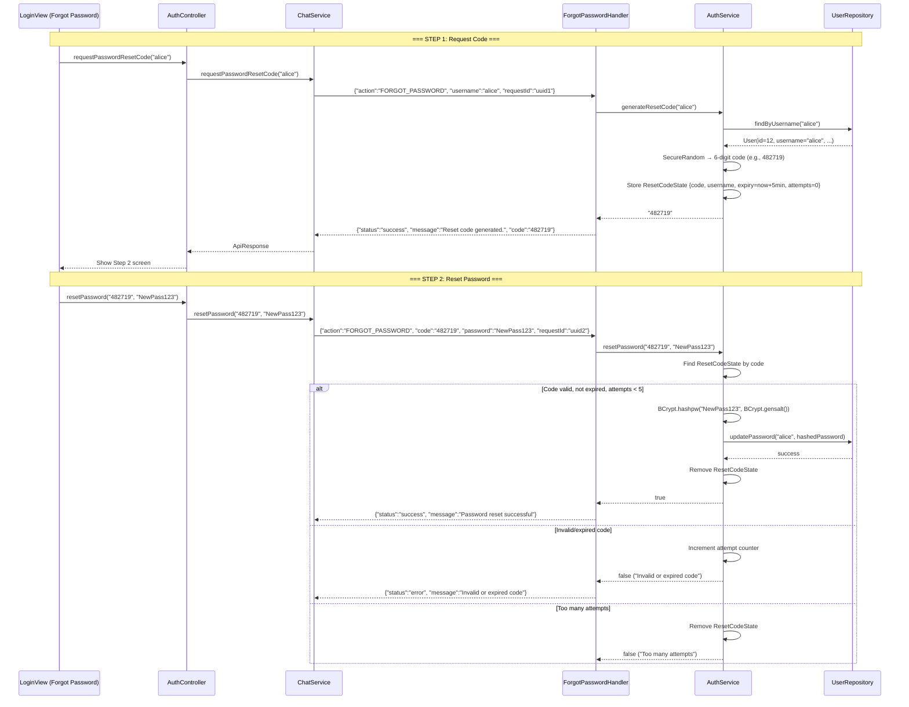

# 🔑 Forgot Password — OTP-Based Reset

## Overview
The Forgot Password feature enables account recovery via a 6-digit one-time code. The flow has two steps: (1) request a code by username, (2) submit the code with a new password. Security measures include `SecureRandom` code generation, 5-minute TTL, 5-attempt limit, and timing-attack mitigation on user lookup.

---

## Source Files

| Layer | File | Package |
|---|---|---|
| **Server Handler** | `ForgotPasswordHandler.java` | `com.server.handler.auth` |
| **Server Service** | `AuthService.java` (Singleton) | `com.server.service` |
| **Server Repository** | `UserRepository.java` | `com.server.repository` |
| **Client View** | `LoginView.java` (2 screens) | `com.client.view` |
| **Client Controller** | `AuthController.java` | `com.client.controller` |
| **Client Service** | `ChatService.java` | `com.client.service` |

---

## Flow



---

## Key Security Features

### 1. SecureRandom Code Generation
```java
SecureRandom random = new SecureRandom();
int code = 100000 + random.nextInt(900000); // 6-digit: 100000–999999
```
NOT `java.util.Random` — cryptographically secure.

### 2. Time-Limited Codes (5-Minute TTL)
```java
class ResetCodeState {
    String code;
    String username;
    long expiryTime;      // System.currentTimeMillis() + 300_000
    int attempts;          // 0–5
}
```

### 3. Brute Force Protection (5 Attempts Max)
- Each invalid attempt increments `attempts`
- At 5 failures, the code is removed entirely — user must request a new one
- This prevents an attacker from guessing a 6-digit code

### 4. Timing Attack Mitigation
```java
// Even when user not found, run BCrypt to maintain constant time
if (user == null) {
    BCrypt.checkpw("dummy", DUMMY_HASH);  // Constant-time operation
    return error("Account not found");     // Generic message
}
```
Prevents attackers from determining valid usernames by measuring response times.

### 5. User Enumeration Prevention
Both "user not found" and "code sent" responses follow the same code path. The error message is always generic: `"Account not found"` — never reveals whether the username exists.

---

## TCP Protocol

### Step 1: Request Code
```json
// Request
{"action": "FORGOT_PASSWORD", "username": "alice", "requestId": "uuid"}

// Success
{"action": "FORGOT_PASSWORD_RESPONSE", "status": "success", "message": "Reset code generated.", "code": "482719"}

// Error
{"action": "FORGOT_PASSWORD_RESPONSE", "status": "error", "message": "Account not found"}
```

### Step 2: Reset Password
```json
// Request
{"action": "FORGOT_PASSWORD", "code": "482719", "password": "NewPass123", "requestId": "uuid"}

// Success
{"action": "FORGOT_PASSWORD_RESPONSE", "status": "success", "message": "Password reset successful"}

// Errors
{"status": "error", "message": "Invalid or expired code"}
{"status": "error", "message": "Too many attempts. Please request a new code."}
{"status": "error", "message": "Missing required info (username or code/password)"}
```

---

## AuthService Internals

```java
// Singleton — single source of truth for reset codes
ConcurrentHashMap<String, ResetCodeState> resetCodes; // keyed by username

public String generateResetCode(String username) {
    User user = userRepository.findByUsername(username);
    if (user == null) {
        BCrypt.checkpw("dummy", DUMMY_HASH); // timing-attack mitigation
        return null;
    }
    String code = String.format("%06d", 100000 + secureRandom.nextInt(900000));
    resetCodes.put(username, new ResetCodeState(code, username, 
        System.currentTimeMillis() + 300_000, 0));
    return code;
}

public boolean resetPassword(String code, String newPassword) {
    ResetCodeState state = findStateByCode(code);
    if (state == null) return false;
    if (System.currentTimeMillis() > state.expiryTime) {
        resetCodes.remove(state.username);
        return false;
    }
    if (state.attempts >= 5) {
        resetCodes.remove(state.username);
        return false;
    }
    // Validate code, hash new password, update DB, remove state
}
```

---

## Distinction from CHANGE_PASSWORD

| | FORGOT_PASSWORD | CHANGE_PASSWORD |
|---|---|---|
| **Auth Required** | ❌ No (pre-login) | ✅ Yes (must be logged in) |
| **Requires Old Password** | ❌ No | ✅ Yes |
| **Uses Reset Code** | ✅ Yes (6-digit OTP) | ❌ No |
| **Handler** | `ForgotPasswordHandler` | `ChangePasswordHandler` |
| **Security Model** | OTP + TTL + attempt limit | BCrypt verification of old password |

---

## Notable Design Decisions

| Decision | Rationale |
|---|---|
| Code returned in response (not email) | Simplified for academic project; production would email/SMS |
| `SecureRandom` not `Random` | Cryptographically secure; prevents code prediction |
| 5-minute TTL | Long enough for user to check "email"; short enough to limit exposure |
| 5 attempts max | 6-digit space is 900K; 5 tries is negligible brute force risk |
| Timing-attack mitigation always runs BCrypt | Constant response time regardless of user existence |
| Generic error messages | Prevents username enumeration |
| `ConcurrentHashMap` for code storage | Thread-safe without explicit locks |

### JSON Request (Client → Server):
```json
{
  "action": "FORGOT_PASSWORD",
  "requestId": "req-forgot-2",
  "code": "482719",
  "password": "NewSecurePassword123"
}
```

### JSON Response (Server → Client):
```json
{
  "action": "FORGOT_PASSWORD_RESPONSE",
  "requestId": "req-forgot-2",
  "status": "success",
  "message": "Password reset successful"
}
```

---

## Server-Side Implementation

### Handler: `ForgotPasswordHandler.java`
**Package**: `com.server.handler.auth`

The handler determines the flow based on payload:
- If `username` is present → generates reset code (Step 1)
- If `code` is present → validates and resets password (Step 2)

### Service: `AuthService.java` (Singleton)
**Package**: `com.server.service`

**Inner class**: `ResetCodeState` — holds `code`, `username`, `expiryTime`, `attempts`

**`generateResetCode(String username)`**:
1. Looks up user via `UserRepository.findByUsername()`
2. Generates 6-digit code using `SecureRandom` (100000–999999)
3. Stores `ResetCodeState` in `ConcurrentHashMap<String, ResetCodeState>` (keyed by username)
4. TTL: 5 minutes from generation

**`resetPassword(String code, String newPassword)`**:
1. Finds `ResetCodeState` matching the code
2. Checks expiry (5-min TTL)
3. Checks attempt count (max 5)
4. Invalid code: increments attempt counter; if max reached, removes the code
5. Valid code: hashes new password with BCrypt, calls `UserRepository.updatePassword()`, removes code

### Security Features
| Feature | Implementation |
|---|---|
| **Code Generation** | `SecureRandom` (not `java.util.Random`) |
| **Code TTL** | 5 minutes |
| **Brute Force Protection** | Max 5 attempts per code |
| **Timing Attack Mitigation** | Always runs `BCrypt.checkpw()` with dummy hash even when user not found |
| **User Enumeration Prevention** | Returns same "Account not found" message regardless of whether username exists |

---

## Client-Side Implementation

### `LoginView.java`
**Package**: `com.client.view`

The login view has two screens for forgot password:
1. **Screen 1**: Username input → calls `AuthController.requestPasswordResetCode(username)`
2. **Screen 2**: Code + new password + confirm password → calls `AuthController.resetPassword(code, newPassword)`

### `AuthController.java`
**Package**: `com.client.controller`

- `requestPasswordResetCode(username, onSuccess, onError)`: Async TCP call via `ChatService.requestPasswordResetCode()`
- `resetPassword(code, newPassword, onSuccess, onError)`: Async TCP call via `ChatService.resetPassword()`

### `ChatService.java`
**Package**: `com.client.service`

- `requestPasswordResetCode(String username)`: Sends `FORGOT_PASSWORD` with only `username`
- `resetPassword(String code, String newPassword)`: Sends `FORGOT_PASSWORD` with `code` + `password`

---

## Error Handling Scenarios

1.  **User Account Not Found (Step 1)**:
    ```json
    {
      "action": "FORGOT_PASSWORD_RESPONSE",
      "requestId": "req-forgot-1",
      "status": "error",
      "message": "Account not found"
    }
    ```

2.  **Invalid or Expired Code (Step 2)**:
    ```json
    {
      "action": "FORGOT_PASSWORD_RESPONSE",
      "requestId": "req-forgot-2",
      "status": "error",
      "message": "Invalid or expired code"
    }
    ```

3.  **Too Many Attempts (Step 2)**:
    ```json
    {
      "action": "FORGOT_PASSWORD_RESPONSE",
      "requestId": "req-forgot-2",
      "status": "error",
      "message": "Too many attempts. Please request a new code."
    }
    ```

4.  **Missing Required Payload Fields**:
    ```json
    {
      "action": "FORGOT_PASSWORD_RESPONSE",
      "requestId": "req-forgot-1",
      "status": "error",
      "message": "Missing required info (username or code/password)"
    }
    ```

---

## Distinction from CHANGE_PASSWORD

| | FORGOT_PASSWORD | CHANGE_PASSWORD |
|---|---|---|
| **Auth Required** | No | Yes (must be logged in) |
| **Requires Old Password** | No | Yes |
| **Uses Reset Code** | Yes (6-digit) | No |
| **Handler** | `ForgotPasswordHandler` | `ChangePasswordHandler` |
| **Service Method** | `AuthService.resetPassword()` | `AuthService.changePassword()` |
