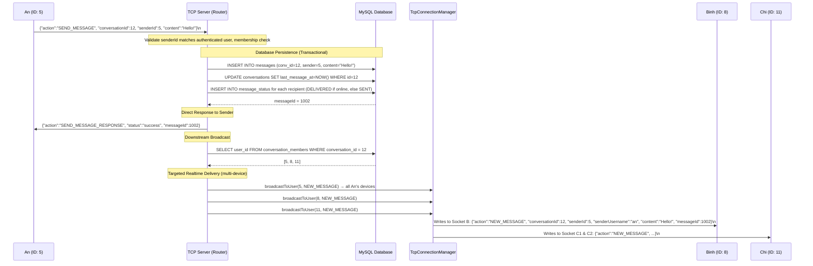
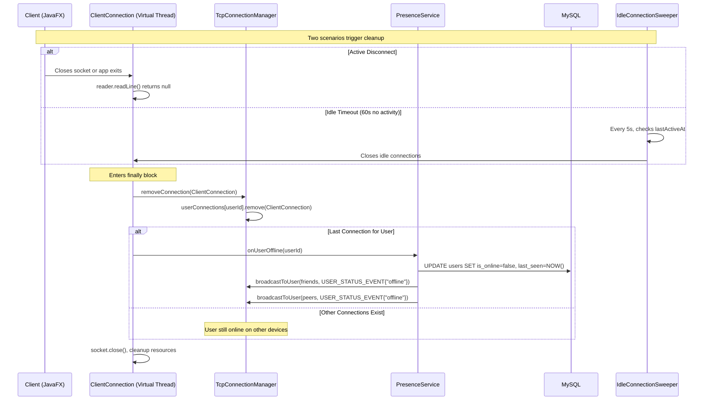
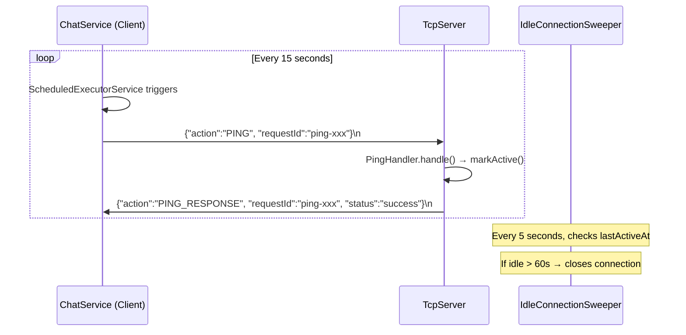

# � Connection & Session Management

## Overview
SinChat manages client connections using `TcpConnectionManager` — a thread-safe `ConcurrentHashMap<Long, Set<ClientConnection>>` that maps user IDs to active TCP sockets. The system supports multi-device login, automatic presence broadcasting, idle timeout sweeping, and graceful cleanup on disconnect. The entire lifecycle is managed: CONNECT → LOGIN → JOIN → [active] → DISCONNECT.

---

## Source Files

| File | Package | Role |
|---|---|---|
| `TcpServer.java` | `com.server.tcp` | Accepts connections, creates `ClientConnection`, starts sweeper/discovery |
| `ClientConnection.java` | `com.server.tcp` | Per-client Virtual Thread: `readLine()` loop, `close()` cleanup |
| `TcpConnectionManager.java` | `com.server.tcp` | Singleton. `addConnection()`, `removeConnection()`, `broadcastToUser()` |
| `PresenceService.java` | `com.server.tcp` | Singleton. `onUserOnline()`, `onUserOffline()`, broadcasts |
| `IdleConnectionSweeper.java` | `com.server.tcp` | Every 5s, closes connections idle >60s |
| `JoinHandler.java` | `com.server.handler` | Processes `JOIN` action |
| `PingHandler.java` | `com.server.handler` | Processes `PING`, calls `conn.markActive()` |
| `UserRepository.java` | `com.server.repository` | `updateOnlineStatus()`, `findLastSeen()`, `resetAllOffline()` |

---

## Session Data Structure

```java
// TcpConnectionManager (Singleton)
ConcurrentHashMap<Long, Set<ClientConnection>> userConnections;
// userId=5  → {socket_laptop, socket_phone}    // 2 devices
// userId=8  → {socket_pc}                       // 1 device
// userId=11 → null or empty                     // offline

Set<ClientConnection> activeConnections;  // snapshot for IdleConnectionSweeper
```

---

## Flow: Full Connection Lifecycle

```mermaid
sequenceDiagram
    participant Client as Client (JavaFX)
    participant Tcp as TcpServer
    participant CC as ClientConnection
    participant Router as Router
    participant JoinH as JoinHandler
    participant TCM as TcpConnectionManager
    participant PS as PresenceService
    participant DB as MySQL
    participant Sweeper as IdleConnectionSweeper

    Note over Client,Tcp: === PHASE 1: TCP Connection ===
    Client->>Tcp: TCP connect to port 3000
    Tcp->>Tcp: ServerSocket.accept()
    Tcp->>CC: new ClientConnection(socket)
    Tcp->>CC: Thread.ofVirtual().start(cc)
    CC->>CC: markActive() — set lastActiveAt = now

    Note over Client,DB: === PHASE 2: Authentication ===
    Client->>CC: {"action":"LOGIN", "username":"alice", "password":"..."}
    CC->>Router: route(json, this)
    Router->>Router: dispatch to LoginHandler
    Router-->>CC: {"status":"success", "userId":5}
    CC->>CC: setUserId(5)
    CC-->>Client: LOGIN_RESPONSE

    Note over Client,DB: === PHASE 3: Session Registration (JOIN) ===
    Client->>CC: {"action":"JOIN", "userId":5}
    CC->>Router: route(json, this)
    Router->>JoinH: handleTcp(request, conn)
    JoinH->>JoinH: Validate userId matches conn.getUserId()
    JoinH->>TCM: addConnection(5, this)
    TCM->>TCM: userConnections[5].add(this)
    JoinH->>PS: onUserOnline(5)
    PS->>DB: UPDATE users SET is_online=true WHERE id=5
    PS->>DB: findAcceptedFriendIds(5) → [8, 11]
    PS->>DB: findConversationPeers(5) → [8, 20]
    PS->>TCM: broadcastToUser(8, USER_STATUS_EVENT{online})
    PS->>TCM: broadcastToUser(11, USER_STATUS_EVENT{online})
    PS->>TCM: broadcastToUser(20, USER_STATUS_EVENT{online})

    Note over Client,Sweeper: === PHASE 4: Active Session ===
    loop Every 15 seconds
        Client->>CC: {"action":"PING", "requestId":"..."}
        CC->>CC: markActive() — reset lastActiveAt
        CC-->>Client: PING_RESPONSE
    end

    loop Every 5 seconds
        Sweeper->>Sweeper: Check all active connections
        alt lastActiveAt > 60s ago
            Sweeper->>CC: close()
        end
    end

    Note over Client,DB: === PHASE 5: Disconnect ===
    alt Clean disconnect
        Client->>Client: ChatService.shutdown()
        Client->>CC: Socket close
    else Idle timeout
        Sweeper->>CC: close()
    else Network failure
        CC->>CC: readLine() throws IOException
    end
    
    CC->>CC: finally block
    CC->>TCM: removeConnection(this)
    TCM->>TCM: userConnections[5].remove(this)
    
    alt Last connection for user
        CC->>PS: onUserOffline(5)
        PS->>DB: UPDATE users SET is_online=false, last_seen=NOW()
        PS->>DB: findAcceptedFriendIds(5) + findConversationPeers(5)
        PS->>TCM: broadcastToUser(all, USER_STATUS_EVENT{offline, lastSeen})
    else Other connections remain
        Note over TCM: User still online on other device; no broadcast
    end
    
    CC->>CC: socket.close(), reader.close(), writer.close()
```

---

## Key Operations

### addConnection (JOIN)
```java
public void addConnection(Long userId, ClientConnection conn) {
    userConnections.computeIfAbsent(userId, k -> ConcurrentHashMap.newKeySet()).add(conn);
    activeConnections.add(conn);
}
```

### removeConnection (Disconnect)
```java
public void removeConnection(ClientConnection conn) {
    Long userId = conn.getUserId();
    if (userId != null) {
        Set<ClientConnection> conns = userConnections.get(userId);
        if (conns != null) {
            conns.remove(conn);
            if (conns.isEmpty()) {
                userConnections.remove(userId);           // Last connection
                PresenceService.getInstance().onUserOffline(userId);
            }
        }
    }
    activeConnections.remove(conn);
}
```

### broadcastToUser (Push)
```java
public void broadcastToUser(Long userId, JsonObject message) {
    Set<ClientConnection> conns = userConnections.get(userId);
    if (conns != null) {
        for (ClientConnection conn : conns) {
            conn.send(message);  // synchronized — prevents frame interleaving
        }
    }
}
```

---

## IdleConnectionSweeper

```java
// Runs every 5 seconds
public void start() {
    Thread.ofVirtual().start(() -> {
        while (!stopped) {
            Thread.sleep(5000);
            long now = System.currentTimeMillis();
            for (ClientConnection conn : getActiveConnectionsSnapshot()) {
                if (now - conn.getLastActiveAt() > idleTimeoutMillis) {  // 60_000ms
                    logger.info("Closing idle connection: {}", conn.getRemoteAddress());
                    conn.close();  // triggers removeConnection → PresenceService
                }
            }
        }
    });
}
```

The `lastActiveAt` timestamp is updated by `markActive()` which is called on EVERY received message — not just PING. This means any activity keeps the connection alive.

---

## PresenceService Broadcasts

| Method | DB Update | Broadcast Target | Event |
|---|---|---|---|
| `onUserOnline(userId)` | `is_online=true` | Friends + conversation peers | `USER_STATUS_EVENT {status:"online"}` |
| `onUserOffline(userId)` | `is_online=false, last_seen=NOW()` | Friends + conversation peers | `USER_STATUS_EVENT {status:"offline", lastSeen}` |
| `broadcastAvatarChangeToPeers(userId, url)` | — | Friends + conversation peers | `USER_AVATAR_CHANGED_EVENT` |
| `broadcastNameChangeToPeers(userId, name)` | — | Friends + conversation peers | `USER_NAME_CHANGED_EVENT` |

Target deduplication: friends and conversation peers may overlap; `HashSet` ensures each user receives exactly one event.

---

## TCP Protocol

### JOIN
```json
{"action": "JOIN", "userId": 5}
```
No response — silent registration. Triggers `PresenceService.onUserOnline()`.

### PING
```json
// Request
{"action": "PING", "requestId": "uuid"}

// Response
{"action": "PING_RESPONSE", "requestId": "uuid", "status": "success"}
```

---

## Notable Design Decisions

| Decision | Rationale |
|---|---|
| `Set<ClientConnection>` per user | Multi-device: phone + laptop simultaneously |
| `onUserOffline` only on LAST disconnect | Accurate presence; no flickering |
| `markActive()` on ALL messages | Any activity resets idle timer; PING is just fallback |
| 5s sweeper + 60s timeout | 4×PING interval tolerance; max 65s cleanup delay |
| `resetAllOffline()` on server start | Clean state after crash/restart; no stale online users |
| `ConcurrentHashMap` for connections | Lock-free reads for broadcast; thread-safe writes |
| Deduplicated broadcast targets | Friends + peers may overlap; each user gets one event |
| Virtual Thread for sweeper | Lightweight; consistent with connection threads |

---

## 2. Identity Registration (JOIN Flow)

```mermaid
sequenceDiagram
    participant Client as Client (JavaFX)
    participant Server as TCP Server (Virtual Thread)
    participant Manager as TcpConnectionManager
    participant Presence as PresenceService
    participant DB as MySQL

    Note over Client,Server: Connection Establishment
    Client->>Server: Opens TCP socket to port 3000
    Server->>Server: Accepts socket, wraps in ClientConnection, starts Virtual Thread
    
    Note over Client,Server: Authentication
    Client->>Server: {"action":"LOGIN", "username":"an", "password":"..."}
    Server->>Client: {"action":"LOGIN_RESPONSE", "status":"success", "userId":5}
    
    Note over Client,Server: Identity Registration (JOIN)
    Client->>Server: {"action":"JOIN", "userId":5}
    Server->>Manager: addConnection(5, ClientConnection)
    Manager->>Manager: userConnections[5].add(ClientConnection)
    Server->>Presence: onUserOnline(5)
    Presence->>DB: UPDATE users SET is_online=true WHERE id=5
    Presence->>Manager: broadcastToUser(friendIds, USER_STATUS_EVENT)
    Presence->>Manager: broadcastToUser(peerIds, USER_STATUS_EVENT)
    
    Note over Server: An (ID: 5) is online; all friends/peers notified
```

---

## 3. Realtime Downstream Messaging



---

## 4. Connection Loss & Cleanup Flow



---

## 5. Heartbeat (Ping/Pong) Flow



---

## 6. Source Code Mapping Reference

| Operation | Class | Method |
|---|---|---|
| **Connection Accept** | `com.server.tcp.TcpServer` | `start()` |
| **Read Loop** | `com.server.tcp.ClientConnection` | `run()` |
| **Request Routing** | `com.server.tcp.Router` | `route()` |
| **Session Cache Add** | `com.server.tcp.TcpConnectionManager` | `addConnection()` |
| **Session Cache Remove** | `com.server.tcp.TcpConnectionManager` | `removeConnection()` |
| **Realtime Broadcast** | `com.server.tcp.TcpConnectionManager` | `broadcastToUser()` |
| **Online Presence** | `com.server.tcp.PresenceService` | `onUserOnline()` |
| **Offline Presence** | `com.server.tcp.PresenceService` | `onUserOffline()` |
| **Message Save** | `com.server.repository.MessageRepository` | `save()` |
| **Conversation Members** | `com.server.repository.ConversationRepository` | `getMemberIds()` |
| **Idle Sweeping** | `com.server.tcp.IdleConnectionSweeper` | `start()` |
| **LAN Discovery** | `com.server.tcp.LanDiscoveryBroadcaster` | `start()` |
| **Client Heartbeat** | `com.client.service.ChatService` | `ScheduledExecutorService` |
| **Client Read Loop** | `com.client.service.ChatService` | Background reader thread |
