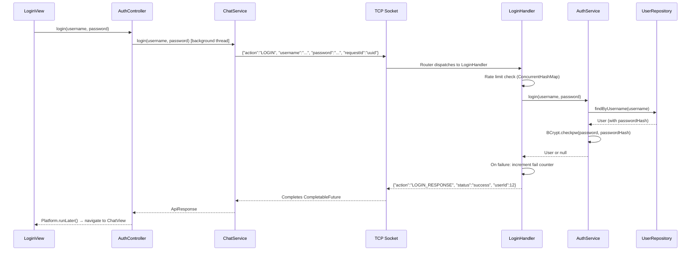

# 🔐 Login & Authentication System

## Overview
The Login system handles user authentication over TCP. It verifies credentials using BCrypt password hashing and implements rate limiting to prevent brute-force attacks.

---

## Architecture
```
Client (LoginView) → AuthController → ChatService → TCP Socket
    → Router → LoginHandler → AuthService → UserRepository → MySQL
```

## Source Files

| Layer | File | Package |
|---|---|---|
| **Client View** | `LoginView.java` | `com.client.view` |
| **Client Controller** | `AuthController.java` | `com.client.controller` |
| **Client Service** | `ChatService.java` | `com.client.service` |
| **Server Handler** | `LoginHandler.java` | `com.server.handler.auth` |
| **Server Service** | `AuthService.java` | `com.server.service` |
| **Server Repository** | `UserRepository.java` | `com.server.repository` |

---

## Flow



---

## Key Features

### 1. Rate Limiting (Brute Force Protection)
Implemented in `LoginHandler.java` using `ConcurrentHashMap<String, long[]>`:
- **Max attempts**: 5 failed logins
- **Lockout duration**: 60 seconds
- **Keyed by**: username (not IP — protects the account, not the connection)
- **Auto-cleanup**: Expired lockouts are automatically removed on next attempt format:
  ```java
  long[] = [attemptCount, lockoutExpiryTimestamp]
  ```
- Error message includes remaining seconds: `"Too many failed attempts. Try again in X seconds."`

### 2. BCrypt Password Verification
- Stored as `BCrypt.hashpw(password, BCrypt.gensalt())` during registration
- Verified with `BCrypt.checkpw(plainPassword, storedHash)`
- BCrypt automatically handles salt extraction from the stored hash
- Work factor: default (10 rounds of key stretching)

### 3. Input Validation
- Username/password max length: 100 characters each
- Rejects empty/missing fields with descriptive errors
- Logs all attempts (success and failure) with remote address

### 4. Connection Binding
After successful login, the `ClientConnection` stores the `userId`:
```java
conn.setUserId(user.getId());
```
This enables subsequent authenticated actions (SEND_MESSAGE, etc.) to verify the sender matches the connection.

### 5. Security Logging
```java
logger.info("[LOGIN ATTEMPT] Remote={} | Username={} | Login attempt", ...)
logger.warn("[LOGIN RATE_LIMITED] Remote={} | Username={} | Account temporarily locked", ...)
```
Logs never contain passwords.

---

## TCP Protocol

### Request
```json
{
  "action": "LOGIN",
  "requestId": "uuid",
  "username": "john_doe",
  "password": "MyP@ssw0rd"
}
```

### Success Response
```json
{
  "action": "LOGIN_RESPONSE",
  "requestId": "uuid",
  "status": "success",
  "userId": 12,
  "username": "john_doe"
}
```

### Error Responses
```json
{"status": "error", "message": "Missing username or password"}
{"status": "error", "message": "Invalid username or password"}
{"status": "error", "message": "Too many failed attempts. Try again in 45 seconds."}
```

---

## After Login: JOIN
After successful login, the client MUST send `JOIN` to register the connection in `TcpConnectionManager` and trigger `PresenceService.onUserOnline()`.

```json
{"action": "JOIN", "userId": 12}
```

This enables:
- Receiving real-time `NEW_MESSAGE` pushes
- Online status broadcast to friends
- Multi-device connection tracking

---

## Notable Design Decisions

| Decision | Rationale |
|---|---|
| Rate limit by username, not IP | Protects the account regardless of attacker's IP |
| 60-second lockout | Long enough to deter brute force, short enough for legitimate user retry |
| BCrypt over SHA/Argon2 | Industry standard, built-in salt, no additional dependencies needed beyond jbcrypt |
| Store userId on connection | Enables stateless handler validation (no session tokens needed) |
| Separate JOIN step | Decouples authentication from session registration; supports re-login on same connection |
