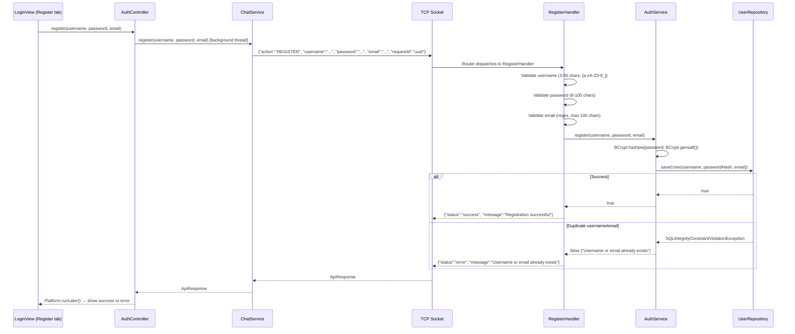

# 📝 Registration System

## Overview
The Registration system handles new user account creation over TCP. It performs strict input validation and uses BCrypt for secure password storage. Duplicate detection is handled via database constraint violation.

---

## Architecture
```
Client (LoginView) → AuthController → ChatService → TCP Socket
    → Router → RegisterHandler → AuthService → UserRepository → MySQL
```

## Source Files

| Layer | File | Package |
|---|---|---|
| **Client View** | `LoginView.java` (Register screen) | `com.client.view` |
| **Client Controller** | `AuthController.java` | `com.client.controller` |
| **Client Service** | `ChatService.java` | `com.client.service` |
| **Server Handler** | `RegisterHandler.java` | `com.server.handler.auth` |
| **Server Service** | `AuthService.java` | `com.server.service` |
| **Server Repository** | `UserRepository.java` | `com.server.repository` |

---

## Flow



---

## Validation Rules

### Username Validation
| Rule | Detail |
|---|---|
| Min length | 3 characters |
| Max length | 50 characters |
| Allowed chars | `[a-zA-Z0-9_]` (letters, numbers, underscores) |
| Trimmed | Leading/trailing whitespace removed |

### Password Validation
| Rule | Detail |
|---|---|
| Min length | 6 characters |
| Max length | 100 characters |
| Storage | BCrypt hash with random salt |
| Plaintext | Never logged or stored |

### Email Validation
| Rule | Detail |
|---|---|
| Regex | `^[A-Za-z0-9+_.-]+@[A-Za-z0-9.-]+\.[A-Za-z]{2,}$` |
| Max length | 100 characters |
| Trimmed | Leading/trailing whitespace removed |

---

## Key Features

### 1. BCrypt Password Hashing
```java
String hashedPassword = BCrypt.hashpw(password, BCrypt.gensalt());
```
- Salt is randomly generated and embedded in the hash string
- No need to store salt separately
- Same algorithm used for login verification

### 2. Duplicate Detection via Database Constraint
The `users` table has `UNIQUE` constraints on `username` and `email`. Instead of pre-checking (which would require 2 extra queries), the handler catches `SQLIntegrityConstraintViolationException`:
```java
try {
    authService.register(username, password, email);
} catch (SQLIntegrityConstraintViolationException e) {
    return "Username or email already exists";
}
```
This is more efficient (1 query instead of 3) and handles race conditions correctly.

### 3. Input Sanitization
- Username and email are trimmed
- Validation happens BEFORE any database call
- All validation errors return specific, descriptive messages

---

## TCP Protocol

### Request
```json
{
  "action": "REGISTER",
  "requestId": "uuid",
  "username": "new_user",
  "password": "SecurePass123",
  "email": "user@example.com"
}
```

### Success Response
```json
{
  "action": "REGISTER_RESPONSE",
  "requestId": "uuid",
  "status": "success",
  "message": "Registration successful"
}
```

### Error Responses
```json
{"status": "error", "message": "Username must be between 3 and 50 characters"}
{"status": "error", "message": "Username can only contain letters, numbers, and underscores"}
{"status": "error", "message": "Password must be at least 6 characters"}
{"status": "error", "message": "Invalid email format"}
{"status": "error", "message": "Username or email already exists"}
```

---

## Client-Side UI
The `LoginView` has a Register tab with:
- Username input field
- Email input field
- Password input field (with eye toggle for show/hide)
- Confirm password field (client-side match validation)
- "Register" button
- Link to switch back to Login screen
- Loading indicator during async TCP call
- Error/success message display

---

## Notable Design Decisions

| Decision | Rationale |
|---|---|
| Catch SQLIntegrityConstraintViolationException | Avoids race condition from check-then-insert; single DB round-trip |
| BCrypt.gensalt() default work factor (10) | Good balance of security vs. registration speed |
| Trim username/email | Prevents accidental whitespace issues |
| No email verification | Simplified for academic project; production would need email confirmation |
| Min password 6 chars | Aligns with common minimum, sufficient for BCrypt protection |
