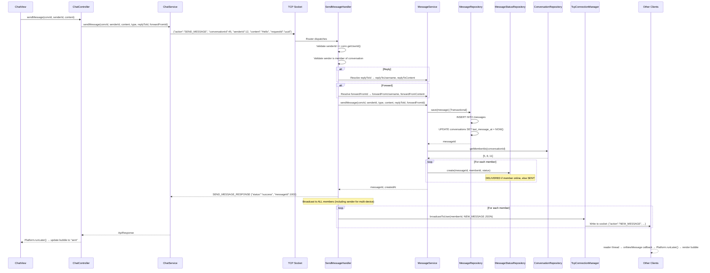

# 💬 Real-Time Messaging System

## Overview
The real-time messaging system is the core of SinChat. When a user sends a message, the server persists it to the database, returns a confirmation to the sender, and broadcasts it to all online conversation members via their active TCP connections — all in a single handler call.

---

## Architecture
```
ChatView → ChatController → ChatService → TCP Socket
    → Router → SendMessageHandler → MessageService → MessageRepository (INSERT)
                                   → TcpConnectionManager.broadcastToUser() (PUSH)
```

## Source Files

| Layer | File | Package |
|---|---|---|
| **Client View** | `ChatView.java` (message input, bubble rendering) | `com.client.view` |
| **Client Controller** | `ChatController.java` | `com.client.controller` |
| **Client Service** | `ChatService.java` | `com.client.service` |
| **Server Handler** | `SendMessageHandler.java` | `com.server.handler.message` |
| **Server Service** | `MessageService.java` | `com.server.service` |
| **Server Repository** | `MessageRepository.java` | `com.server.repository` |
| **Server Repository** | `MessageStatusRepository.java` | `com.server.repository` |
| **Server Repository** | `ConversationRepository.java` | `com.server.repository` |
| **Connection Manager** | `TcpConnectionManager.java` | `com.server.tcp` |

---

## Complete Flow



---

## Message Types

| Type | Description | Content Limit |
|---|---|---|
| `TEXT` | Plain text message (default) | 10,000 chars |
| `IMAGE` | Base64-encoded image data URL | 7,000,000 chars (~5MB) |
| `VIDEO` | Video message (metadata only) | 10,000 chars |
| `VOICE` | Voice message (metadata only) | 10,000 chars |
| `FILE` | File attachment message | 10,000 chars |
| `SYSTEM` | System-generated messages | 10,000 chars |

---

## Security Checks (3 Layers)

### Layer 1: Authentication
```java
Long connectedUserId = conn.getUserId();
if (connectedUserId == null || senderId != connectedUserId) {
    return error("Unauthorized: senderId mismatch");
}
```
The `senderId` in the request MUST match the userId stored on the connection (set during LOGIN).

### Layer 2: Membership
```java
List<Long> memberIds = conversationRepository.getMemberIds(conversationId);
if (!memberIds.contains(senderId)) {
    return error("Unauthorized: not a member of this conversation");
}
```
User must be a member of the conversation they're sending to.

### Layer 3: Content Limits
```java
int lenLimit = (type == IMAGE) ? 7_000_000 : MAX_MESSAGE_LENGTH;
if (content.length() > lenLimit) {
    return error("Message too long");
}
```

---

## Reply & Forward Support

### Reply (`replyToId`)
When replying to a message, the server:
1. Fetches the original message by `replyToId`
2. Resolves `replyToUsername` and `replyToContent`
3. Includes these in the `NEW_MESSAGE` broadcast
4. Client renders a reply preview bar above the message bubble

### Forward (`forwardFromId`)
When forwarding a message:
1. Fetches the original message by `forwardFromId`
2. Resolves `forwardFromUsername` and `forwardFromContent`
3. Empty content is allowed (the forwarded message IS the content)
4. Client renders a forward indicator

---

## Message Status Initialization
After saving the message, the server initializes `message_status` for EACH recipient:
- **DELIVERED**: Recipient is online (`is_online = true`)
- **SENT**: Recipient is offline

This enables the sender to see delivery status immediately.

---

## TCP Protocol

### Request
```json
{
  "action": "SEND_MESSAGE",
  "requestId": "uuid",
  "conversationId": 45,
  "senderId": 12,
  "content": "Hello!",
  "type": "TEXT",
  "replyToId": null,
  "forwardFromId": null
}
```

### Direct Response (to sender)
```json
{
  "action": "SEND_MESSAGE_RESPONSE",
  "requestId": "uuid",
  "status": "success",
  "messageId": 1002,
  "conversationId": 45,
  "senderId": 12,
  "content": "Hello!",
  "createdAt": "2026-07-03 14:30:00"
}
```

### Broadcast (to all members)
```json
{
  "action": "NEW_MESSAGE",
  "conversationId": 45,
  "senderId": 12,
  "senderUsername": "alice",
  "content": "Hello!",
  "messageId": 1002,
  "type": "TEXT",
  "createdAt": "2026-07-03 14:30:00"
}
```

With reply:
```json
{
  "...": "...",
  "replyToId": 1001,
  "replyToUsername": "bob",
  "replyToContent": "Hi there!"
}
```

---

## Notable Design Decisions

| Decision | Rationale |
|---|---|
| Transactional save (message + last_message_at) | Atomicity: both succeed or both fail |
| Status initialized per-recipient | Immediate delivery status visibility |
| Broadcast includes sender | Supports multi-device sync (phone + laptop) |
| IMAGE type gets 7M char limit | Base64-encoded images are larger; allows ~5MB images |
| Empty content allowed for forward-only | Forwarded message content serves as the payload |
| 3-layer security check | Defense in depth: auth → membership → limits |
