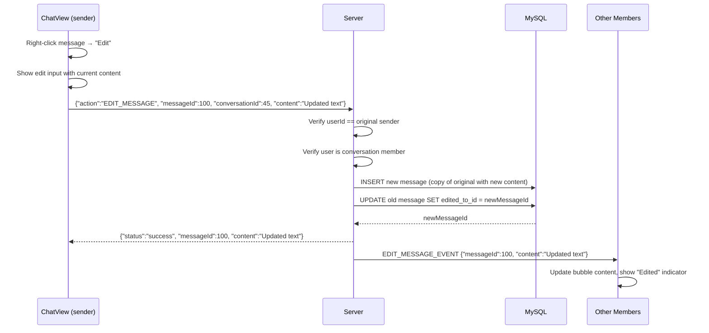
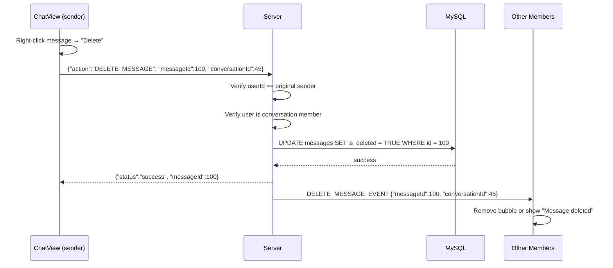

# ✏️ Message Edit & Delete System

## Overview
SinChat supports editing and soft-deleting messages after they've been sent. Both operations broadcast real-time events so all conversation members see changes instantly. Only the original sender can edit or delete their own messages.

---

## Source Files

| Layer | File | Package |
|---|---|---|
| **Server Handler** | `EditMessageHandler.java` | `com.server.handler.message` |
| **Server Handler** | `DeleteMessageHandler.java` | `com.server.handler.message` |
| **Server Service** | `MessageService.java` | `com.server.service` |
| **Server Repository** | `MessageRepository.java` | `com.server.repository` |
| **Client View** | `ChatView.java` (context menu, rendering) | `com.client.view` |
| **Client Controller** | `ChatController.java` | `com.client.controller` |
| **Client Service** | `ChatService.java` | `com.client.service` |

---

## Edit Message

### Flow



### How Edit Works (Technical Detail)

Instead of modifying the original message row, the system uses a **copy-on-edit** pattern:

1. **Create new message**: A new row is inserted into `messages` with the updated content, same `conversationId`, same `senderId`, same `type`
2. **Link old → new**: The original message's `edited_to_id` column is set to the new message's ID
3. **Query filtering**: When fetching messages, rows where `edited_to_id IS NOT NULL` are excluded (only the latest version is shown)
4. **Broadcast**: `EDIT_MESSAGE_EVENT` is sent to all conversation members with the old `messageId` and new `content`

```sql
-- Original message becomes a "pointer" to the edited version
UPDATE messages SET edited_to_id = 101 WHERE id = 100;

-- New message with updated content
INSERT INTO messages (conversation_id, sender_id, content, type, ...) VALUES (45, 12, 'Updated text', 'TEXT', ...);

-- Query filters out "old versions"
SELECT * FROM messages WHERE conversation_id = 45 AND edited_to_id IS NULL;
```

### Security
```java
// Only the original sender can edit
if (originalMessage.getSenderId() != userId) {
    throw new SecurityException("Only the sender can edit this message");
}
```

### Client UI
- Right-click context menu on own messages shows "Edit"
- Clicking "Edit" opens an inline edit bar with the current content
- Pressing Enter saves; pressing Escape cancels
- On `EDIT_MESSAGE_EVENT` received: update the bubble content and show "(đã chỉnh sửa)" indicator

---

## Delete Message

### Flow



### How Delete Works (Soft Delete)

The system uses **soft delete** — the message row is never physically removed:

```sql
UPDATE messages SET is_deleted = TRUE WHERE id = 100;
```

- Deleted messages are excluded from `GET_MESSAGES` queries
- The data remains for audit/recovery purposes
- Only the original sender can delete

### Security
```java
// Only the original sender can delete
if (originalMessage.getSenderId() != userId) {
    throw new SecurityException("Only the sender can delete this message");
}
```

### Client UI
- Right-click context menu on own messages shows "Delete"
- On `DELETE_MESSAGE_EVENT` received: remove the bubble or show "Tin nhắn đã bị xóa"
- Deleted message is removed from all members' views in real-time

---

## Common Security Checks (Both Edit & Delete)

| Check | Edit | Delete |
|---|---|---|
| User authenticated (`conn.getUserId() != null`) | ✅ | ✅ |
| User is conversation member | ✅ | ✅ |
| User is original sender | ✅ | ✅ |
| Message exists | ✅ | ✅ |
| Content not empty (edit only) | ✅ | N/A |

---

## TCP Protocol

### Edit Request
```json
{
  "action": "EDIT_MESSAGE",
  "requestId": "uuid",
  "messageId": 100,
  "conversationId": 45,
  "content": "Updated message text"
}
```

### Edit Broadcast
```json
{
  "action": "EDIT_MESSAGE_EVENT",
  "messageId": 100,
  "conversationId": 45,
  "content": "Updated message text"
}
```

### Delete Request
```json
{
  "action": "DELETE_MESSAGE",
  "requestId": "uuid",
  "messageId": 100,
  "conversationId": 45
}
```

### Delete Broadcast
```json
{
  "action": "DELETE_MESSAGE_EVENT",
  "messageId": 100,
  "conversationId": 45
}
```

---

## Notable Design Decisions

| Decision | Rationale |
|---|---|
| Copy-on-edit (new row, link old→new) | Preserves message history; no data loss; enables "view edit history" in future |
| Soft delete (`is_deleted = TRUE`) | Recoverable; audit trail; no foreign key cascade issues |
| Only sender can edit/delete | Standard messaging app behavior (Telegram, WhatsApp) |
| Real-time broadcast to ALL members | Everyone sees edits/deletes instantly |
| Old `messageId` preserved in events | Client updates the existing bubble in-place |
