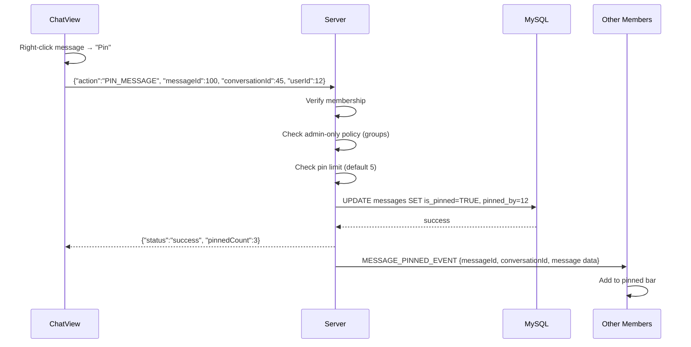

# 📌 Message Pin System

## Overview
The pin system allows conversation members to pin important messages. Pinned messages appear in a collapsible bar at the top of the chat. Groups can enable admin-only pinning. A configurable limit (default 5) prevents excessive pinning.

---

## Source Files

| Layer | File | Package |
|---|---|---|
| **Server Handler** | `PinMessageHandler.java` | `com.server.handler.message` |
| **Server Handler** | `UnpinMessageHandler.java` | `com.server.handler.message` |
| **Server Handler** | `SetPinPolicyHandler.java` | `com.server.handler.message` |
| **Server Repository** | `MessageRepository.java` | `com.server.repository` |
| **Server Repository** | `ConversationRepository.java` | `com.server.repository` |
| **Client View** | `ChatView.java` (pinned bar, context menu) | `com.client.view` |
| **Client Controller** | `ChatController.java` | `com.client.controller` |

---

## Flow: Pin a Message



---

## Permission Model

### Private Conversations
- **Any member** can pin/unpin
- No admin/owner concept in private chats

### Group Conversations
- **Default**: Any member can pin
- **Admin-only mode**: Only users with role `ADMIN` or `OWNER` can pin
- Policy toggled via `SET_PIN_POLICY` action (admin/owner only)

```java
String convType = conversationRepository.getConversationType(conversationId);
if ("GROUP".equals(convType)) {
    boolean adminOnly = conversationRepository.isAdminOnlyPinEnabled(conversationId);
    if (adminOnly) {
        String role = conversationRepository.getUserRoleInConversation(conversationId, userId);
        if (!"ADMIN".equals(role) && !"OWNER".equals(role)) {
            return error("Chỉ quản trị viên mới được ghim tin nhắn");
        }
    }
}
```

---

## Pin Limit

- **Default limit**: 5 pinned messages per conversation
- **Configurable**: Stored in `conversation_roles` or conversation settings
- **Limit check**: Before pinning, count existing pinned messages

```java
int limit = conversationRepository.getPinLimit(conversationId);
int current = messageRepository.countPinned(conversationId);
if (current >= limit) {
    return error("Pin limit reached");
}
```

---

## Client UI

### Pinned Messages Bar
- Collapsible bar at the top of the chat (below header)
- Shows up to 5 pinned messages (most recent first)
- Each shows: sender name + truncated content
- Click to scroll to the original message
- X button to unpin

### Context Menu
- Right-click any message → "Pin" / "Unpin"
- Only visible if user has pin permission

### Real-Time Updates
- `MESSAGE_PINNED_EVENT` → add to pinned bar
- `MESSAGE_UNPINNED_EVENT` → remove from pinned bar

---

## TCP Protocol

### Pin Message
```json
// Request
{"action": "PIN_MESSAGE", "messageId": 100, "conversationId": 45, "userId": 12, "requestId": "uuid"}

// Response
{"action": "PIN_MESSAGE_RESPONSE", "status": "success", "message": "Đã ghim tin nhắn", "pinnedCount": 3}

// Broadcast
{"action": "MESSAGE_PINNED_EVENT", "messageId": 100, "conversationId": 45, ...message data}
```

### Unpin Message
```json
// Request
{"action": "UNPIN_MESSAGE", "messageId": 100, "conversationId": 45, "userId": 12, "requestId": "uuid"}

// Broadcast
{"action": "MESSAGE_UNPINNED_EVENT", "messageId": 100, "conversationId": 45}
```

### Set Pin Policy
```json
// Request
{"action": "SET_PIN_POLICY", "conversationId": 45, "userId": 12, "adminOnly": true, "requestId": "uuid"}

// Response
{"action": "SET_PIN_POLICY_RESPONSE", "status": "success", "message": "Pin policy updated"}
```

---

## Error Cases

| Error | Trigger |
|---|---|
| "Bạn không phải là thành viên..." | User not in conversation |
| "Chỉ quản trị viên mới được ghim..." | Admin-only mode, user is not admin |
| "Đã đạt giới hạn ghim (5)" | Pin limit reached |
| "Chưa đăng nhập" | userId is null on connection |

---

## Notable Design Decisions

| Decision | Rationale |
|---|---|
| Pin limit (5) | Prevents UI clutter; matches Discord/Telegram behavior |
| Admin-only option | Gives group owners control over important messages |
| Pin policy separate from pin action | Clean separation of concerns; policy change doesn't affect already-pinned messages |
| pinned_by tracking | Enables future "Pinned by X" display |
| Real-time broadcast | All members see pin bar update instantly |
