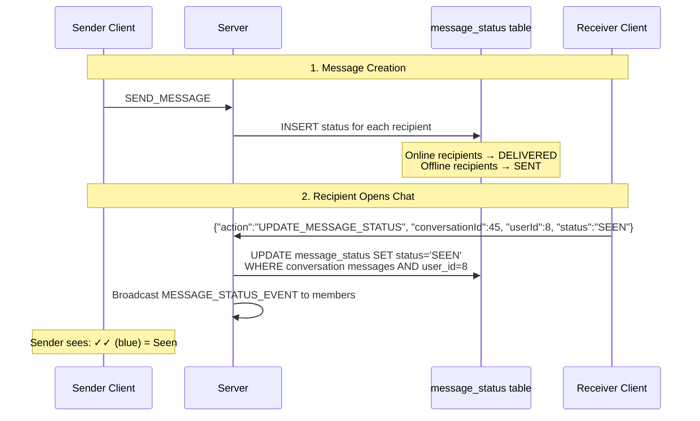

# ✓ Message Status System (Sent/Delivered/Seen)

## Overview
SinChat tracks per-recipient message status across three states: SENT → DELIVERED → SEEN. The status is initialized when a message is sent, updated when recipients come online or view messages, and broadcast to conversation members in real-time.

---

## Source Files

| Layer | File | Package |
|---|---|---|
| **Server Handler** | `UpdateMessageStatusHandler.java` | `com.server.handler.message` |
| **Server Repository** | `MessageStatusRepository.java` | `com.server.repository` |
| **Server Model** | `MessageStatus.java` | `com.server.model` |
| **Client View** | `ChatView.java` (checkmark rendering) | `com.client.view` |
| **Client Controller** | `ChatController.java` | `com.client.controller` |

---

## Status States

```
SENT ──────► DELIVERED ──────► SEEN
(offline)    (online)         (viewed)
```

| Status | Meaning | When Set |
|---|---|---|
| `SENT` | Message stored in DB, recipient offline | On message creation (if recipient `is_online = false`) |
| `DELIVERED` | Message reached recipient's device | On message creation (if recipient `is_online = true`) |
| `SEEN` | Recipient viewed the message | When client calls `UPDATE_MESSAGE_STATUS` or `markAllAsSeen` |

---

## Flow



---

## Database Schema

```sql
CREATE TABLE message_status (
    message_id BIGINT,
    user_id BIGINT,
    status ENUM('SENT', 'DELIVERED', 'SEEN'),
    updated_at TIMESTAMP DEFAULT CURRENT_TIMESTAMP,
    PRIMARY KEY (message_id, user_id)
);
```

---

## Key Operations

### 1. Initialize on Send
When a message is sent, `MessageStatusRepository.create()` is called for EACH recipient:
```java
for (Long memberId : memberIds) {
    Status status = userRepository.isOnline(memberId) ? Status.DELIVERED : Status.SENT;
    messageStatusRepository.create(messageId, memberId, status);
}
```

### 2. Single Message Update
When a user views a specific message:
```java
// Client sends
{"action": "UPDATE_MESSAGE_STATUS", "messageId": 1002, "userId": 8, "status": "SEEN"}

// Server updates
messageStatusRepository.update(messageId, userId, Status.SEEN);
```

### 3. Bulk Mark-All-As-Seen
When a user opens a conversation:
```java
// Client sends
{"action": "UPDATE_MESSAGE_STATUS", "conversationId": 45, "userId": 8, "status": "SEEN"}

// Server updates ALL unread messages in that conversation
messageStatusRepository.markAllAsSeen(conversationId, userId);
```

### 4. Collective Status
`getCollectiveStatus(messageId)` returns the **lowest** status across all recipients:
- If ANY recipient has SENT → returns SENT
- If ALL are at least DELIVERED → returns DELIVERED
- If ALL are SEEN → returns SEEN

This determines what the sender sees on their bubble.

### 5. Seen-By Users
`getSeenUsersForConversation(conversationId)` returns which users have seen each message:
```java
Map<Long, List<SeenUserInfo>> seenMap = messageStatusRepository.getSeenUsersForConversation(conversationId);
```
The client renders small avatar circles below the message bubble for each user who has seen it.

---

## Client UI Indicators

| Icon | Status | Meaning |
|---|---|---|
| ✓ (gray) | SENT | Message stored, recipient offline |
| ✓✓ (gray) | DELIVERED | Message reached recipient's device |
| ✓✓ (blue) | SEEN | Recipient viewed the message |

For group chats, the indicator shows the collective status. Seen-by avatars show individual read status.

---

## TCP Protocol

### Mark Single Message as Seen
```json
// Request
{"action": "UPDATE_MESSAGE_STATUS", "messageId": 1002, "userId": 8, "status": "SEEN", "requestId": "uuid"}

// Broadcast
{"action": "MESSAGE_STATUS_EVENT", "messageId": 1002, "userId": 8, "status": "SEEN"}
```

### Mark All Messages in Conversation as Seen
```json
// Request
{"action": "UPDATE_MESSAGE_STATUS", "conversationId": 45, "userId": 8, "status": "SEEN", "requestId": "uuid"}
```

---

## Notable Design Decisions

| Decision | Rationale |
|---|---|
| Per-recipient status tracking | Enables group read receipts (who has seen what) |
| Collective status for sender | Single checkmark that summarizes all recipients |
| DELIVERED on send for online users | Immediate feedback; no extra round-trip |
| markAllAsSeen bulk operation | Single UPDATE for all messages in conversation |
| Broadcast on status change | All members see status updates in real-time |
| `SeenUserInfo` with username | Shows "Seen by Alice, Bob" on message bubble |
