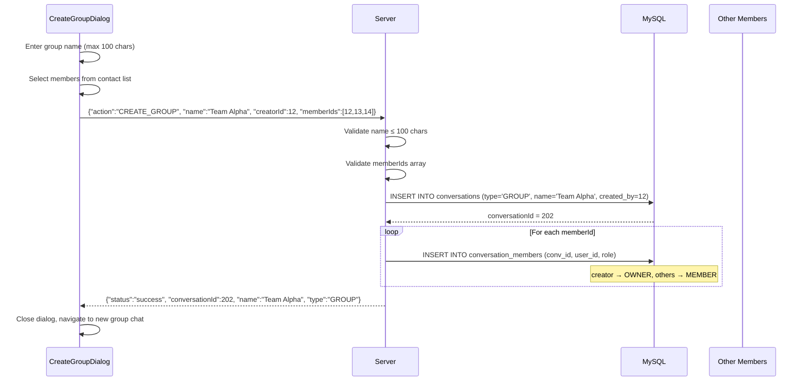
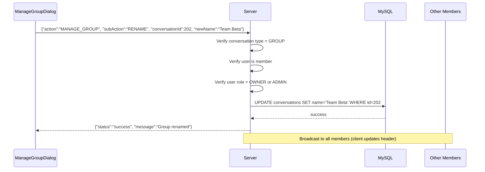
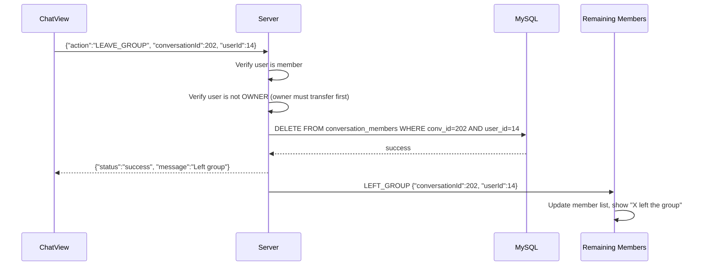

# 👥 Group Chat System

## Overview
SinChat supports GROUP conversations with full member management: create, rename, add/remove members, transfer admin, and disband. All group operations broadcast real-time events to members. The permission system distinguishes between OWNER (creator), ADMIN, and MEMBER roles.

---

## Source Files

| Layer | File | Package |
|---|---|---|
| **Server Handler** | `CreateGroupHandler.java` | `com.server.handler.message` |
| **Server Handler** | `GroupManagementHandler.java` | `com.server.handler.message` |
| **Server Handler** | `LeaveGroupHandler.java` | `com.server.handler.message` |
| **Server Service** | `ConversationService.java` | `com.server.service` |
| **Server Repository** | `ConversationRepository.java` | `com.server.repository` |
| **Client View** | `CreateGroupDialog.java` | `com.client.view` |
| **Client View** | `ManageGroupDialog.java` | `com.client.view` |
| **Client View** | `ChatView.java` | `com.client.view` |

---

## Supported Actions

| Action | Handler | Permission |
|---|---|---|
| `CREATE_GROUP` | `CreateGroupHandler` | Any authenticated user |
| `MANAGE_GROUP` (sub-actions below) | `GroupManagementHandler` | Varies |
| `LEAVE_GROUP` | `LeaveGroupHandler` | Any member |

### MANAGE_GROUP Sub-Actions

| Sub-Action | Permission | Description |
|---|---|---|
| `GET_MEMBERS` | Any member | List all members with roles |
| `RENAME` | OWNER or ADMIN | Change group name |
| `ADD_MEMBER` | OWNER or ADMIN | Add new member |
| `KICK_MEMBER` | OWNER or ADMIN | Remove member |
| `TRANSFER_ADMIN` | OWNER only | Transfer ownership |
| `DISBAND` | OWNER only | Delete group entirely |

---

## Flow: Create Group



---

## Flow: Manage Group (Rename Example)



---

## Flow: Leave Group



---

## Permission Matrix

| Operation | OWNER | ADMIN | MEMBER |
|---|---|---|---|
| Send messages | ✅ | ✅ | ✅ |
| View members | ✅ | ✅ | ✅ |
| Rename group | ✅ | ✅ | ❌ |
| Add member | ✅ | ✅ | ❌ |
| Kick member | ✅ | ✅ | ❌ |
| Transfer admin | ✅ | ❌ | ❌ |
| Disband group | ✅ | ❌ | ❌ |
| Leave group | ❌* | ✅ | ✅ |

\* OWNER must transfer ownership before leaving.

---

## Client UI

### CreateGroupDialog
- Group name input (max 100 characters)
- Member search bar (searches users)
- Contact list with checkboxes
- Selected members shown as chips (with X to remove)
- Create button (disabled until name + 2+ members selected)

### ManageGroupDialog
- Group name (editable for admin/owner)
- Member list with role badges (OWNER/ADMIN/MEMBER)
- Add member button (admin/owner only)
- Kick button per member (admin/owner only, not self)
- Transfer admin button (owner only)
- Disband button (owner only, with confirmation dialog)

### ChatView (Group Context)
- Group avatar with member count
- "X is typing..." shows typing user's name (not just "typing")
- Message bubbles show sender name and avatar
- Pinned messages bar
- Group management button (opens ManageGroupDialog)

---

## TCP Protocol

### Create Group
```json
// Request
{"action": "CREATE_GROUP", "name": "Team Alpha", "creatorId": 12, "memberIds": [12, 13, 14], "requestId": "uuid"}

// Response
{"action": "CREATE_GROUP_RESPONSE", "status": "success", "conversationId": 202, "name": "Team Alpha", "type": "GROUP"}
```

### Manage Group
```json
// Request (RENAME)
{"action": "MANAGE_GROUP", "subAction": "RENAME", "conversationId": 202, "newName": "Team Beta", "requestId": "uuid"}

// Request (ADD_MEMBER)
{"action": "MANAGE_GROUP", "subAction": "ADD_MEMBER", "conversationId": 202, "targetUserId": 15, "requestId": "uuid"}

// Request (KICK_MEMBER)
{"action": "MANAGE_GROUP", "subAction": "KICK_MEMBER", "conversationId": 202, "targetUserId": 14, "requestId": "uuid"}

// Request (TRANSFER_ADMIN)
{"action": "MANAGE_GROUP", "subAction": "TRANSFER_ADMIN", "conversationId": 202, "targetUserId": 13, "requestId": "uuid"}

// Request (DISBAND)
{"action": "MANAGE_GROUP", "subAction": "DISBAND", "conversationId": 202, "requestId": "uuid"}
```

### Leave Group
```json
// Request
{"action": "LEAVE_GROUP", "conversationId": 202, "userId": 14, "requestId": "uuid"}

// Broadcast
{"action": "LEFT_GROUP", "conversationId": 202, "userId": 14}
```

---

## Notable Design Decisions

| Decision | Rationale |
|---|---|
| Three-tier roles (OWNER/ADMIN/MEMBER) | Flexible governance; matches Discord model |
| Creator auto-assigned OWNER | Clear ownership from creation |
| OWNER must transfer before leaving | Prevents orphaned groups |
| DISBAND deletes conversation + all members | Clean removal; no orphaned data |
| Group name max 100 chars | Reasonable limit for display |
| Real-time broadcast on all changes | All members see updates instantly |
