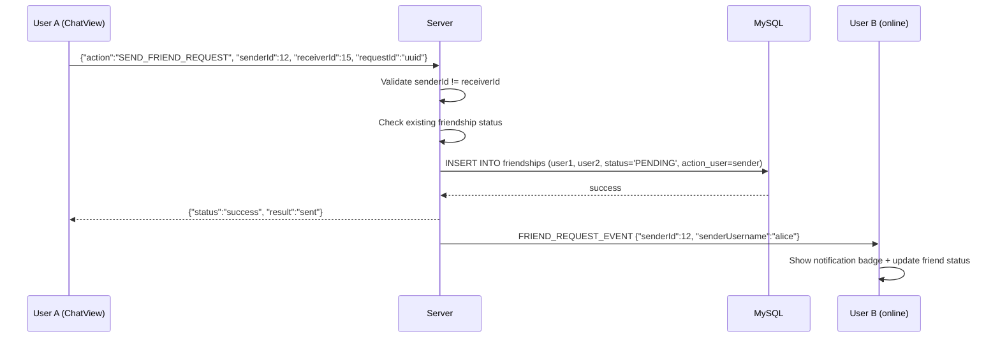
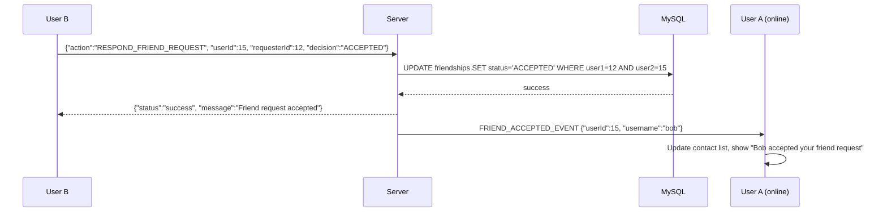

# 🤝 Friendship System

## Overview
SinChat has a complete friendship management system with 8 TCP actions. Users can send friend requests, accept/reject them, unfriend, block/unblock, and view friend lists with online status. Friendship events are pushed in real-time.

---

## Source Files

| Layer | File | Package |
|---|---|---|
| **Server Handler** | `SendFriendRequestHandler.java` | `com.server.handler.friendship` |
| **Server Handler** | `RespondFriendRequestHandler.java` | `com.server.handler.friendship` |
| **Server Handler** | `GetFriendsHandler.java` | `com.server.handler.friendship` |
| **Server Handler** | `GetFriendRequestsHandler.java` | `com.server.handler.friendship` |
| **Server Handler** | `GetFriendshipStatusHandler.java` | `com.server.handler.friendship` |
| **Server Handler** | `UnfriendHandler.java` | `com.server.handler.friendship` |
| **Server Handler** | `BlockUserHandler.java` | `com.server.handler.friendship` |
| **Server Handler** | `UnblockUserHandler.java` | `com.server.handler.friendship` |
| **Server Service** | `FriendshipService.java` | `com.server.service` |
| **Server Repository** | `FriendshipRepository.java` | `com.server.repository` |
| **Client View** | `ChatView.java` (right panel, friend button) | `com.client.view` |
| **Client View** | `FriendRequestHistoryDialog.java` | `com.client.view` |
| **Client Controller** | `ChatController.java` | `com.client.controller` |

---

## Friendship States

```
NONE ──send request──► PENDING ──accept──► ACCEPTED (friends)
                        │    │                  │
                        │    └──reject──► NONE   └──unfriend──► NONE
                        │                        │
                        └──cancel──► NONE         └──block──► BLOCKED
                                                              │
                                                      unblock─┘──► NONE
```

---

## Database Convention

Friendships use `user1_id < user2_id` ordering to prevent duplicate rows:
```sql
CREATE TABLE friendships (
    user1_id BIGINT,      -- always the smaller ID
    user2_id BIGINT,      -- always the larger ID
    action_user_id BIGINT, -- who initiated the action
    status ENUM('PENDING', 'ACCEPTED', 'BLOCKED'),
    created_at TIMESTAMP,
    updated_at TIMESTAMP,
    PRIMARY KEY (user1_id, user2_id)
);
```

This means a single row represents the relationship between two users, regardless of who initiated.

---

## Flow: Send Friend Request



## Flow: Accept Friend Request



---

## All 8 Actions

| Action | Handler | Description |
|---|---|---|
| `SEND_FRIEND_REQUEST` | `SendFriendRequestHandler` | Send request; pushes event to receiver |
| `RESPOND_FRIEND_REQUEST` | `RespondFriendRequestHandler` | Accept or reject; pushes event on accept |
| `GET_FRIENDS` | `GetFriendsHandler` | Returns accepted friends with online status |
| `GET_FRIEND_REQUESTS` | `GetFriendRequestsHandler` | Returns pending received + sent requests |
| `GET_FRIENDSHIP_STATUS` | `GetFriendshipStatusHandler` | Returns status between two users |
| `UNFRIEND` | `UnfriendHandler` | Remove friend; also handles cancel request |
| `BLOCK_USER` | `BlockUserHandler` | Block user (self-block prevented) |
| `UNBLOCK_USER` | `UnblockUserHandler` | Remove block |

---

## Response Status Values

`sendFriendRequest` returns one of:
- `"sent"` — Request sent successfully
- `"already_friends"` — Already accepted
- `"pending_sent"` — You already sent a request
- `"pending_received"` — They already sent you a request
- `"blocked"` — One user has blocked the other
- `"error"` — Operation failed

`getFriendshipStatus` returns:
- `"friends"` — Both accepted
- `"pending_sent"` — You sent, they haven't responded
- `"pending_received"` — They sent, you haven't responded
- `"blocked"` — Block exists
- `"none"` — No relationship

---

## Security

| Check | Description |
|---|---|
| `senderId != receiverId` | Cannot friend yourself |
| `userId != targetId` (block/unblock) | Cannot block yourself |
| Connection userId validation | userId must match authenticated connection |

---

## Client UI

### Right Panel (ChatView)
- Shows friendship status with selected user
- Context-sensitive buttons:
  - "Add Friend" (no relationship)
  - "Accept" / "Reject" (pending received)
  - "Cancel Request" (pending sent)
  - "Unfriend" (friends)
  - "Block" / "Unblock"

### Friend Request Badge
- Left panel shows pending request count as badge
- Click to open `FriendRequestHistoryDialog`

### FriendRequestHistoryDialog
- Two tabs: Received / Sent
- Each entry shows: avatar, username, status, action buttons
- Real-time updates on new events

---

## TCP Protocol

### Send Request
```json
// Request
{"action": "SEND_FRIEND_REQUEST", "senderId": 12, "receiverId": 15, "requestId": "uuid"}

// Response
{"action": "SEND_FRIEND_REQUEST_RESPONSE", "status": "success", "result": "sent"}

// Push to receiver
{"action": "FRIEND_REQUEST_EVENT", "senderId": 12, "senderUsername": "alice"}
```

### Respond
```json
// Request
{"action": "RESPOND_FRIEND_REQUEST", "userId": 15, "requesterId": 12, "decision": "ACCEPTED", "requestId": "uuid"}

// Push to requester (on accept)
{"action": "FRIEND_ACCEPTED_EVENT", "userId": 15, "username": "bob"}
```

### Get Friends
```json
// Request
{"action": "GET_FRIENDS", "userId": 12, "requestId": "uuid"}

// Response
{"action": "GET_FRIENDS_RESPONSE", "status": "success", "friends": [
    {"userId": 15, "username": "bob", "avatarUrl": "...", "isOnline": true, "lastSeen": "..."}
]}
```

### Block/Unblock
```json
// Block
{"action": "BLOCK_USER", "userId": 12, "targetId": 15, "requestId": "uuid"}

// Unblock
{"action": "UNBLOCK_USER", "userId": 12, "targetId": 15, "requestId": "uuid"}
```

---

## Notable Design Decisions

| Decision | Rationale |
|---|---|
| `user1_id < user2_id` convention | Single row per relationship; no duplicate checking needed |
| `action_user_id` column | Tracks who initiated the last action (for display logic) |
| Real-time push for requests/accepts | Immediate notification; no polling needed |
| Self-friend/self-block prevention | Sanity check in service layer |
| Block persists after unfriend | Follows standard social platform behavior |
| Friendship status in search results | Users can see relationship before interacting |
