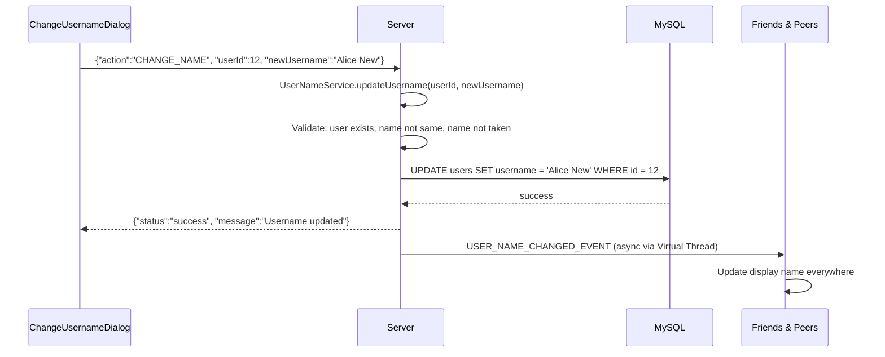

# 👤 User Profile & Avatar System

## Overview
The profile system allows authenticated users to view and update their profile information including avatar, display name, and email. Avatar changes and name changes are broadcast to friends and conversation peers in real-time.

---

## Source Files

| Layer | File | Package |
|---|---|---|
| **Server Handler** | `ProfileHandler.java` | `com.server` |
| **Server Handler** | `AvatarHandler.java` | `com.server.handler.changeavatar` |
| **Server Handler** | `GetAvatarHandler.java` | `com.server.handler.avatar` |
| **Server Handler** | `NameHandler.java` | `com.server.handler.changeName` |
| **Server Handler** | `ChangePasswordHandler.java` | `com.server.handler.auth` |
| **Server Service** | `AvatarService.java` | `com.server.service` |
| **Server Service** | `UserNameService.java` | `com.server.service` |
| **Client View** | `ChatView.java` (right panel) | `com.client.view` |
| **Client View** | `AvatarModalView.java` | `com.client.view` |
| **Client View** | `ChangeUsernameDialog.java` | `com.client.view` |
| **Client View** | `ChangePasswordDialog.java` | `com.client.view` |
| **Client Controller** | `ChatController.java` | `com.client.controller` |

---

## Profile Actions Overview

| Action | TCP Action | Handler |
|---|---|---|
| Get Profile | `PROFILE` (subAction: `GET_PROFILE`) | `ProfileHandler` |
| Update Profile | `PROFILE` (subAction: `UPDATE_PROFILE`) | `ProfileHandler` |
| Change Avatar | `CHANGE_AVATAR` | `AvatarHandler` |
| Get Avatar | `GET_AVATAR` | `GetAvatarHandler` |
| Change Name | `CHANGE_NAME` | `NameHandler` |
| Change Password | `CHANGE_PASSWORD` | `ChangePasswordHandler` |

---

## Avatar System

### Upload Flow

```mermaid
sequenceDiagram
    participant UI as AvatarModalView
    participant Ctrl as ChatController
    participant Svc as ChatService
    participant Svr as Server
    participant DB as user_avatars
    participant Peers as Friends & Peers

    UI->>UI: User selects image (file chooser or gallery)
    UI->>UI: Crop + zoom (500×500 circular preview)
    UI->>Ctrl: changeAvatar(image, onSuccess, onError)
    Ctrl->>Svc: changeAvatar(userId, base64DataUrl)
    Note over Svc: ImageUtils.imageToBase64Png(image)
    Svc->>Svr: {"action":"CHANGE_AVATAR", "userId":12, "avatarUrl":"data:image/png;base64,..."}
    
    Svr->>Svr: AvatarService.changeAvatar(userId, base64DataUrl)
    Svr->>Svr: Decode base64 → byte[]
    Svr->>Svr: Resize to 512×512 PNG
    Svr->>DB: INSERT INTO user_avatars (user_id, avatar_data) ON DUPLICATE KEY UPDATE
    DB-->>Svr: success
    
    Svr-->>Svc: {"status":"success", "message":"Avatar updated", "avatarUrl":"db:12"}
    Svc-->>Ctrl: ApiResponse
    Ctrl-->>UI: Platform.runLater() → update avatar display
    
    Svr->>Peers: PresenceService.broadcastAvatarChangeToPeers(userId, avatarUrl)
    Peers->>Peers: Update avatar in contact list / chat header
```

### Get Avatar Flow
```mermaid
sequenceDiagram
    participant UI as ChatView
    participant Svr as Server
    participant DB as user_avatars

    UI->>Svr: {"action":"GET_AVATAR", "userId":15, "requestId":"uuid"}
    Svr->>DB: SELECT avatar_data FROM user_avatars WHERE user_id = 15
    DB-->>Svr: BLOB data
    Svr->>Svr: Encode as base64 data URL
    Svr-->>UI: {"status":"success", "avatarUrl":"data:image/png;base64,..."}
    UI->>UI: ImageUtils.decodeAvatarDataUrl() → Image → ImageView
```

### Storage
Avatars are stored as **BLOB** in the `user_avatars` table:
```sql
CREATE TABLE user_avatars (
    user_id BIGINT PRIMARY KEY,
    avatar_data MEDIUMBLOB,
    updated_at TIMESTAMP DEFAULT CURRENT_TIMESTAMP ON UPDATE CURRENT_TIMESTAMP
);
```
- Uses `INSERT ... ON DUPLICATE KEY UPDATE` for upsert behavior
- Server-side resize to 512×512 PNG for consistency
- Base64 data URL format for transport: `data:image/png;base64,...`

---

## Avatar Modal (`AvatarModalView.java`)

### Features
- **Circular preview**: 500×500 pixel circular crop area
- **Zoom**: Slider control, 1× to 3× magnification
- **Drag**: Click and drag to reposition image within crop area
- **Previously used gallery**: Shows recently uploaded avatars for quick re-selection
- **File upload**: Native file chooser for new images
- **Real-time preview**: Changes reflected immediately before saving

---

## Display Name Change

### Flow


### Validation
- User must exist
- New name must differ from current name
- New name must not be taken by another user
- `UserNameService.updateUsername()` performs all checks in service layer

---

## Profile (Get/Update)

### Get Profile
Returns `username`, `email`, `avatar_url` for authenticated user.

### Update Profile
Currently allows email update. Avatar goes through separate `CHANGE_AVATAR` action.

---

## TCP Protocol

### Get Profile
```json
// Request
{"action": "PROFILE", "subAction": "GET_PROFILE", "userId": 12, "requestId": "uuid"}

// Response
{"action": "PROFILE_RESPONSE", "status": "success", "username": "alice", "email": "alice@example.com", "avatar_url": "db:12"}
```

### Change Avatar
```json
// Request (base64 data URL of 512×512 PNG)
{"action": "CHANGE_AVATAR", "userId": 12, "avatarUrl": "data:image/png;base64,iVBORw0KG...", "requestId": "uuid"}

// Broadcast
{"action": "USER_AVATAR_CHANGED_EVENT", "userId": 12, "avatarUrl": "db:12"}
```

### Change Name
```json
// Request
{"action": "CHANGE_NAME", "userId": 12, "newUsername": "Alice New", "requestId": "uuid"}

// Broadcast (async Virtual Thread)
{"action": "USER_NAME_CHANGED_EVENT", "userId": 12, "newUsername": "Alice New"}
```

---

## Notable Design Decisions

| Decision | Rationale |
|---|---|
| BLOB storage for avatars | Self-contained; no external CDN/file server dependency |
| Server-side resize to 512×512 | Consistent display size; reduced storage |
| Avatar broadcast via PresenceService | Single point for all presence-related broadcasts |
| Name change broadcast via Virtual Thread | Non-blocking; doesn't delay response to name changer |
| Profile and avatar use separate actions | Clean separation of concerns; different validation rules |
| Base64 data URL transport | Works over JSON line protocol; no binary frame needed |
