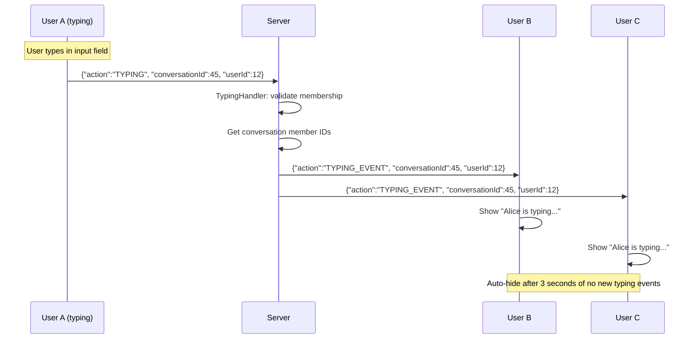

# ⌨️ Typing Indicators

## Overview
When a user starts typing in a conversation, the client sends a `TYPING` action. The server broadcasts a `TYPING_EVENT` to all other conversation members, who see "User is typing..." with a 3-second auto-hide.

---

## Source Files

| Layer | File | Package |
|---|---|---|
| **Server Handler** | `TypingHandler.java` | `com.server.handler` |
| **Client View** | `ChatView.java` (typing indicator) | `com.client.view` |
| **Client Controller** | `ChatController.java` | `com.client.controller` |
| **Client Service** | `ChatService.java` | `com.client.service` |

---

## Flow



---

## Key Implementation Details

### Client-Side Debounce
The client does NOT send a typing event for every keystroke. Instead, it implements a debounce pattern:
- On first keystroke → send TYPING immediately
- Subsequent keystrokes within a short window → skip (already sent)
- After 3 seconds of no typing → if user types again, send new TYPING

### Auto-Hide
The receiving client shows "User is typing..." and sets a 3-second timer. If no new `TYPING_EVENT` arrives within 3 seconds, the indicator fades out.

### Private Chat vs Group Chat
- **Private chat**: Shows "is typing..." in the header
- **Group chat**: Shows "{username} is typing..." (more informative)

### Membership Validation
The server verifies the typing user is actually a member of the conversation before broadcasting.

---

## TCP Protocol

### Request
```json
{
  "action": "TYPING",
  "conversationId": 45,
  "userId": 12
}
```

### Broadcast
```json
{
  "action": "TYPING_EVENT",
  "conversationId": 45,
  "userId": 12
}
```

> Note: `TYPING` is one of the few actions that does NOT use `requestId` or expect a response. It's fire-and-forget.

---

## Notable Design Decisions

| Decision | Rationale |
|---|---|
| Fire-and-forget (no requestId) | Typing is ephemeral; no value in request/response correlation |
| Server-side broadcast only | Server determines who to notify; client doesn't manage member list |
| Membership validation | Prevents typing events from non-members |
| 3-second auto-hide | Standard UX pattern (matches WhatsApp/Telegram) |
| Debounce on client | Reduces network traffic; one TYPING per typing burst |
