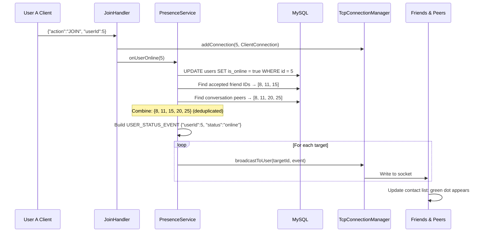

# 🟢 Presence System (Online/Offline Status)

## Overview
The Presence system automatically tracks and broadcasts user online/offline status. When a user connects (JOIN), they are marked online and all friends + conversation peers are notified. When they disconnect or time out, they are marked offline with a `lastSeen` timestamp.

---

## Source Files

| Layer | File | Package |
|---|---|---|
| **Server** | `PresenceService.java` (Singleton) | `com.server.tcp` |
| **Server** | `JoinHandler.java` | `com.server.handler` |
| **Server** | `ClientConnection.java` (close/cleanup) | `com.server.tcp` |
| **Server** | `TcpConnectionManager.java` | `com.server.tcp` |
| **Server** | `IdleConnectionSweeper.java` | `com.server.tcp` |
| **Server Repository** | `UserRepository.java` | `com.server.repository` |
| **Server Repository** | `ConversationRepository.java` | `com.server.repository` |
| **Client Service** | `ChatService.java` (onUserStatusChange callback) | `com.client.service` |
| **Client View** | `ChatView.java` (green/gray dots) | `com.client.view` |

---

## Architecture

```
Connection Event          PresenceService                Broadcast Targets
─────────────────────────────────────────────────────────────────────────
JOIN                      onUserOnline()      ──────►  Friends + Peers
ClientConnection.close()  onUserOffline()     ──────►  Friends + Peers
IdleConnectionSweeper     onUserOffline()     ──────►  Friends + Peers
AvatarChange              broadcastAvatar...  ──────►  Friends + Peers
NameChange                broadcastName...    ──────►  Friends + Peers
```

---

## Flow: User Comes Online



## Flow: User Goes Offline

```mermaid
sequenceDiagram
    participant CC as ClientConnection
    participant PS as PresenceService
    participant DB as MySQL
    participant TCM as TcpConnectionManager
    participant Friends as Friends & Peers

    Note over CC: Socket closes or idle timeout
    
    CC->>TCM: removeConnection(ClientConnection)
    
    alt Last connection for user
        CC->>PS: onUserOffline(5)
        PS->>DB: UPDATE users SET is_online=false, last_seen=NOW() WHERE id=5
        PS->>DB: Find friends + peers
        PS->>PS: Build USER_STATUS_EVENT {"userId":5, "status":"offline", "lastSeen":"2026-07-03 14:30:00"}
        
        loop For each target
            PS->>TCM: broadcastToUser(targetId, event)
        end
        
        Friends->>Friends: Update contact list: gray dot + last seen time
    else Other connections exist (multi-device)
        Note over CC: User still online on other device; no broadcast
    end
```

---

## Broadcast Targets

The PresenceService notifies TWO groups:
1. **Accepted friends**: `UserRepository.findAcceptedFriendIds(userId)`
2. **Conversation peers**: `ConversationRepository.findConversationPeers(userId)` — anyone sharing a conversation

Targets are deduplicated (a user who is both a friend and a conversation peer receives only one event).

---

## Multi-Device Support

`TcpConnectionManager` stores a `Set<ClientConnection>` per user:
```java
ConcurrentHashMap<Long, Set<ClientConnection>> userConnections;
```

- `onUserOnline()` is called on the FIRST connection (JOIN)
- `onUserOffline()` is called only when the LAST connection is removed
- A user with laptop + phone stays online until both disconnect

---

## Idle Timeout

`IdleConnectionSweeper` runs every 5 seconds:
- Checks `lastActiveAt` on each `ClientConnection`
- Closes connections idle > 60 seconds
- Triggers the same cleanup → `PresenceService.onUserOffline()`

---

## Client UI

### Online Status Display
- **Green dot**: User is online
- **Gray dot**: User is offline
- **Last seen**: Vietnamese relative time via `TimeUtils.formatRelativePresence()`
  - "Vừa mới hoạt động" (just now)
  - "Hoạt động X phút trước" (X minutes ago)
  - "Hoạt động X giờ trước" (X hours ago)
  - "Offline" (long time)

### Real-Time Updates
`ChatService` registers `onUserStatusChange` callback:
- On `USER_STATUS_EVENT` received → `Platform.runLater()` → update all UI dots

---

## TCP Protocol

### JOIN (triggers online)
```json
{"action": "JOIN", "userId": 12}
```

### Broadcast Events
```json
// Online
{"action": "USER_STATUS_EVENT", "userId": 12, "status": "online"}

// Offline
{"action": "USER_STATUS_EVENT", "userId": 12, "status": "offline", "lastSeen": "2026-07-03 14:30:00"}

// Avatar changed
{"action": "USER_AVATAR_CHANGED_EVENT", "userId": 12, "avatarUrl": "db:12"}

// Name changed
{"action": "USER_NAME_CHANGED_EVENT", "userId": 12, "newUsername": "Alice New"}
```

---

## Notable Design Decisions

| Decision | Rationale |
|---|---|
| Two target groups (friends + peers) | Ensures all relevant users see status change |
| Target deduplication (HashSet) | Prevents duplicate events for friend+peer overlap |
| Multi-device: only broadcast on last disconnect | Accurate status; no flickering |
| lastSeen on offline only | Reduces DB writes; meaningful timestamp |
| IdleConnectionSweeper at 5s/60s | Balances resource cleanup with tolerance for network lag |
| PresenceService as Singleton | Single authority for all presence state |
