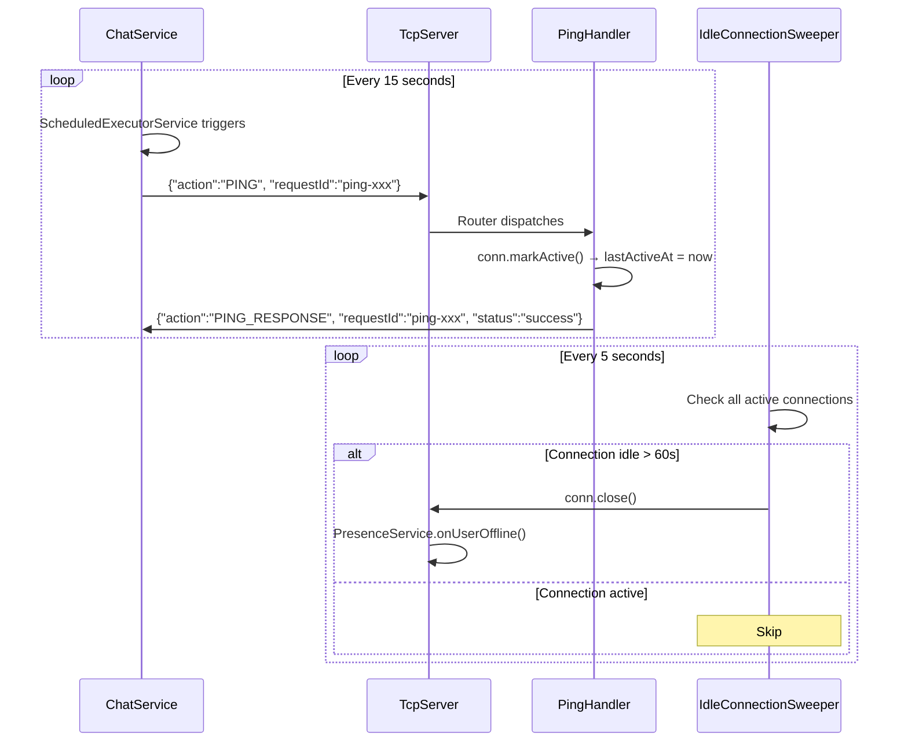

# 💓 Heartbeat / Keep-Alive System

## Overview
The heartbeat system prevents stale connections from consuming server resources. The client sends a `PING` every 15 seconds. The server responds with `PING_RESPONSE` and updates the connection's `lastActiveAt` timestamp. `IdleConnectionSweeper` closes connections idle longer than 60 seconds.

---

## Source Files

| Layer | File | Package |
|---|---|---|
| **Server Handler** | `PingHandler.java` | `com.server.handler` |
| **Server** | `IdleConnectionSweeper.java` | `com.server.tcp` |
| **Server** | `ClientConnection.java` (markActive, lastActiveAt) | `com.server.tcp` |
| **Client Service** | `ChatService.java` (ScheduledExecutorService) | `com.client.service` |

---

## Architecture

```
┌─────────────────────────────────────────────────────────────┐
│                        CLIENT                               │
│  ScheduledExecutorService.scheduleAtFixedRate(15s)          │
│       │                                                     │
│       ▼                                                     │
│  sendPing() → {"action":"PING", "requestId":"..."}          │
└────────────────────────┬────────────────────────────────────┘
                         │ TCP Socket
┌────────────────────────▼────────────────────────────────────┐
│                       SERVER                                │
│  ┌─────────────────────────────────────────────────────┐    │
│  │ PingHandler.handleTcp()                              │    │
│  │  → conn.markActive()  // updates lastActiveAt        │    │
│  │  → response: PING_RESPONSE                           │    │
│  └─────────────────────────────────────────────────────┘    │
│                                                              │
│  ┌─────────────────────────────────────────────────────┐    │
│  │ IdleConnectionSweeper (every 5 seconds)              │    │
│  │  for each connection:                                │    │
│  │    if (now - conn.lastActiveAt > 60_000ms)           │    │
│  │      → conn.close()                                  │    │
│  │      → PresenceService.onUserOffline()               │    │
│  └─────────────────────────────────────────────────────┘    │
└─────────────────────────────────────────────────────────────┘
```

---

## Flow



---

## Key Parameters

| Parameter | Value | Location |
|---|---|---|
| Client PING interval | 15 seconds | `ChatService.java` → `ScheduledExecutorService` |
| Sweeper check interval | 5 seconds | `IdleConnectionSweeper.java` |
| Idle timeout | 60 seconds | `TcpServer` constructor default |
| `lastActiveAt` updates | On every message received | `ClientConnection.markActive()` |

---

## Why Two Different Intervals?

- **15s PING**: Frequent enough to keep NAT/firewall sessions alive; not so frequent as to waste bandwidth
- **5s Sweeper**: Higher frequency ensures stale connections are cleaned up within ~65 seconds max (60s timeout + up to 5s sweep delay)
- **60s timeout**: 4× the PING interval; tolerates 3 consecutive missed PINGs before disconnect

---

## Connection Lifecycle

```
CONNECT → LOGIN → JOIN → [PING every 15s] → ... → DISCONNECT
                                              │
                                              ▼
                                    IdleConnectionSweeper
                                    (closes after 60s idle)
                                              │
                                              ▼
                                    PresenceService.onUserOffline()
                                    → Broadcast to friends/peers
```

---

## TCP Protocol

### Request
```json
{
  "action": "PING",
  "requestId": "ping-1716281000"
}
```

### Response
```json
{
  "action": "PING_RESPONSE",
  "requestId": "ping-1716281000",
  "status": "success"
}
```

---

## Client Implementation (`ChatService.java`)

```java
// Started in connectAsync()
heartbeatScheduler = Executors.newSingleThreadScheduledExecutor();
heartbeatScheduler.scheduleAtFixedRate(() -> {
    try {
        if (isConnected()) {
            sendPing();
        }
    } catch (Exception e) {
        logger.warn("Heartbeat failed", e);
    }
}, 15, 15, TimeUnit.SECONDS);
```

---

## Notable Design Decisions

| Decision | Rationale |
|---|---|
| Client-initiated PING (not server) | Standard practice; client knows its own state best |
| PING uses requestId (unlike TYPING) | Enables client to detect network issues if response not received |
| `markActive()` on ALL messages (not just PING) | Any activity resets the idle timer; PING is just a fallback |
| 60s = 4 × 15s | Tolerates 3 missed PINGs before disconnect |
| Sweeper separate from PING handler | Separation of concerns; sweeper is infrastructure, PING is application |
| Single-threaded heartbeat scheduler | Lightweight; one thread per client is sufficient |
