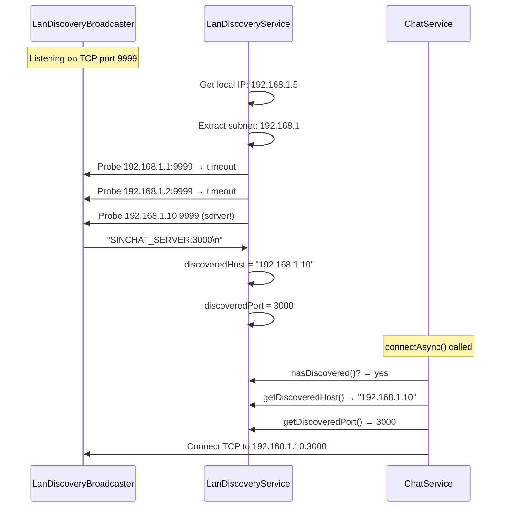

# 🌐 LAN Discovery System

## Overview
SinChat supports zero-configuration LAN deployment. The server broadcasts its presence on TCP port 9999. The client probes the local network to discover the server automatically — no manual IP configuration needed.

---

## Source Files

| Layer | File | Package |
|---|---|---|
| **Server** | `LanDiscoveryBroadcaster.java` | `com.server.tcp` |
| **Server** | `TcpServer.java` (starts broadcaster) | `com.server.tcp` |
| **Client** | `LanDiscoveryService.java` | `com.client.service` |
| **Client** | `ChatService.java` (uses discovery) | `com.client.service` |

---

## Architecture

```
┌──────────────────────────────────────────────────────────────────┐
│                         SERVER                                   │
│  TcpServer.start()                                               │
│    ├── Start main server on port 3000                            │
│    └── Start LanDiscoveryBroadcaster on port 9999                │
│         └── Listens for TCP connections                          │
│         └── Responds: "SINCHAT_SERVER:3000\n"                    │
└──────────────────────────┬───────────────────────────────────────┘
                           │ TCP port 9999
┌──────────────────────────▼───────────────────────────────────────┐
│                         CLIENT                                   │
│  LanDiscoveryService.start()                                     │
│    ├── Probe localhost:9999                                      │
│    ├── Get local IP (e.g., 192.168.1.5)                          │
│    ├── Extract subnet (192.168.1)                                │
│    ├── Probe 192.168.1.1 through 192.168.1.254 on port 9999     │
│    └── On response "SINCHAT_SERVER:3000":                        │
│         → discoveredHost = responder's IP                        │
│         → discoveredPort = 3000                                  │
│                                                                  │
│  ChatService.connectAsync()                                      │
│    └── If no explicit host configured:                           │
│         → Use LanDiscoveryService.getDiscoveredHost()            │
│         → Use LanDiscoveryService.getDiscoveredPort()            │
└──────────────────────────────────────────────────────────────────┘
```

---

## Flow



---

## Protocol

### Server Response (port 9999)
```
SINCHAT_SERVER:<port>\n
```
Example: `SINCHAT_SERVER:3000\n`

The server simply writes this string to any connecting client and closes the discovery connection. The real chat communication happens on the main port.

### Client Probe (port 9999)
The client:
1. Tries `localhost:9999` first (for same-machine testing)
2. Gets its own local IP address
3. Extracts the subnet (e.g., from `192.168.1.5` → probes `192.168.1.x`)
4. Tries each IP in the subnet on port 9999
5. First response wins — stores discovered host and port

---

## Server Implementation

```java
// LanDiscoveryBroadcaster.java
public void start() {
    Thread.ofVirtual().start(() -> {
        ServerSocket serverSocket = new ServerSocket(9999);
        while (!stopRequested) {
            Socket client = serverSocket.accept();
            PrintWriter out = new PrintWriter(client.getOutputStream(), true);
            out.println("SINCHAT_SERVER:" + parentPort);
            client.close();
        }
    });
}
```

Started by `TcpServer.start()` alongside the main server.

---

## Client Implementation

```java
// LanDiscoveryService.java
public void start() {
    // Step 1: Try localhost
    try { probe("127.0.0.1", 9999); } catch (...) { }
    
    // Step 2: Get subnet
    String localIp = InetAddress.getLocalHost().getHostAddress();
    String subnet = localIp.substring(0, localIp.lastIndexOf('.'));
    
    // Step 3: Scan subnet
    for (int i = 1; i <= 254 && !discovered; i++) {
        String ip = subnet + "." + i;
        try { probe(ip, 9999); } catch (...) { }
    }
}
```

---

## Usage in ChatService

```java
// ChatService.connectAsync()
String host = System.getProperty("tcp.host");
int port = Integer.parseInt(System.getProperty("tcp.port", "3000"));

if (host == null || host.isEmpty()) {
    // Use LAN discovery
    lanDiscovery.start();
    // Wait for discovery or timeout
    host = lanDiscovery.getDiscoveredHost();
    port = lanDiscovery.getDiscoveredPort();
}

socket = new Socket(host, port);
```

---

## Launch Scripts

| Script | Behavior |
|---|---|
| `run_client.cmd` | Uses default/explicit host |
| `run_client_lan.cmd` | Forces LAN discovery mode |
| `run_client_railway.cmd` | Connects to remote Railway deployment |

---

## Notable Design Decisions

| Decision | Rationale |
|---|---|
| Separate port (9999) for discovery | Doesn't interfere with main chat protocol on 3000 |
| Simple text protocol (not JSON) | Discovery is one-shot; minimal overhead |
| Subnet scan (not broadcast/multicast) | Works reliably across different network configurations |
| localhost first | Fast path for same-machine development |
| Discovery separate from ChatService | Clean separation; LanDiscoveryService is reusable |
| Virtual Thread for discovery listener | Lightweight; consistent with main server architecture |
