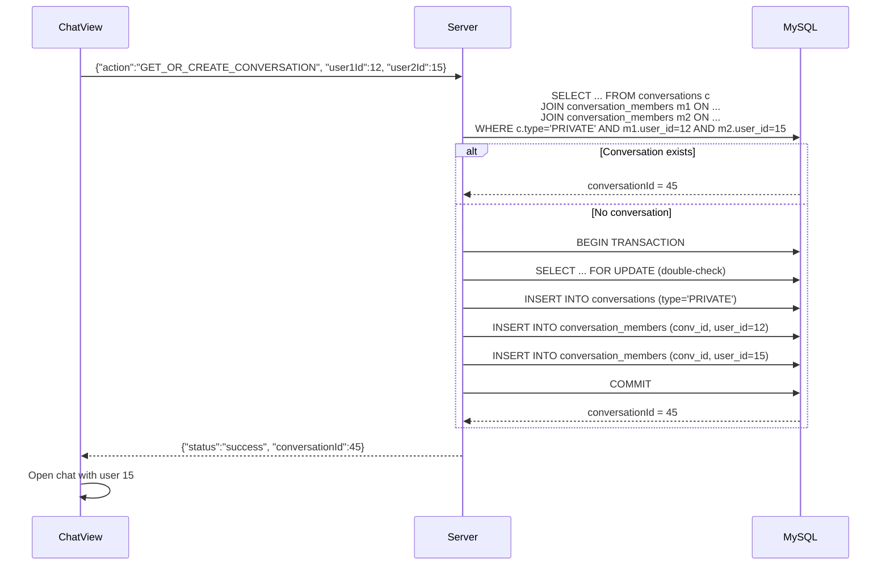
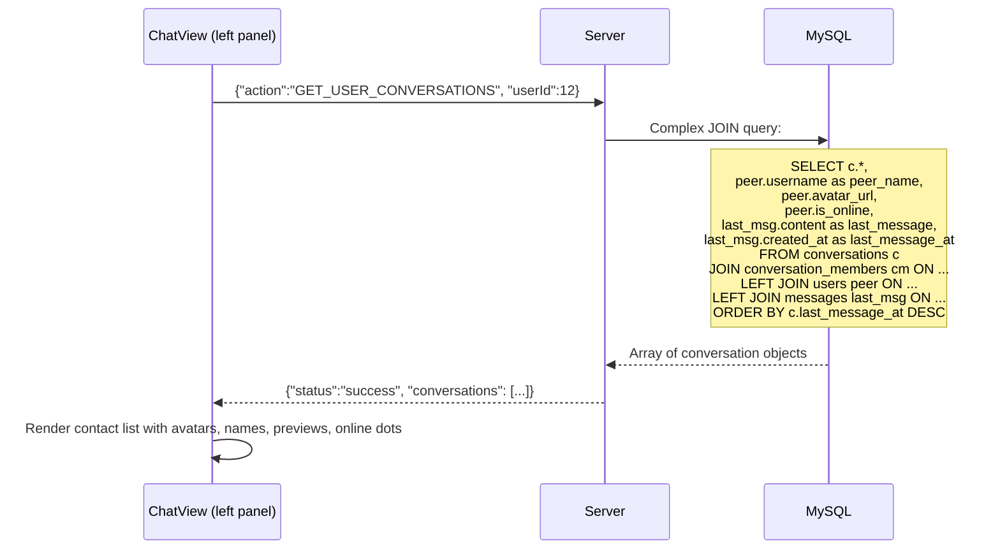

# 💬 Conversation Management

## Overview
The conversation system manages private and group chats. Private conversations are auto-created on first message between two users. The system returns conversation lists with last message previews, online status, and unread indicators.

---

## Source Files

| Layer | File | Package |
|---|---|---|
| **Server Handler** | `ConversationHandler.java` | `com.server.handler.message` |
| **Server Handler** | `GetConversationsHandler.java` | `com.server.handler.message` |
| **Server Service** | `ConversationService.java` | `com.server.service` |
| **Server Repository** | `ConversationRepository.java` | `com.server.repository` |
| **Client View** | `ChatView.java` (left panel contact list) | `com.client.view` |
| **Client Controller** | `ChatController.java` | `com.client.controller` |

---

## Actions

| Action | Handler | Purpose |
|---|---|---|
| `GET_OR_CREATE_CONVERSATION` | `ConversationHandler` | Find existing or create PRIVATE conversation between two users |
| `GET_USER_CONVERSATIONS` | `GetConversationsHandler` | List all conversations for a user with details |

---

## Flow: Get or Create Private Conversation



### Atomic Find-or-Create
The server uses `SELECT ... FOR UPDATE` to prevent race conditions:
```sql
-- In a transaction:
SELECT c.id FROM conversations c
JOIN conversation_members m1 ON c.id = m1.conversation_id AND m1.user_id = ?
JOIN conversation_members m2 ON c.id = m2.conversation_id AND m2.user_id = ?
WHERE c.type = 'PRIVATE'
FOR UPDATE;

-- If not found, INSERT conversation + 2 members
```

This ensures two simultaneous requests between the same users create only ONE conversation.

---

## Flow: Get User Conversations



---

## Conversation Object (Response)

```json
{
  "conversationId": 45,
  "type": "PRIVATE",
  "name": "Alice",
  "avatarUrl": "db:15",
  "lastMessage": "Hello!",
  "lastMessageAt": "2026-07-03 14:30:00",
  "lastMessageSenderId": 15,
  "peerId": 15,
  "isOnline": true,
  "lastSeen": "2026-07-03 14:25:00"
}
```

For GROUP conversations, `name` is the group name and `peerId` is null.

---

## Client UI (Left Panel)

The contact list renders each conversation as:
- **Circle avatar** with initials (color-coded by userId)
- **Display name** (peer username for private, group name for group)
- **Last message preview** (truncated)
- **Timestamp** (relative: "2 phút trước", "Hôm qua", etc.)
- **Online status dot** (green/gray)
- **Unread indicator** (if applicable)

### Search/Filter
- Search bar at top filters contacts by name
- "+ New conversation" button to start chat with any user by ID or search

---

## TCP Protocol

### Get or Create Conversation
```json
// Request
{"action": "GET_OR_CREATE_CONVERSATION", "user1Id": 12, "user2Id": 15, "requestId": "uuid"}

// Response
{"action": "GET_OR_CREATE_CONVERSATION_RESPONSE", "status": "success", "conversationId": 45}
```

### Get Conversations
```json
// Request
{"action": "GET_USER_CONVERSATIONS", "userId": 12, "requestId": "uuid"}

// Response
{"action": "GET_USER_CONVERSATIONS_RESPONSE", "status": "success", "conversations": [...]}
```

---

## Notable Design Decisions

| Decision | Rationale |
|---|---|
| `FOR UPDATE` for atomic find-or-create | Prevents duplicate conversations under concurrency |
| Single row per conversation (not two) | Both users share the same conversation; simplifies queries |
| `last_message_at` on conversations table | Avoids JOIN to messages table for sorting conversation list |
| Complex JOIN for conversation list | Single query returns all needed data (peer info, last message, online status) |
| `peerId` in response | Client knows who the "other person" is in private chats |
| `isOnline` included in list | Immediate visual feedback without separate status query |
