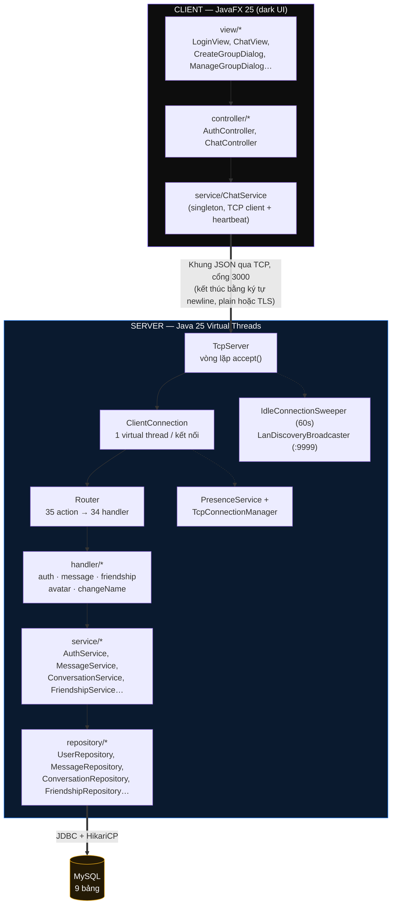

<p align="center">
  <h1 align="center">💬 SinChat</h1>
  <p align="center"><em>Ứng dụng chat thời gian thực với giao diện JavaFX, chạy trên nền TCP Socket thuần (stateful) — đồ án môn Lập trình mạng</em></p>
</p>

<p align="center">
  
  
  
  
  
  
  
  
</p>

---

## 📖 Giới thiệu

**SinChat** là ứng dụng chat client–server hoàn chỉnh, xây dựng cho môn **Lập trình mạng**. Toàn bộ giao tiếp giữa client và server đi qua **TCP Socket thuần, duy trì kết nối liên tục (stateful)** với giao thức JSON tự định nghĩa — **không dùng HTTP/REST, không dùng WebSocket**. Giao diện client viết bằng **JavaFX** (dark theme), server chạy **Java 25 với Virtual Threads**, đóng gói bằng **Docker** và triển khai trên **Render**.

Repo gồm 2 module Maven độc lập (`Code/Client`, `Code/Server`) dùng chung một giao thức JSON qua TCP, cộng thêm tài liệu thiết kế (`Docs/`) và script tiện ích (`Extra/`).

> **Số liệu nhanh:** 117 file Java (64 server · 23 client · 30 test) · **35 action TCP** · **13 sự kiện đẩy realtime** · 9 bảng dữ liệu · 30 file test tự động.

> ℹ️ Một số tài liệu trong `Docs/` (đặc biệt `01_System_Architecture.md`, `02_TCP_API_Protocol.md`, `08_Missing_Features...md`, `CODEBASE_STRUCTURE.md`) được viết ở giai đoạn đầu dự án, **trước khi** có group chat, kết bạn, ghim tin nhắn, emoji... README này được viết lại bằng cách đọc trực tiếp mã nguồn hiện tại nên phản ánh đúng trạng thái mới nhất; coi các tài liệu cũ như tư liệu tham khảo lịch sử.

---

## 📑 Mục lục

- [Tính năng](#-tính-năng)
- [Kiến trúc hệ thống](#️-kiến-trúc-hệ-thống)
- [Công nghệ sử dụng](#-công-nghệ-sử-dụng)
- [Giao thức TCP](#-giao-thức-tcp)
- [Cấu trúc thư mục](#-cấu-trúc-thư-mục)
- [Bắt đầu](#-bắt-đầu)
- [Cơ sở dữ liệu](#-cơ-sở-dữ-liệu)
- [Kiểm thử](#-kiểm-thử)
- [Bảo mật](#-bảo-mật)
- [Tài liệu chi tiết](#-tài-liệu-chi-tiết)
- [Thành viên nhóm](#-thành-viên-nhóm)
- [Hạn chế & định hướng phát triển](#-hạn-chế--định-hướng-phát-triển)

---

## ✅ Tính năng

### 🔐 Xác thực & tài khoản
- Đăng ký tài khoản: username 3–50 ký tự (chỉ chữ/số/`_`), mật khẩu 6–100 ký tự, email theo regex, băm bằng **BCrypt**
- Đăng nhập, giới hạn **5 lần sai → khoá 60 giây** theo từng username
- Quên mật khẩu: mã reset **6 số** sinh bằng `SecureRandom`, **TTL 5 phút**, tối đa **5 lần thử/mã**, chống dò username & timing attack bằng so sánh BCrypt "giả"
- Đổi mật khẩu (yêu cầu xác nhận mật khẩu cũ)
- Đổi username, tự động phát sự kiện `USER_NAME_CHANGED_EVENT` cho bạn bè & người có chung hội thoại

### 💬 Nhắn tin thời gian thực
- Gửi/nhận tin nhắn văn bản tức thời qua TCP, không polling (giới hạn 10.000 ký tự)
- Gửi ảnh dạng base64 nhúng thẳng trong tin nhắn (`type: IMAGE`, tối đa ~5 MB / 7.000.000 ký tự)
- **Trả lời (reply)** một tin nhắn cụ thể, kèm trích dẫn người gửi + nội dung gốc
- **Chuyển tiếp (forward)** tin nhắn sang hội thoại khác
- **Sửa** tin nhắn (giữ chuỗi lịch sử chỉnh sửa qua `edited_to_id`)
- **Xoá** tin nhắn (soft delete)
- **Ghim / bỏ ghim** tin nhắn, giới hạn số tin ghim theo hội thoại (mặc định 5), có thể đặt chính sách "chỉ admin được ghim"
- Trạng thái đã gửi/đã nhận/đã xem (**SENT → DELIVERED → SEEN**), theo dõi danh sách người đã xem
- **Tìm kiếm tin nhắn** theo từ khoá trong hội thoại, có phân trang
- Chỉ báo "đang gõ" (typing indicator), throttle phía client
- Lấy lịch sử tin nhắn phân trang (`limit`/`offset`)

### 👥 Trò chuyện nhóm
- Tạo nhóm kèm danh sách thành viên ban đầu
- Vai trò **OWNER / ADMIN / MEMBER** cho từng thành viên trong nhóm
- Quản lý nhóm: xem danh sách thành viên, đổi tên nhóm, thêm thành viên, kick thành viên, chuyển quyền admin, giải tán nhóm
- Rời nhóm
- Chính sách ghim tin nhắn riêng theo từng nhóm (bật/tắt "chỉ admin ghim", giới hạn số tin ghim)

### 🧑‍🤝‍🧑 Bạn bè
- Gửi / chấp nhận / từ chối lời mời kết bạn
- Danh sách lời mời đang chờ, danh sách bạn bè
- Kiểm tra trạng thái quan hệ với một người dùng cụ thể
- Huỷ kết bạn, chặn / bỏ chặn người dùng
- Tìm kiếm người dùng theo username để bắt đầu trò chuyện hoặc kết bạn

### 🙋 Hồ sơ & trạng thái hoạt động
- Xem/cập nhật hồ sơ (họ tên, email, số điện thoại, ngày sinh...)
- Đổi avatar: client upload base64 → server resize & nén còn tối đa **512×512 PNG** → lưu **BLOB** trong bảng `user_avatars` riêng (tách khỏi bảng `users`)
- Trạng thái online/offline broadcast realtime tới bạn bè **và** người có chung hội thoại, kèm `last_seen` khi offline
- Đổi avatar cũng broadcast sự kiện cho bạn bè/peer

### 😄 Emoji kiểu WeChat
- **100 emoji động (GIF)** + **98 emoji tĩnh (PNG)**, có nhãn tiếng Việt dạng `[cười]`
- Quy tắc hiển thị: 1 emoji đứng riêng → GIF động cỡ lớn (120×120); nhiều emoji hoặc emoji kèm chữ → PNG tĩnh nhỏ inline (28×28)

### 🌐 Mạng & hạ tầng
- **Java 25 Virtual Threads**: mỗi kết nối TCP chạy trên 1 virtual thread (`Executors.newVirtualThreadPerTaskExecutor()`), không cần tự quản lý thread pool cố định
- **Heartbeat PING/PONG** mỗi 15 giây từ client; server tự đóng kết nối "chết"
- **Idle Connection Sweeper**: quét mỗi 5 giây, đóng kết nối không hoạt động quá 60 giây và cập nhật offline
- **Tự động kết nối lại**: client retry mỗi 2 giây, tự `JOIN` lại `userId` sau khi tái kết nối
- **LAN auto-discovery**: server mở thêm cổng TCP **9999** riêng, trả về `SINCHAT_SERVER:<port>` khi client dò subnet — không cần biết trước IP server
- **3 chế độ kết nối client**: Direct (IP/port cố định), LAN Discovery (tự dò mạng LAN), Railway Proxy (qua `acela.proxy.rlwy.net:45139`)
- Hỗ trợ nhiều thiết bị đăng nhập cùng một tài khoản
- Hạ tầng **TLS/SSL** sẵn có qua `TcpServerSocketFactory` (keystore/truststore cấu hình qua biến môi trường) — xem lưu ý ở mục [Bắt đầu](#-bắt-đầu)

---

## 🏗️ Kiến trúc hệ thống



### Các lớp trong hệ thống

| Lớp | Vị trí | Trách nhiệm |
|---|---|---|
| **View** | `client/view/*` | Giao diện JavaFX thuần, không chứa logic mạng |
| **Controller** | `client/controller/*` | Điều phối gọi TCP async (`CompletableFuture`) và trả kết quả về UI thread |
| **ChatService** | `client/service/ChatService` | Singleton quản lý socket, heartbeat, reconnect, khớp `requestId` ↔ response, phân phối sự kiện đẩy |
| **Router** | `server/tcp/Router` | Đọc trường `action`, định tuyến tới đúng handler trong 34 handler singleton |
| **Handler** | `server/handler/*` | Validate input, kiểm tra quyền, gọi Service, trả `JsonObject` response |
| **Service** | `server/service/*` | Logic nghiệp vụ (băm mật khẩu, ghép message, quản lý nhóm...), độc lập với tầng mạng |
| **Repository** | `server/repository/*` | JDBC thuần + `PreparedStatement`, không dùng ORM |
| **Database** | `server/config/Database` | HikariCP pool (tối đa 5 kết nối) + tự chạy migration khi khởi động |

### Design pattern chính
- **Singleton** — `ChatService` (client), `Router`, các Service/Repository dùng chung instance
- **Layered / Service-Repository** — tách bạch network ↔ business logic ↔ data access
- **Request/Response tương quan qua `requestId`** — kiểu JSON-RPC, khớp bằng `CompletableFuture` phía client
- **Observer (callback)** — `ChatService` expose các callback `onNewMessage`, `onMessageEdited`, `onUserTyping`, `onFriendRequestReceived`... để UI phản ứng theo sự kiện đẩy từ server
- **Virtual Thread per connection** — không cần tự tay tính toán kích thước thread pool

---

## 🧱 Công nghệ sử dụng

| Thành phần | Công nghệ |
|---|---|
| **Ngôn ngữ** | Java 25 (cả Client & Server, `maven.compiler.release=25`) |
| **Giao diện Client** | JavaFX (OpenJFX) 25, theme tối thủ công (không dùng CSS framework ngoài) |
| **Giao tiếp mạng** | `java.net.Socket` thuần — TCP stateful, khung JSON kết thúc bằng `\n`, TLS tuỳ chọn |
| **Concurrency (Server)** | Java 25 Virtual Threads — `Executors.newVirtualThreadPerTaskExecutor()` |
| **Cơ sở dữ liệu** | MySQL (driver `mysql-connector-j` 8.3.0) |
| **Connection pool** | HikariCP 5.1.0 (tối đa 5 kết nối — phù hợp gói free của Render) |
| **Băm mật khẩu** | jBCrypt 0.4 |
| **JSON** | Google Gson 2.10.1 |
| **Cấu hình môi trường** | dotenv-java 3.0.0 (đọc file `.env`) |
| **Build** | Apache Maven (`maven-compiler-plugin`, `maven-shade-plugin` để tạo fat JAR) |
| **Log** | SLF4J 2.0.13 + `slf4j-simple` |
| **Đóng gói server** | Docker multi-stage: `eclipse-temurin:25-jdk-jammy` (build) → `eclipse-temurin:25-jre-jammy` (run) |
| **Đóng gói client** | `jpackage` → app-image hoặc `.exe`/`.msi` (qua WiX Toolset) |
| **Hosting** | Render (server, đọc `PORT` do Render cấp) / Railway (TCP proxy cho client) |
| **Kiểm thử** | JUnit 5.10.2 + Mockito 5.17.0 |
| **Lưu avatar** | BLOB trong bảng riêng `user_avatars`, ảnh được resize/nén còn ≤512×512 PNG trước khi lưu |

---

## 🔌 Giao thức TCP

Toàn bộ giao tiếp là **TCP Socket thuần** trên cổng mặc định **3000**. Dữ liệu là chuỗi JSON UTF-8, mỗi message kết thúc bằng ký tự xuống dòng `\n`. Request/response khớp nhau qua trường `requestId`.

**Khung request (Client → Server):**
```json
{
  "action": "TEN_ACTION",
  "requestId": "uuid-hoac-chuoi-bat-ky",
  "...": "các trường khác tuỳ action"
}
```

**Khung response (Server → Client):**
```json
{
  "action": "TEN_ACTION_RESPONSE",
  "requestId": "khớp với request",
  "status": "success | error",
  "message": "mô tả kết quả (khi lỗi)",
  "...": "dữ liệu trả về"
}
```

**Ví dụ — đăng nhập:**
```json
// Request
{ "action": "LOGIN", "requestId": "req-1", "username": "alice", "password": "••••••" }

// Response thành công
{ "action": "LOGIN_RESPONSE", "requestId": "req-1", "status": "success", "userId": 12, "username": "alice" }
```

**Ví dụ — gửi tin nhắn trả lời (reply):**
```json
{
  "action": "SEND_MESSAGE",
  "requestId": "req-2",
  "conversationId": 45,
  "senderId": 12,
  "content": "Ok nhé!",
  "replyToId": 1002
}
```

### Danh sách 35 action (Client → Server)

| Action | Nhóm | Mô tả |
|---|---|---|
| `LOGIN` | Xác thực | Đăng nhập, rate-limit 5 lần sai/60s |
| `REGISTER` | Xác thực | Đăng ký tài khoản mới |
| `FORGOT_PASSWORD` | Xác thực | 2 bước: xin mã 6 số → xác nhận mã + mật khẩu mới |
| `CHANGE_PASSWORD` | Xác thực | Đổi mật khẩu (cần mật khẩu cũ) |
| `PROFILE` | Hồ sơ | `subAction`: `GET_PROFILE` / `UPDATE_PROFILE` |
| `GET_USER_PROFILE` | Hồ sơ | Lấy hồ sơ người dùng khác |
| `CHANGE_AVATAR` | Hồ sơ | Upload avatar base64 |
| `GET_AVATAR` | Hồ sơ | Lấy avatar (byte thô) theo `userId` |
| `CHANGE_NAME` | Hồ sơ | Đổi username |
| `GET_OR_CREATE_CONVERSATION` | Hội thoại | Lấy/tạo hội thoại riêng giữa 2 người |
| `GET_USER_CONVERSATIONS` | Hội thoại | Danh sách hội thoại kèm tin nhắn cuối |
| `SEARCH_USERS` | Hội thoại | Tìm user theo username |
| `SEND_MESSAGE` | Tin nhắn | Gửi tin nhắn — hỗ trợ `replyToId`, `forwardFromId`, `type` |
| `GET_MESSAGES` | Tin nhắn | Lấy lịch sử tin nhắn (`limit`/`offset`) |
| `SEARCH_MESSAGES` | Tin nhắn | Tìm kiếm theo từ khoá trong hội thoại |
| `EDIT_MESSAGE` | Tin nhắn | Sửa nội dung tin nhắn |
| `DELETE_MESSAGE` | Tin nhắn | Xoá tin nhắn (soft delete) |
| `PIN_MESSAGE` | Tin nhắn | Ghim tin nhắn (theo `pin_limit` & quyền) |
| `UNPIN_MESSAGE` | Tin nhắn | Bỏ ghim tin nhắn |
| `SET_PIN_POLICY` | Tin nhắn | Cấu hình `admin_only_pin` / `pin_limit` cho nhóm |
| `UPDATE_MESSAGE_STATUS` | Tin nhắn | Cập nhật SENT/DELIVERED/SEEN |
| `TYPING` | Tin nhắn | Báo đang gõ |
| `CREATE_GROUP` | Nhóm | Tạo nhóm với danh sách thành viên ban đầu |
| `LEAVE_GROUP` | Nhóm | Rời nhóm |
| `MANAGE_GROUP` | Nhóm | `subAction`: `GET_MEMBERS`/`RENAME`/`ADD_MEMBER`/`KICK_MEMBER`/`TRANSFER_ADMIN`/`DISBAND` |
| `SEND_FRIEND_REQUEST` | Bạn bè | Gửi lời mời kết bạn |
| `RESPOND_FRIEND_REQUEST` | Bạn bè | Chấp nhận/từ chối lời mời |
| `GET_FRIEND_REQUESTS` | Bạn bè | Danh sách lời mời đang chờ |
| `GET_FRIENDS` | Bạn bè | Danh sách bạn bè |
| `GET_FRIENDSHIP_STATUS` | Bạn bè | Kiểm tra quan hệ với 1 user |
| `UNFRIEND` | Bạn bè | Huỷ kết bạn |
| `BLOCK_USER` | Bạn bè | Chặn người dùng |
| `UNBLOCK_USER` | Bạn bè | Bỏ chặn |
| `JOIN` | Kết nối | Gắn `userId` vào socket sau khi login |
| `PING` | Kết nối | Heartbeat — server trả `PING_RESPONSE` |

### 13 sự kiện đẩy (Server → Client, không cần request trước)

| Sự kiện | Khi nào server gửi |
|---|---|
| `NEW_MESSAGE` | Có tin nhắn mới trong hội thoại |
| `EDIT_MESSAGE_EVENT` | Một tin nhắn vừa được sửa |
| `DELETE_MESSAGE_EVENT` | Một tin nhắn vừa bị xoá |
| `PIN_MESSAGE_EVENT` / `UNPIN_MESSAGE_EVENT` | Ghim / bỏ ghim tin nhắn |
| `MESSAGE_STATUS_EVENT` | Trạng thái đã nhận/đã xem thay đổi |
| `TYPING_EVENT` | Thành viên khác đang gõ |
| `LEFT_GROUP` | Có thành viên rời/bị kick khỏi nhóm |
| `FRIEND_REQUEST_EVENT` | Nhận lời mời kết bạn mới |
| `FRIEND_ACCEPTED_EVENT` | Lời mời kết bạn được chấp nhận |
| `USER_STATUS_EVENT` | Bạn bè/peer chung hội thoại online hoặc offline |
| `USER_AVATAR_CHANGED_EVENT` | Bạn bè/peer đổi avatar |
| `USER_NAME_CHANGED_EVENT` | Bạn bè/peer đổi username |
| `PING_RESPONSE` | Phản hồi heartbeat |

---

## 📂 Cấu trúc thư mục

```
sinchat-network-programming/
├── Code/
│   ├── Client/                              # Ứng dụng desktop JavaFX
│   │   ├── src/main/java/com/client/
│   │   │   ├── controller/                  # AuthController, ChatController
│   │   │   ├── emoji/                       # EmojiDef, EmojiManager
│   │   │   ├── model/                       # ApiResponse, Conversation, Message, User
│   │   │   ├── service/                     # ChatService, LanDiscoveryService
│   │   │   ├── util/                        # ImageUtils, StyleConstants, TimeUtils
│   │   │   ├── view/                        # LoginView, ChatView, các Dialog quản lý nhóm/avatar...
│   │   │   ├── Launcher.java, Main.java
│   │   ├── src/main/resources/emojis/       # 100 GIF động + 98 PNG tĩnh + emoji_list.json
│   │   └── pom.xml
│   └── Server/                              # TCP server
│       ├── src/main/java/com/server/
│       │   ├── config/                      # Database (HikariCP + auto-migration)
│       │   ├── handler/                     # 34 handler (auth/ avatar/ changeavatar/ changeName/ friendship/ message/)
│       │   ├── model/                       # User, Message, Conversation, Friendship, MessageStatus...
│       │   ├── repository/                  # Truy vấn JDBC thuần (PreparedStatement)
│       │   ├── service/                     # Logic nghiệp vụ
│       │   ├── tcp/                         # TcpServer, Router, ClientConnection, PresenceService...
│       │   ├── Main.java, ProfileHandler.java
│       ├── src/test/java/com/server/        # 30 file test (unit + integration)
│       ├── Dockerfile, pom.xml
├── Docs/                                     # Tài liệu thiết kế, đặc tả & test case
├── Extra/                                     # Script chạy nhanh, JavaFX jmods, icon, jpackage installer
└── README.md
```

---

## 🚀 Bắt đầu

### Yêu cầu
- **JDK 25** trở lên (bắt buộc — cả 2 module đều pin `release=25` để dùng Virtual Threads)
- **Apache Maven**
- **MySQL** đang chạy sẵn (local hoặc cloud), đã có database + user; xem thêm mục [Cơ sở dữ liệu](#-cơ-sở-dữ-liệu)
- (Tuỳ chọn) JavaFX 25 jmods trong `Extra/lib/javafx-jmods-25.0.3/` nếu muốn đóng gói installer bằng `jpackage`

### Cấu hình `.env` cho server
Tạo file `Code/Server/.env`:
```env
PORT=3000
DB_URL=jdbc:mysql://<host>:3306/<ten_database>
DB_USER=<username>
DB_PASSWORD=<password>
USE_SSL=false

# TLS Socket cho TCP (tuỳ chọn — xem lưu ý bên dưới)
# TLS_KEYSTORE_PATH=/duong/dan/keystore.jks
# TLS_KEYSTORE_PASSWORD=changeit
# TLS_KEYSTORE_TYPE=JKS
```

> ⚠️ **Lưu ý về TLS:** hạ tầng TLS (`TcpServerSocketFactory` đọc keystore/truststore qua biến môi trường, `ChatService` phía client đọc cờ `TLS_ENABLED`) đã có sẵn trong mã nguồn, nhưng `Main.java` phía server hiện **luôn khởi tạo `TcpServer` ở chế độ plaintext** (`new TcpServer(port)` → `tlsEnabled=false` mặc định). Muốn bật TLS đầu-cuối, cần sửa `Main.java` để đọc một cờ bật/tắt và gọi constructor 3 tham số của `TcpServer`.

> Repo **không** kèm sẵn `docker-compose.yml` — chỉ có `Dockerfile` cho riêng server, xem mục Docker bên dưới.

### Cách 1 — Chạy nhanh bằng script (Windows)

| Thao tác | File |
|---|---|
| Chạy server | Double-click **`Extra/run_server.cmd`** |
| Chạy client (kết nối trực tiếp `127.0.0.1:3000`) | Double-click **`Extra/run_client.cmd`** |
| Chạy client (tự dò server trong mạng LAN) | Double-click **`Extra/run_client_lan.cmd`** |
| Chạy client (qua Railway proxy) | Double-click **`Extra/run_client_railway.cmd`** |

### Cách 2 — Chạy thủ công bằng Maven

**Server:**
```powershell
cd Code/Server
mvn compile
mvn exec:java -Dexec.mainClass="com.server.Main"
```

**Client:**
```powershell
cd Code/Client
mvn compile
mvn javafx:run
```

Client hỗ trợ 3 chế độ kết nối, chọn qua biến môi trường `TCP_HOST` / `TCP_PORT` / `TLS_ENABLED`:
- **Direct** (mặc định nếu set `TCP_HOST`) — ví dụ `127.0.0.1:3000`
- **LAN Discovery** (mặc định nếu **không** set `TCP_HOST`) — dò cổng 9999 trên subnet, tự nhận IP:port thật của server
- **Railway Proxy** — `acela.proxy.rlwy.net:45139`

### Cách 3 — Docker (chỉ server)
```bash
cd Code/Server
docker build -t sinchat-server .
docker run -p 3000:3000 --env-file .env sinchat-server
```
`Dockerfile` build 2 giai đoạn: biên dịch bằng `eclipse-temurin:25-jdk-jammy` + Maven, chạy bằng `eclipse-temurin:25-jre-jammy` với fat JAR (`maven-shade-plugin`). Biến `PORT` được Render tự cấp khi deploy.

### Cách 4 — Đóng gói client thành file cài đặt Windows
```powershell
cd Extra
package_installer.cmd
```
Script dùng `jpackage` để build fat JAR rồi đóng gói thành `.exe`/`.msi` (nếu có WiX Toolset) hoặc app-image, cấu hình sẵn để trỏ tới Railway proxy. Cần JavaFX jmods đặt tại `Extra/lib/javafx-jmods-25.0.3/`.

---

## 🗄️ Cơ sở dữ liệu

Repo **không** đi kèm file `schema.sql`/`init.sql` — 9 bảng dữ liệu cần tồn tại sẵn trên MySQL trước khi chạy server; `Database.runMigrations()` chỉ tự động **thêm mới** bảng/cột còn thiếu mỗi khi server khởi động (không tạo toàn bộ schema từ đầu).

| Bảng | Vai trò |
|---|---|
| `users` | Tài khoản (username, password hash, email, trạng thái online, `last_seen`) |
| `conversations` | Hội thoại (`PRIVATE`/`GROUP`), tên & avatar nhóm, `admin_only_pin`, `pin_limit` |
| `conversation_members` | Thành viên trong hội thoại + cột `role` (`ADMIN`/`MEMBER`) |
| `conversation_roles` | Vai trò chi tiết `OWNER`/`ADMIN`/`MEMBER` cho từng hội thoại nhóm |
| `messages` | Nội dung tin nhắn (`content` kiểu `MEDIUMTEXT` để chứa ảnh base64), `reply_to_message_id`, `edited_to_id`, `pinned`, `pinned_by` |
| `message_status` | Trạng thái SENT/DELIVERED/SEEN theo từng người nhận |
| `friendships` | Quan hệ bạn bè (`PENDING`/`ACCEPTED`/`BLOCKED`), `action_user_id` |
| `user_avatars` | Avatar dạng BLOB, tách riêng khỏi bảng `users` |
| `attachments` | Metadata file đính kèm (model đã có sẵn — xem lưu ý ở mục hạn chế) |

Tự động migrate khi khởi động server (`Database.runMigrations()`): tạo bảng `friendships` và `conversation_roles` nếu chưa có; thêm các cột `reply_to_message_id`, `pinned`/`pinned_by`, `role`, `edited_to_id`, `admin_only_pin`/`pin_limit` nếu còn thiếu; nới cột `messages.content` từ `TEXT` lên `MEDIUMTEXT`.

---

## 🧪 Kiểm thử

**30 file test** trong `Code/Server/src/test/java/com/server/`:

| Nhóm | Số lượng | Ví dụ |
|---|---|---|
| Unit test — handler | 13 | Auth, Friendship (8 handler), GroupManagement, Avatar, Name |
| Unit test — model | 7 | User, Message, Conversation, Attachment, MessageStatus, Friendship, ChangeAvatar |
| Unit test — service | 6 | Auth, Avatar, Conversation, Friendship, Message, UserName |
| Integration test | 4 | Auth, Message, và các action khác theo luồng end-to-end |

Chạy toàn bộ test:
```powershell
cd Code/Server
mvn test
```

---

## 🔐 Bảo mật

| Cơ chế | Chi tiết |
|---|---|
| Băm mật khẩu | BCrypt (jBCrypt 0.4) |
| Chống SQL Injection | `PreparedStatement` cho toàn bộ truy vấn |
| Giới hạn đăng nhập sai | 5 lần sai/username → khoá 60 giây (lưu tạm trong `ConcurrentHashMap`) |
| Quên mật khẩu | Mã 6 số bằng `SecureRandom`, TTL 5 phút, tối đa 5 lần thử/mã |
| Chống timing attack | So sánh với BCrypt hash "giả" khi username không tồn tại hoặc mã reset sai, giữ thời gian phản hồi ổn định |
| Kiểm tra quyền | Xác minh `senderId`/`userId` khớp với kết nối đã đăng nhập trước khi gửi tin nhắn, xem hồ sơ, thao tác nhóm, ghim tin nhắn... |
| Giới hạn dữ liệu vào | Username 3–50 ký tự (chỉ chữ/số/`_`), mật khẩu 6–100 ký tự, tin nhắn văn bản ≤10.000 ký tự, ảnh base64 ≤~7.000.000 ký tự |
| TLS/SSL | Hạ tầng sẵn có qua `TcpServerSocketFactory` + keystore/truststore (xem lưu ý ở mục [Bắt đầu](#-bắt-đầu)) |

---

## 📚 Tài liệu chi tiết

| Tài liệu | Nội dung |
|---|---|
| [`Docs/01_System_Architecture.md`](Docs/01_System_Architecture.md) | Kiến trúc phân lớp (giai đoạn đầu dự án) |
| [`Docs/02_TCP_API_Protocol.md`](Docs/02_TCP_API_Protocol.md) | Đặc tả giao thức (11 action đầu tiên — chưa cập nhật nhóm/bạn bè/ghim) |
| [`Docs/03_Realtime_Message_Flow.md`](Docs/03_Realtime_Message_Flow.md) | Luồng gửi/nhận tin nhắn realtime |
| [`Docs/04_Server_Guide.md`](Docs/04_Server_Guide.md) | Hướng dẫn cấu hình & vận hành server |
| [`Docs/05_Client_Guide.md`](Docs/05_Client_Guide.md) | Kiến trúc & cách dùng client |
| [`Docs/06_Forgot_Password_Flow.md`](Docs/06_Forgot_Password_Flow.md) | Chi tiết luồng quên mật khẩu |
| [`Docs/07_TCP_Activity_Diagrams.md`](Docs/07_TCP_Activity_Diagrams.md) | Sơ đồ activity/sequence |
| [`Docs/08_Missing_Features_and_Network_Upgrades.md`](Docs/08_Missing_Features_and_Network_Upgrades.md) | Đề xuất nâng cấp — phần lớn đã được triển khai (heartbeat, TLS, group, bạn bè...) |
| [`Docs/10_Change_Password_TCP_Implementation.md`](Docs/10_Change_Password_TCP_Implementation.md) | Chi tiết luồng đổi mật khẩu |
| [`Docs/11_Message_Search_TCP_Implementation.md`](Docs/11_Message_Search_TCP_Implementation.md) | Chi tiết luồng tìm kiếm tin nhắn |
| [`Docs/CODEBASE_STRUCTURE.md`](Docs/CODEBASE_STRUCTURE.md) | Tổng quan cấu trúc code (giai đoạn đầu) |
| [`Docs/JAVA_FILES_REFERENCE.md`](Docs/JAVA_FILES_REFERENCE.md) | Danh sách file Java kèm mô tả |
| [`Docs/project.tex`](Docs/project.tex) | Đề xuất dự án ban đầu (proposal, LaTeX) |
| `Docs/TestCases/*.xlsx` | Bộ test case do thành viên nhóm biên soạn |

---

## 👥 Thành viên nhóm

| Thành viên | Vai trò | Đóng góp chính |
|---|---|---|
| **[Nguyen Sun Sin](https://github.com/ngnsusinn)** | Team Lead · Backend Core · DevOps | Kiến trúc server (TcpServer, Router, ClientConnection), heartbeat/TLS/presence/idle sweeper, API quên mật khẩu, HikariCP, BCrypt, Docker + Render, Maven, test server, tài liệu, LAN auto-discovery, Railway proxy, migrate Virtual Threads |
| **[Tran Van Thai](https://github.com/ThaiDevv)** | Project Owner · Messaging · Database | Thiết kế schema database, model & repository tin nhắn, luồng gửi/nhận tin nhắn, kiểm tra hội thoại riêng tư, tái cấu trúc kiến trúc & tối ưu luồng tin nhắn, PR review & merge, tìm kiếm tin nhắn, xác nhận đã đọc |
| **[Nguyen Le Huy Tam](https://github.com/Sleepy2608)** | UI Developer · Avatar | Giao diện JavaFX (LoginView, ChatView, Main), tính năng đổi avatar, sửa lỗi ChatView, cải tiến UI, dark theme |
| **[Nguyen Ngoc Gia Bao](https://github.com/Baon5824)** | Endpoint Integration | Kết nối backend endpoint với UI JavaFX, dọn dẹp/refactor TCP endpoint, xác nhận đã đọc hàng loạt |
| **[Tran Van Ngoc Thang](https://github.com/Thang414)** | Auth · Avatar | Tính năng đăng ký, đổi avatar (upload base64, crop/zoom UI), cập nhật avatar endpoint |
| **[Huynh Dinh Chan](https://github.com/Chan-2006)** | Profile Management | API `ProfileHandler` (xem/cập nhật hồ sơ, email), triển khai endpoint hồ sơ, đóng góp xác nhận đã đọc |

*(Bảng phân công giữ nguyên từ tài liệu gốc của nhóm — các tính năng bổ sung sau này như group chat, kết bạn, ghim tin nhắn, emoji chưa có ghi nhận đóng góp chi tiết theo từng người trong mã nguồn.)*

---

## 🚧 Hạn chế & định hướng phát triển

- **Gọi thoại / gọi video / chia sẻ màn hình**: chưa triển khai. Không có action, handler hay bảng dữ liệu nào cho tính năng này trong mã nguồn hiện tại.
- **Truyền file nhị phân thực sự**: model `Attachment` và bảng `attachments` đã tồn tại ở tầng dữ liệu, nhưng `SEND_MESSAGE` hiện chỉ hỗ trợ nhúng ảnh base64 thẳng vào trường `content` (tối đa ~5 MB) — chưa có kênh truyền file dạng chunk/binary riêng như đề xuất trong `Docs/08`.
- **TLS đầu-cuối**: hạ tầng đã sẵn sàng ở cả 2 phía nhưng chưa được bật mặc định (xem lưu ý ở mục [Bắt đầu](#-bắt-đầu)).
- **`docker-compose.yml`** cho việc chạy server + MySQL cục bộ bằng 1 lệnh: chưa có trong repo, dù được nhắc tới trong một vài tài liệu cũ.
- Chưa có file license mã nguồn mở — đây là đồ án học tập trong môn Lập trình mạng.